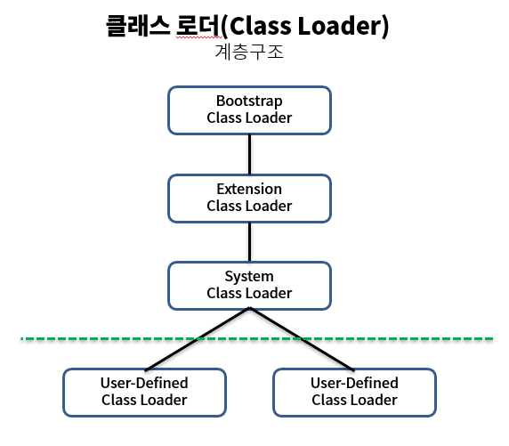

### 1. 클래스 로더 (Class loader)
* 자바는 동적 로드, 즉 컴파일 타임이 아니라 런타임에 클래스를 처음으로 참조할 때 해당 클래스를 로드하고 링크하는 특징이 있다. 이 동적 로드를 담당하는 부분이 JVM 클래스 로더이다.

> 여기서 특징은 자바를 실행 하면 클래스들을 한번에 전부 로드하지 않는다 ! 낭비이기 때문에 그때그때 실행을 하면서 필요한 것들만 클래스 로더가 가져온다.
>   실행엔진이 실행하다가 클래스가 필요하면 클래스 로더에게 요청을하고 클래스 로더는 클래스를 로드해서 응답해준다.

### 1-1 계층구조

* 부트스트랩 클래스 로더
    * 최상위 클래스로더 유일하게 JAVA가 아니라 네이티브 코드로 구현이 되어있다.
    * JVM이 실행될 때 같이 메모리에 올라간다.
    * Object 클래스를 비롯하여 JAVA API들을 로드한다.

* 익스텐션 클래스 로더
    * 기본 JAVA API를 제외한 확장 클래스들을 로드한다. (다양한 보안 확장기능 로드)

* 시스템 클래스 로더
    * 부트스트랩과 익스텐션 클래스로더가 JVM 자체의 구성요소들을 로드한다면, 시스템 클래스 로더는 애플리케이션의 클래스들을 로드한다.
    * 사용자가 지정한 $CLASSPATH 내의 클래스들을 로드한다.

* 사용자 정의 클래스 로더
    * 애플리케이션 사용자가 직접 코드상에서 생성하여 사용하는 클래스로더

### 2. 클래스 로드의 과정

1. 로딩 : .class 파일을 jvm 메모리에 로드하는 과정이다 !
2. 링킹 :
    1. 검증 : 바이트코드가 제대로 자바에 규칙을 따르고 있는지 검증 !
    2. 준비 : 클래스가 필요로하는 메모리 양이 미리 할당을 해둔다 !
    3. 분석 : 클래스가 참조하는 객체에 대해 실제 메모리 주솟값을 대입하게 된다.
3. 초기화 : 클래스 안에 스테틱 변수가 있겠지? 그럼 그 변수의 값을 할당을 하고 초기화 시키는 단계이다.

### 3. 클래스 로드 요청 과정

1. 캐시에 해당 클래스가 있는지 확인을 한다.
    1. 캐시란 미리 불러온 것들을 저장하는 것을 의미 즉 이미 불러온 클래스가 있는지 확인
2. 상위 클래스 로더에서 확인을한다. 해당 클래스를 가져온게 있는지 없으면 하위클래스 없으면 본인 클래스 로더에서 가져오게 된다.

