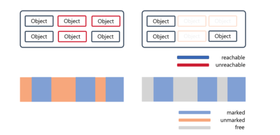
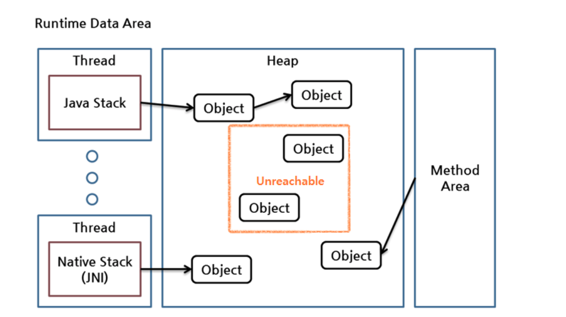
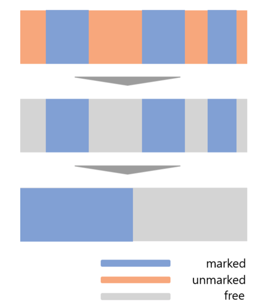
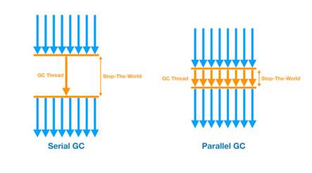
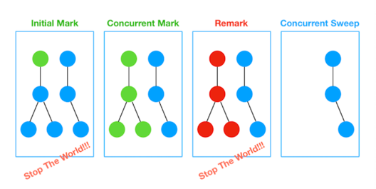
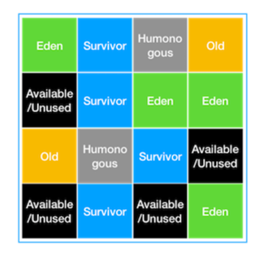
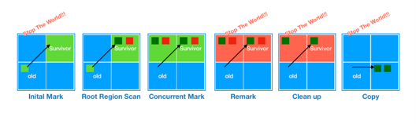

## 1. GC란 무엇인가?
* GC란 이미 할당된 메모리에서 더이상 사용하지 않는 메모리를 해제하는 행동을 의미한다.
    * 여기서 말하는 메모리는 Heap과 Method Area에서 사용되지 않는 Object를 의미한다.

* 참고로 소스상의 close()를 볼 수 있는데 이 메서드는 Object의 사용 중지를 뜻하는 의사표현일 뿐 Object를 메모리에서 삭제하겠다는 뜻은 아니다.
    * System.gc()를 명시적으로 호출할 수 있지만 이 메소드 호출은 Full GC를 수행시키는 메소드이기 때문에 Stop-the-world 시간이 길고 무거운 작업이며 반드시 즉시 수행한다는 보장도 없다.

## 2. GC가 왜 필요할까?
* Heap 영역에 저장되는 객체들이 계속해서 쌓이게 된다면 OutOfMemoryException이 발생하게 된다. 이를 방지하기 위해서 주기적으로 사용하지 않는 객체를 수집하여 제거해줘야 한다.

## 3. GC의 종류 및 설명

### Minor GC
1. 자바 객체가 생성되면 처음에 Eden 영역에 저장된다.
2. 생성된 객체는 Minor GC가 발생할 때 Survivor 영역으로 이동한다.
3. Survivor 영역은 1,2 두 영역으로 나누어지는데, Minor GC가 발생하면 Eden 과 Survivor 활성 객체를 다른 Survivor로 복사한다.
   1. 두 영역중에 반드시 1개의 영역에만 데이터가 존재할 수 있다.
   2. 둘 중 1개의 영역은 반드시 빈 상태가 되어야한다.
4. 활성이 아닌 객체는 즉 GC의 대상이 되는 객체는 다른 Survivor 영역에 남아있게 되며 해당 Survivor 영역과 Eden 영역을 클리어한다.
5. 1~4번의 과정을 반복하면서 Survivor 영역에서 오래 살아남은 객체는 Old 영역으로 옮기게된다.

* 속도가 빠름
* 작은 크기의 메모리를 콜렉팅하는데 효과적이다.
* Stop The World 방식으로 Stop The World 시간이 짧다.

### Major GC
* Old 영역이 가득 차면 발생하는 GC다.
* Minor GC 과정에서 삭제되지 않고 Old 영역으로 옮겨진 객체 중 미사용된다고 판단되는 객체를 삭제하는 GC다.
* Stop The World 방식이며 Stop The World 시간이 길다.

#### 대표적으로 Mark & Sweep 알고리즘을 사용한다.
1. GC로 Root로부터 모든 객체들의 참조를 확인하면서 참조가 연결되지 않은 객체를 Mark한다.
   1. GC Root란 Runtime Data Area에서 Method Area, Native Stack(JNI), Java Stack 등에서 Heap 메모리 Object들을 참조하는 영역
   2. 
2. 1번의 작업이 끝나면 사용되지 않는 객체를 모두 표시하고 이 표시된 객체를 Sweep 한다.

### Full GC
* 속도가 매우 느리다.
* Full GC가 일어나는 도중에는 순간적으로 자바 애플리케이션이 중지 되기 때문에 애플리케이션의 성능과 안정성에 영향을 준다.
* Heap 메모리 전체 영역에서 발생한다.
* Old, Young 영역 모두에서 발생하는 GC다.
* Minor GC, Major GC 모두 실패하거나 Young 영역과 Old 영역이 모두 가득 찼을 때 발생한다.

#### 대표적으로 Mark & Sweep & Compact 알고리즘을 사용한다.
1. 전체 객체들의 참조를 확인하면서 참조가 연결되지 않은 객체를 Mark한다.
2. 1번의 작업이 끝나면 사용되지 않는 객체를 모두 표시하고 이 표시된 객체를 Sweep 한다.
3. 메모리를 정리하여 메모리 단편화를 해결할 수 있도록 한다.

### 이 중에서 Minor GC와 Major GC로 구분하는 이유는 뭘까?
* JVM은 Heap 영역을 설계할 때 2가지 전제조건으로 설계가 되었다.
  1. 대부분 객체가 금방 접근 불가능한 상태가 된다.
  2. 오래된 객체에서 새로운 객체로의 참조는 드물게 존재한다.
* **객체는 일회성인 경우가 많고, 메모리에 오래 남아있는 경우가 드물기 때문에 Young, Old 영역으로 분리하여 설계하였다. 따라서 자주 발생하는 Minor GC, Old 영역이 가득 찰 때 생하여 비교적 적게 발생하는 Major GC로 나눠져서 발생한다.**

## 4. GC의 발전

* JVM 버전이 올라감에 따라 여러가지 GC방식이 추가되고 발전되어 왔다. 때문에 다양한 방식의 GC가 존재하며 상황에 따라 필요한 GC방식을 설정해서 사용할 수 있다.

### 4-1 Serial GC
* 순차적은 GC 방식이다.
* 순차적으로 동작할 수 밖에 없는 이유는 GC를 처리하는 스레드가 하나이기 때문이다.
* 메모리나 CPU Core 리소스가 부족할 때 사용할 수 있을 것이다.
* Java가 처음 등장했던 90년대 후반의 PC들을 생각하면 이해가 쉽다.

### 4-2 Parallel GC
* 위의 Serial GC를 사용하던 시절보다 PC의 성능이 좋아졌다 !
  * 메모리도 넉넉해지며 CPU Core 수도 증가
* Parallel GC는 Minor GC를 처리하는 스레드를 여러개로 늘려 좀 더 빠른 동작이 가능하게 한 방식이다.
* 그림처럼 Sereal GC는 작업을 하는 스레드가 하나지만 Parallel은 GC 스레드가 여러개 존재한다.
* 이 Parallel GC에서의 GC프로세스가 더 빠르게 동작할 수 있게 해주며 이러한 차이는 GC를 처리하는 동안 Java 프로세스가 모두 멈춰버리는 Stop-The-World 현상이 나타나는 시간에도 영향을 주게된다.
* **즉 Stop-The-World 시간이 조금 더 적게 걸리는 Parallel GC 에서의 Java 애플리케이션이 좀 더 매끄럽게 동작한다는 뜻을 가지고 있다.**

### 4-3 CMS GC
* 앞서 살펴본 GC 방식보다 개선된 방식이다.
* 개선이 된 만큼 성능은 좋아졌지만 GC의 과정은 좀 더 복잡해진 방식이다.
* CMS는 GC에서 발생하는 STW 시간을 최소화 하는데 초점을 맞춘 GC이다.
* 즉 GC 대상을 최대한 자세히 파악 후 정리하는 시간을 짧게 가져가겠다는 컨셉이다.
* 다만 GC 대상을 파악하는 과정이 복잡하한 여러 단계로 수행되기 때문에 다른 GC 대비 CPU 사용량이 높다.
* CMS GC의 과정
    1. Initial Mark : GC 과정에서 살아남은 객체를 탐색하는 시작 객체(GC ROOT)에서 참조 Tree상 가까운 객체만 1차적으로 찾아가며 객체가 GC 대상인지를 판단한다. 이 때는 SWT 현상이 발생하게 되지만 탐색 깊이가 얕기 때문에 기간이 매우 짧다.
    2. Concurrent Mark : SWT 현상없이 진행되며 1단계에서 GC 대상으로 판별된 객체들이 참조하는 다른 객체들을 따라가며 GC 대상을 추가적으로 확인한다.
    3. Remart : 2단계의 결과를 검증한다. 이 단계에서 GC 대상으로 추가 확인되거나 참조가 제거되었는지의 확인을 한다. 이 검증과정은 STW를 유발하기 때문에 STW 지속시간을 최대한 줄이기 위해 멀테스레드로 검증 작업을 수행한다.
    4. Concurrent Sweep : STW 없이 3단계에서 검증 완료된 GC 객체들을 메모리에서 제거한다.

### 4-4 G1 GC
* 하드웨어가 발전되면서 Java 애플리케이션에 사용할 수 있는 메모리의 크기도 점차 커져갔다.
* 하지만 기존의 GC 알고리즘들로는 큰 메모리에서 좋은 성능을 내기 힘들었기 때문에 G1 GC가 등장하게 되었다.
* 즉 G1 GC는 큰 힙 메모리에서 짧은 GC 시간을 보장하는데 그 목적을 둔다.
* G1 GC는 앞서 살펴본 GC와는 다른 방식으로 힙 메모리를 관리한다.
* 위의 Eden, Survivor, Old 영역이 존재하지만 고징된 크기로, 고징된 위치에 존재하는 것이 아니다.
* 전체 힙 메모리 영역을 Region 이라는 특정한 크기로 나눠서 각 Region이 상태에 따라 그 Region에 역할(Eden, Survivor, Old)이 동적으로 부여되는 상태이다.
* JVM 힙은 2048개의 Region으로 나눌 수 있으며 각 Region의 크기는 1MB~ 32MB 사이로 지정될 수 있다.

### G1 GC 자세히 보기
* G1 GC에서는 그동안 Heap에서 보지 못한 Humongous, Avaliable/Unused 가 존재한다.
* Humongous
    * Region 크기의 50%를 초과하는 큰객체를 저장하기 위한 공간이다.
    * 이 Region에서는 GC 동작이 최적으로 동작하지 않는다.
* Avaliable/Unused
    * 아직 사용되지 않은 Region을 의미한다.

* G1 GC에서 Young GC를 수행할 때는 STW현상이 발생하며 STW 시간을 최대한 줄이기 위해서 멀티스레드로 수행한다.
* Young GC는 각 Region중 GC 대상 객체가 가장 많은 Region(Eden, Survivor)에서 수행된다.
* 이 Region에서 살아남은 객체를 다른 Region(Surivor 역할) 으로 옮긴 후 비워진 Region을 사용가능한 Region으로 돌리는 형태로 동작한다.

* G1 GC에서 Full GC 수행과정
    * Initail Mark
        * Old Region에 존재하는 객체들이 참조하는 Suvivor Region을 찾는다. 이 과정에서 STW 현상이 발생한다.
    * Root Region Scan
        * Initial Mark 에서 찾은 Survivor Region에 대한 GC 대상 객체 스캔 작업을 진행한다.
    * Concurrent Mark
        * 전체 힙의 Region에 대해 스캔 작업을 진행하며, GC 대상 객체가 발견되지 않은 Region은 이후 단계를 처리하는데 제외되도록 한다.
    * Remart
        * 애플리케이션을 멈추고(STW) 최종적으로 GC 대상에서 제외될 객체를 식별해낸다.
    * Cleanup
        * 애플리케이션을 멈추고(STW) 살아있는 객체가 가장 적은 Region에 대한 미사용 객체 제거를 수행한다.
        * 이후 STW를 끝내고 앞선 GC 과정에서 완전히 비워진 Region을 Freelist에 추가하여 재사용 될 수 있게 한다.
    * Copy
        * GC 대상 Region이었지만 CleanUp 과정에서 완전히 비워지지 않은 Region의 살아남은 객체들을 새로운(Avaliable/Unused) Region에 복사하여 Compaction 작업을 수행한다.
        
