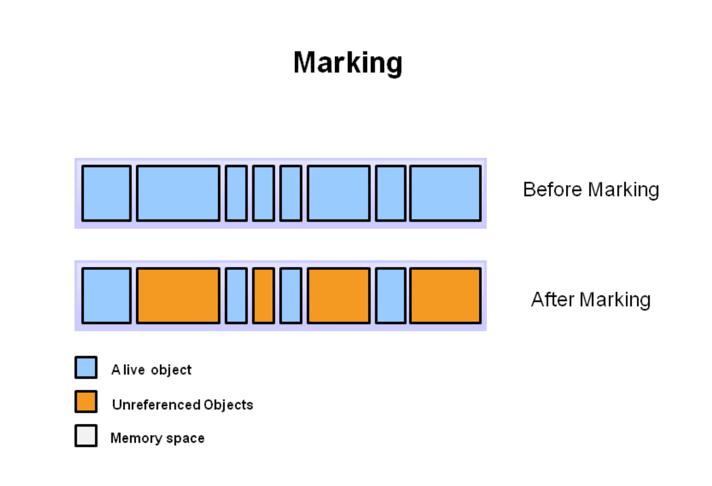
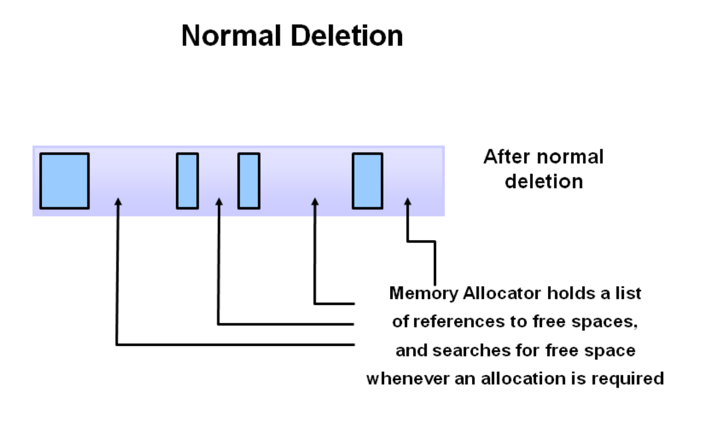
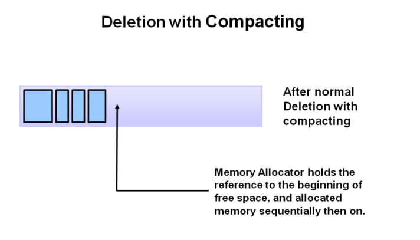
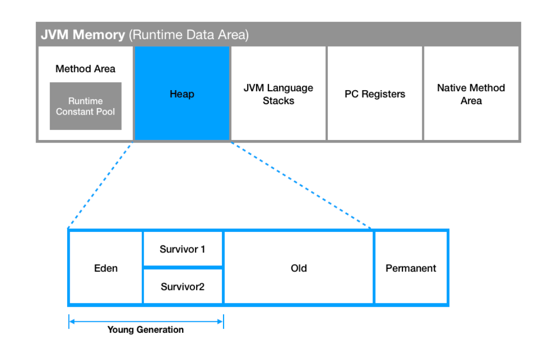
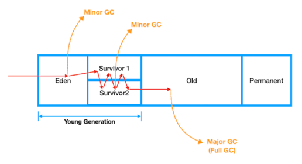
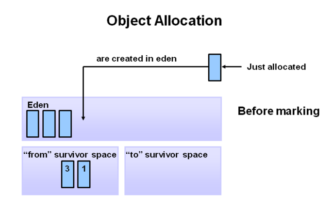
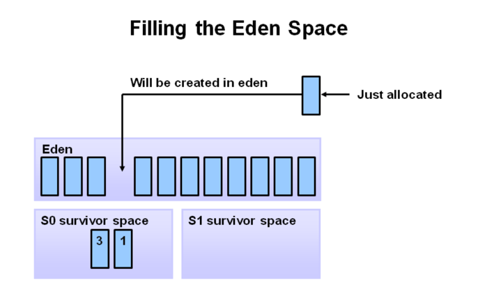
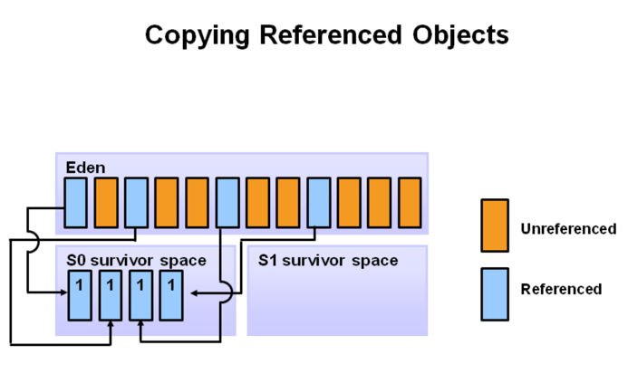
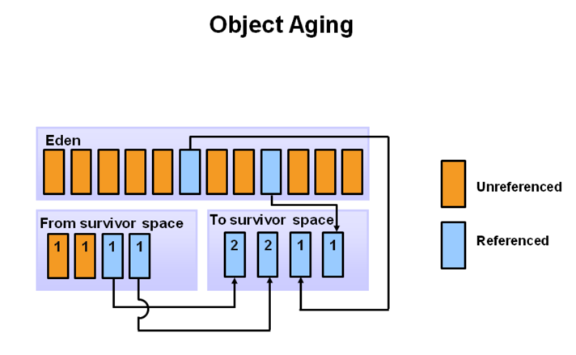
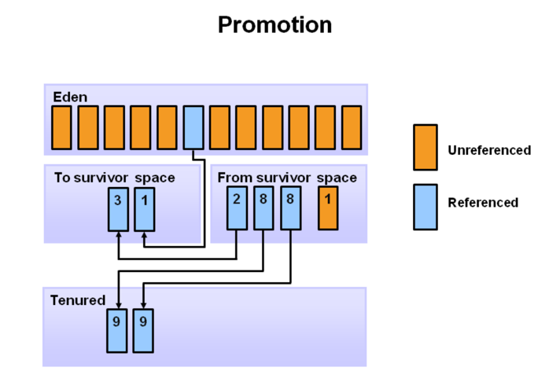

## 1. GC를 도입하게 된 이유

### 대부분의 객체는 금방 접근 불가능 상태가 된다.
```java
for(int i=0; i<10000; i++) {
    Object object = new Object();    
    ~~~
}
```
* 10,000번의 오브젝트 객체는 Loop 내에서 생성되고 Loop 밖에서는 사용할 일이 없어진다.
* 이런 객체들이 메모리를 계속 점유하고 있다면 다른 코드를 실행하기 위한 메모리 작원은 지속적으로 줄어들기만 할 것이다.
* GC는 이렇게 한번 쓰이고 버려지는 객체들 즉 접근 불가능 상태가 된 객체를 주기적을 비워줌으로써 한정된 메모리를 효율적으로 사용할 수 있게 해준다.


### 오래된 객체에서 젊은 객체로의 참조는 아주 적게 존재한다.
* 자바 개발시 가장 많이 사용하는 객체는 POJO(Plain Old Java Object)일 것이다.
* 보통 어떤 값이나 상태를 저장하기 이해 POJO 객체를 생성하고, 다른 메소드나 클래스에 전달하고, 다 사용한 객체는 더이상 사용하지 않는다.
* 경우에 따라 오래 살아남아 재활용 되는 케이스가 있긴 하지만, 대부분의 경우는 아닐 것이다.

```java
Model model = new Model("value");
do(model);

// 더이상 사용하지 않는다.
```
<hr>

## 2. GC의 장단점


### GC의 장점
* 가장 큰 장점으로 개발자가 동적으로 할당된 메모리 전체를 관리할 필요가 없어진다.
* 유효하지 않은 포인터에 접근하거나 이미 한번 해제한 메모리를 두번 해제하는 등 버그 등 불필요한 작업을 해소할 수 있게된다.

### GC의 단점
* GC가 수행되는 정확한 시점을 알 수 없다.
* GC가 실행될 때는 반드시 애플리케이션을 중지시키는 Stop The World가 수행되고 이는 오버헤드를 일으키게 된다.
* 오버헤드는 성능 저하의 원인이 될 수 있다. 또한 프로그램에 예측 불가능하게 일시정지 될 수 있기 때문에 실시간 시스템에는 적합하지 않다.

<hr>

## 3. GC 가 일어나는 과정(메모리 수거하는 과정)

> 현재 사용중인 객체의 메모리를 제거한다면 프로그램이 정상적으로 실행되지 않을 것이다.<br>
> 때문에 GC를 위해서는 우선 메모리에 있는 격체가 현재 사용중인지 사용중이 아닌지를 구분할 수 있어야 한다 !

### 3-1 GC의 동작 순서 (수거 과정)
1. Mark - GC Root로부터 모든 변수를 스캔하면서 각각 어떤 객체를 참조하고 있는지 찾아서 마킹한다.
   1. 
2. Sweep - Unreachable한 객체들을 Heap에서 제거한다.
   1. !
3. Compact(optional) - Sweep 후에 분산된 객체들을 Heap의 시작 주소로 모아 메모리가 할당된 부분과 그렇지 않은 부분으로 나눈다.
   1. !

### 3-2 GC가 일어나는 과정

#### 오래된 객체의 기준은 뭘까 ?
* JVM에서는 이 오래된 객체를 표현하기 위해서 메모리를 여러 영역으로 나눴다 !

> Minor GC가 발생하는 동안 얼마나 오래 살아남았는지로 판단하게 된다. <br>
> 각 객체는 Minor GC에서 살아남은 횟수를 기록하는 age bit를 가지고 있다. <br>
> Minor GC가 발생할 때마다 age bit 값은 1씩 증가하게 되며 이 bit 값이 설정값을 초과하게 되는 경우 Old 영역으로 객체가 이동하게 된다.
> 또는 설정값을 초과하기 전이라도 Suvivor 영역보다 메모리가 클 경우 Old 영역으로 객체가 옮겨질 수도 있다.





1. 처음 생성된 객체는 Young Generation 영역의 일부인 Eden 영역에 위치하게 된다.
   1. 
2. 그리고 Eden영역이 가득 차 Minor GC가 발생하게 된다면 사용하지 않는 즉 다른곳에서 참조하지 않는 객체는 메모리에서 제거된다.
   1. 
3. Mark 과정에서 살아남은 객체들은 Survivor 영역으로 복사한후 Eden 영역에 있는 데이터들을 삭제한다.
   1. 
4. 그 다음 다시 Minor GC가 일어났을 때 Eden 영역과 Servivor 0 영역을 모두 mark하고 살아남은 객체들은 다시 1 영역으로 복사하고 Eden 영역과 0 영역의 데이터를 삭제한다 복사하는 과정에서 해당 객체의 Age bit 값이 증가한다.
   1. 
5. 특정 age에 도달한 객체들은 Old 영역으로 옮겨지며 이 옮겨지는 현상을 promotion이라고 부른다.
   1. 
6. Old generation 영역에도 꽉차면 Major GC가 발생한다.
