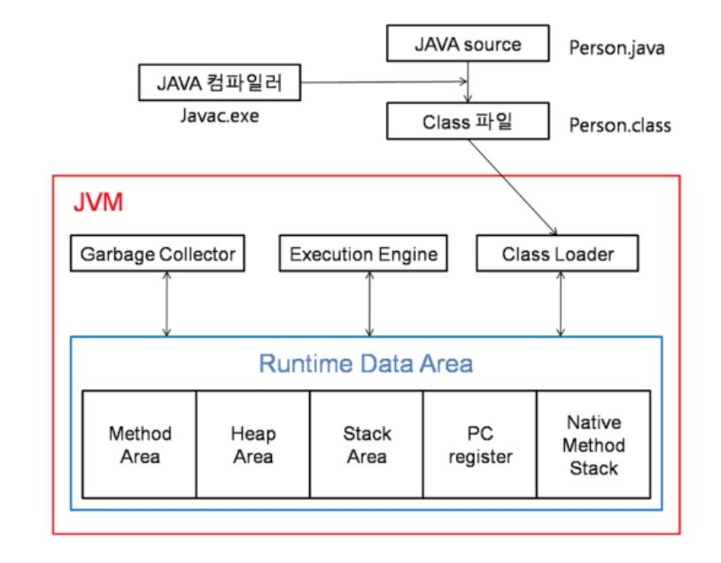
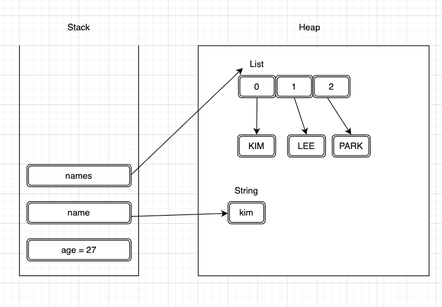
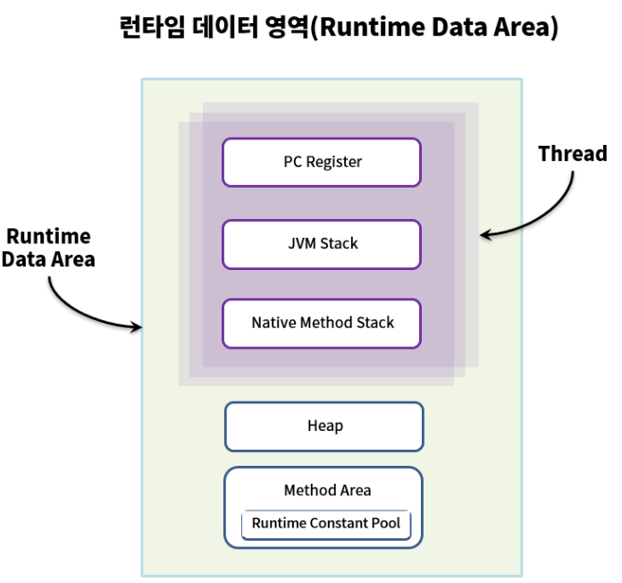

<hr>



<hr>

## 1. 자바의 메모리 할당 및 실행 과정

### Stack 영역
* 정적으로 할당되는 메모리의 영역으로
    * 프리미티브 타입들이 값이랑 같이 할당이 된다.
* Heap 영역에 오브젝트 타입 데이터의 참조값이 할당이 되는 공간이다.
* **스레드당 하나씩 할당된다.**
* 함수가 호출될 때 사용되는 메모리로 기능 수행이 끝나면 자동으로 반환되는 메모리

### Heap 영역
* 동적으로 할당된 메모리 영역으로
    * 모든 오브젝트 타입의 데이터가 할당이 된다.
* stack에 쌓이는 데이터를 제외하고 Heap 영역에 쌓인다.
* Heap 영역은 하나만 존재하기에 공유하며 사용한다.

```java
public static void main(String[] args) {
   
    int age = 27; // stack에 값과 같이 할당된다.
    String name = "kim" // 스텍에 name 이라는 참조값만 실제 값은 Heap에 저장된다.    
    List<String> namse = new ArrayList<>(); // 스텍에 names 라는 참조값만 실제 값은 Heap에 저장된다.
    names.add("KIM");
    names.add("LEE");
    names.add("PARK');
}
```


<hr>

## 2. 각 메모리 영역 역할

### 클래스로더
* 자바는 동적 로드, 즉 컴파일 타임이 아니라 런타임에 클래스를 처음으로 참조할 때 해당 클래스를 로드하고 링크하는 특징이 있다. 이 동적 로드를 담당하는 부분이 JVM 클래스 로더이다.

### 런타임 데이터 영억

* JVM이 OS위에서 실행되면서 할당받는 메모리 영역이 바로 런타임 데이터 영역이다. 이 영역은 6가지 영역으로 나눌 수 있다.
  

> 이 중 PC Register, JVM Stack, Native Method Stack은 스레드마다 하나씩 생성되며
> <br> Heap, Method Area는 모든 스레드가 공유해서 사용한다.

* **PC Register**
    * PC Register는 현재 수행중인 명령의 주소를 가지고 스레드가 시작될 때 생성되며 각 스레드마다 하나씩 존재한다.
* **JVM Stack**
    * 스텍 프레임 구조체를 저장하는 스택이다.
    * 에외 발생 시 printStackTrace() 메서드로 보여주는 Stack Track각 라인 하나가 스텍 프레임을 표현한다.
    * JVM 스택 역시 PC Register와 마찬가지로 스레드가 시작될 때 생성되며 각 스레드마다 하나씩 존재한다.
    * 지역변수 리턴정보 등등
* **Native Method Area**
    * JAVA 외의 언어로 작성된 네이티브 코드를 위한 스택이다.
    * JAVA Native Interface를 통해 호출하는 C/C++등의 코드를 수행하기 위한 스택으로, 언어에 맞게 스택이 생성된다.
* **Heap**
    * 인스턴스 또는 객체를 저장하는 공간으로 GC의 대상이다.
    * 런타임중에 데이터가 동적으로 할당되는 곳
    * JVM성능 등의 이슈에서 가장 많이 언급되는 공간으로 힙 구성 방식이나 GC 방법 등은 JVM 벤더들의 재량이다.
* **Method Area**
    * 모든 스레드가 공유하는 영역으로 JVM이 시작될 때 생성된다.
    * JVM이 읽어 들인 각각의 클래스와 인터페이스에 대한 런타임 상수 풀, 필드왜 메서드에 대한 정보, Static 변수, 메서드의 바이트코드 등을 보관한다.
* **Runtime Constant Pool**
    * JVM 동작에서 가장 핵심적인 역할을 수행하는 곳으로 JVM 명세에서도 따로 중요하게 기술한다.
    * 각 클래스와 인터페이스의 상수 뿐만 아니라, 메서드와 필드에 대한 모든 래퍼런스까지 담고 있는 테이블이다.
    * 어떤 메서드나 필드를 참조할 때 JVM은 런타임 상수 풀을 통해 해당 메서드나 필드의 실제 메모리상 주소를 찾아서 참조한다.

### 실행엔진
* 클래스 로더를 통해 런타임 데이터 영역에 배치된 바이트 코드를 명령어 단위로 읽어서 실행한다.
    * 바이트 코드의 각 명령어는 1바이트 크기의 OpCode와 추가 피연산자로 이루어져 있다.
    * 실행엔진은 하나의 OpCode를 가져와서 피연산자와 작업을 수행한 다음 그 다음 OpCode를 수행한다.
* 이 과정에서 두가지 방법이 존재한다.
    * 인터프리터
        * 바이트 코드 명령어를 하나씩 읽고 해석하고 실행한다. 하나하나의 해석은 빠르지만 전체적인 실행 속도는 느리다는 단점이 있다.
        * JVM 안에서 바이트코드는 기본적으로 인터프리터 방식으로 동작한다.
    * JIT 컴파일러
        * 인터프리터의 단점을 보완하기 위해 바이트 코드 전체를 컴파일하여 네이티브 코드로 변경하고 이후에는 해당 메서드를 더이상 인터프리팅 하지 않고 네이티브 코드로 직접 실행하는 방식이다.
        * 실행 속도는 인터프리팅 방식보다 빠르다.