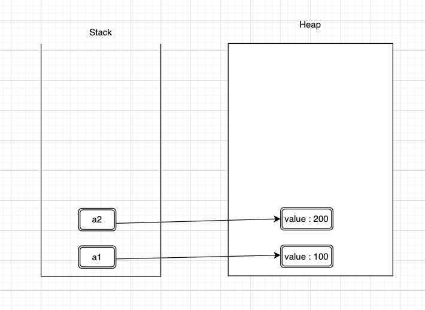
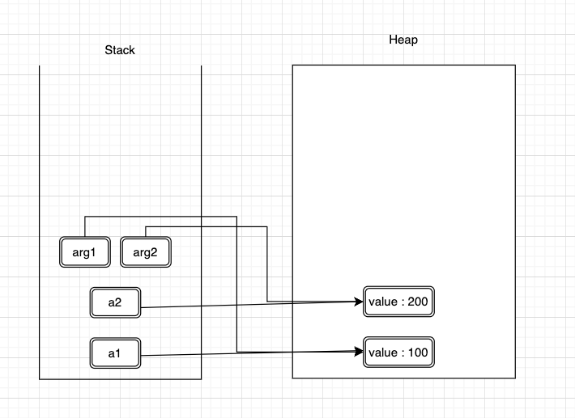
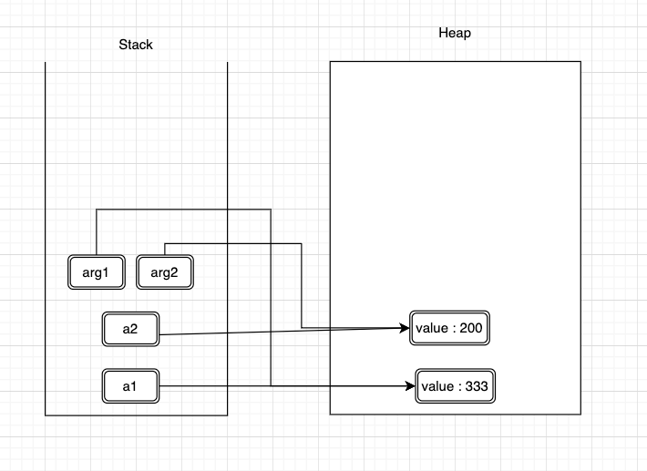
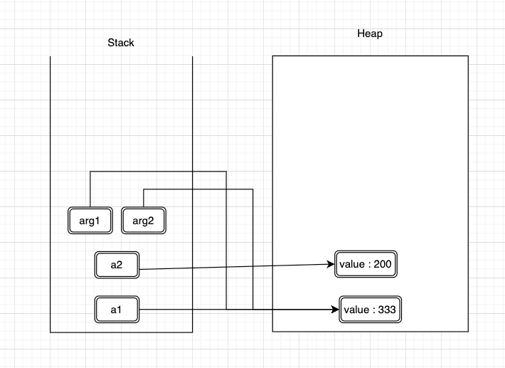

## call by value 메모리 할당
```java
class A{
    int value;
    A(int i){
        this.value = i;
    }

}
public class Main {

    public static void main(String[] args) {
        A a1 = new A(100);
        A a2 = new A(200);
        run(a1, a2);
    }

    public static void run(A arg1, A arg2) {
        arg1.value = 333;
        arg2 = arg1;
    }
    
}
```

<hr>

```java
    A a1 = new A(100);
    A a2 = new A(200);
```


<hr>

* run 메서드를 통해 매개변수를 전달 받으면 같은 주소 값을 "복사"하여 "독자"적으로 가지게 된다.
* 즉 주소 값을 "복사"하여 가져가는 call by value 방식이다.

```java
    run(a1, a2);
```



<hr>

* arg1을 통해 값을 변경한다면 arg1이 가지고 있는 주소 값을 통해 객체의 값을 변경하게 된다.

```java
    arg1.value = 333;
```


<hr>

* arg2에 arg1의 값을 저장해도 run 메서드 내에 존재하는 arg2가 arg1이 가진 주소값을 복사하여 저장하는 것 뿐 a2와는 독립되기 때문에 변경되지 않는다.

```java
    arg2 = arg1;
```



<hr>

> 즉 주소의 값을 복사하여 독자적으로 가져가기 때문에 전달 방식이 call by value이다 !