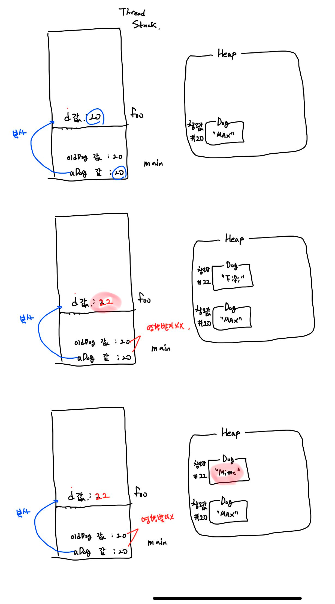

# Call By value

[[Java] Java는 Call by reference가 없다](https://deveric.tistory.com/92)

[Log in or sign up to view](https://www.facebook.com/1070166746/posts/10222585502760852/?d=n)

Java 에서는 **객체를 “참조에 의해" 전달한다고 말하는 것을 옳지 않다**고 한다.

프로그래밍 언어 디자인 상, 함수에 인자가 전달될 때, **“참조에 의해 전달된다” 라는 용어는** 호출된 함수가 **“실제 값에 대한 참조 값의 복사값” 이 아닌 “ 실제 값 에 대한 참조" 자체를 받은 경우를 의미하는 것**이다. 만약 함수에서 그 파라미터를 변경하는 경우, caller 속에서의 값이 바뀌어야 한다. 왜냐하면, 인자와 파라미터는 메모리상에 같은 곳의 값에 접근하고 있는 것이 되기 때문이다.

- 하지만  Java 의 경우 Stack 에 존재하던 참조”값”을 “복사" 하여 인자로 전달 하게 된다.
- 이는 Java의 경우 “reference” 라는 용어는 다른 언어에서 “포인터"에 가까운 것 이기 때문이다.
- Java 에서는 “참조값을 참조변수를 통해 접근" 하여 “상태를 직접 변경하는 경우"는 해당 변경이 반영될 수 있지만, 이것이 참조 자체를 전달 하기 때문이 아니라는 것.

자바 언어에서는 **객체를 by reference 로 전달하고 있지 않다**. ***“값에 의해 객체 참조"를 전달 하고 있는 것***이다.

> 즉, Java 는 call by value 방식만 있는데, 레퍼런스 “값"을 call by value 로 전달하면, 호출된 메소드 내에서 Caller 쪽에서 참조 하고 있던 오브젝트 내부의 값을 변경할 수 있다.
>
>
> 하지만 참조 자체를 전달하는 것이 아니기 때문에, 파라미터에 새로운 값을 할당해도 Caller에서의 값이 바뀌지는 않는다.
>

```java
public class foo {
	public static void main(String[] args) {
		Dog aDog = new Dog("Max");
		Dog oldDog = aDog;

		foo(aDog);

		aDog.getName().equals("Fifi"); // true

		System.out.println(aDog == oldDog); // true
	}

	public static void foo(Dog d) {
		d.getName().equals("Max"); // true
		d = new Dog("Fifi"); // 이렇게 해도 main 의 aDog 에는 아무런 변화도 없다.
		d.setName("Mime"); 
	}
}
class Dog {
	public String name;

	public Dog(String name) {
		this.name = name;
	}

	public void setName(String name) {
		this.name = name;
	}

	public String getName() {
		return name;
	}
}
```

