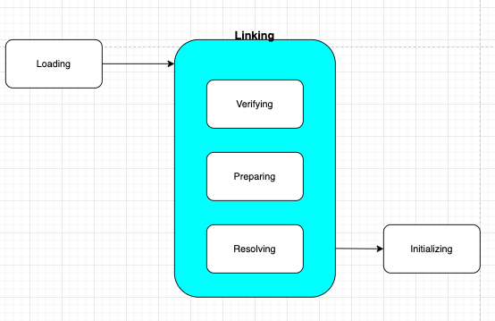

# 클래스 로더

- 자바에서는 모든 것이 객체다 → 자바에서는 클래스를 기반으로 객체를 생성한다 → 자바에선 모든 것이 클래스로부터 만들어진다.
- 자바 어플리케이션 **실행을 위해서는 클래스로더를 통해 클래스를 메모리에 로드 해야** 한다.
    - “클래스 로더” 는 **“컴파일된 자바 바이트 코드" 를 런타임 데이터 영역에 로드** → 실행 엔진이 자바 코드를 실행
- 자바 어플리케이션에서 모든 클래스들은, java.lang.ClassLoader 의 서브클래스들을 사용해서 로드된다. 그리고 이들은 클래스들을 동적으로 로드한다.
    - 즉, 컴파일 타임이 아닌 **런타임에, 클래스를 처음 참조할 때 해당 클래스를 로드하고 링크**한다
    - 클래스가 로드되었다는 것은, 이 클래스가 참조하는 모든 클래스들 역시 로드되는 것을 뜬한다. 따라서 클래스 로딩 패턴은 재귀적으로 일어나게 된다. ( 필요한 모든 클래스들이 로드되어야 하기 때문)
        - 따라서, 참조되지 않은 클래스들의 경우는 , 그들이 참조되는 시점 까지는 로드 되지 않는다.

- 클래스로딩을 최대한 효율적으로 수행하기 위해 “지연로딩"과 “캐싱" 같은 기법을 활용한다. 즉, 한번에 모든 클래스들을 로딩해오지 않는다.

> static nested class 는 마치 해당 클래스의 클래스 변수처럼 다뤄 진다고 했었다.
>
>
> 해당 클래스의 static block 으로 다뤄진다고 생각하면
>
> 아우터 클래스가 처음으로 참조되어 로딩될 때, 그 과정에서 static block 에 대한 초기화를 하기에 outer class 의 클래스 로딩 시점에 static nested class 도 로드된다고 생각할 수 있을 듯 하다.
>

## 클래스로더사이의 관계

- 클래스들끼리
    - ***계층구조를 갖는다 -*** 최상위 클래스 로더는 “부트스트랩 클래스 로더" 다.
        - Bootstrap, Extension, Application
    - ***위임 모델*** : **계층구조 바탕으로 클래스 로더끼리 로드를 위임하**는 구조로 동작한다. ( 상속 계층 구조는 아니라는 거임 )
        - 클래스 로더시 “**먼저 상위 클래스 로더를 확인" 하여 “상위 클래스 로더에 있다면 해당 클래스 사용**" 하고, **없다면 “로드를 요청받은 클래스 로더가 클래스를 로드"** 한다.
    - ***가시성 제한*** : 하위 클래스 로더는 “상위 클래스 로더의 클래스" 를 찾을 수 있으나, 상위클래스로더→하위클래스 로더로는 불가능
    - ***언로드 불가*** : 대신 클래스로더를 삭제하고 아예 새로운 클래스 로더를 생성 할 수 있다.
- 각 클래스로더는 “**로드된 클래스들을 보관하는 네임스페이스"**를 갖는다.
- 클래스 로드시 **“이미 로드된 클래스인지 확인"** 하기 위해 “**각 클래스로더의 네임스페이스에 보관된 FQCN(FullyQualifiedClassName)을 기준으로 클래스를 찾는**다.
    - 여기서 주의할 것
        - FQCN 은 같아도, “네임스페이스가 다름" —> 다른 클래스 로더가 로드한 클래스라는 것—> 다른 클래스로 간주
- 어떤 클래스 로더가 **“클래스 로드를 요청받을  때"** 일어나는 일
    - **해당 클래스가 있는지 (이전에 로드된 클래스인지) 확인**한다.
        - 이 때 순서 : **“클래스 로더 캐시" → “상위" 클래스 로더( 상위 → ...→ 부트스트랩 클래스로더 ) → “자기 자신"**
    - 없는 경우 → “파일시스템" 에서 “해당 클래스를 찾는다"
        - 찾아낸 클래스를 로드 하는 과정 : **클래스 로드, 링크, 초기화**

          


## Loading

[https://dzone.com/articles/jvm-architecture-explained](https://dzone.com/articles/jvm-architecture-explained)

[https://jenkov.com/tutorials/java-reflection/dynamic-class-loading-reloading.html](https://jenkov.com/tutorials/java-reflection/dynamic-class-loading-reloading.html)

- 로드 : JVM 의 메모리로 클래스 파일을 로드
    - Bootstrap ClassLoader : JRE 의 lib 폴더에 있는 rt.jar 파일을 뒤져 기본 자바 api 라이브러리를 로드한다. 모든 다른 클래스로더의 parent 클래스로더다.
    - Extension ClassLoader : jre/lib 의 ext 폴더에 있는 모든 확장 코어 클래스파일을 로드한다.
    - Application ClassLoader : 어플리케이션 레벨에 있는 클래스들을 로드한다. 사용자가 직접정의한 클래스파일들을 로드한다.  CLASSPATH 환경 변수에 의해 명시된
- 모든 Class 객체들은, 이를 정의한 클래스로더에 대한 참조를 하고 있다. ( 따라서 이 클래스를 클래스로드 한 클래스로더 정보를 알 수 있음 )

## Linking

- 링킹 : 로드된 모든 클래스는 링크되어야 한다. ClassLoader 인스턴스는 같은 클래스를 두번 이상 링크 할 수 없다. ( 다른 클래스로더 인스턴스를 사용해서 , 이미 이전에 클래스로더에 의해 로드된 클래스를 reload 하는 것이 가능 하다고 하는데 이에 대해서는 잘 모르겠다 )
    1. 검증 : JAVA 언어 명세, JVM 명세에 맞는 구성을 가진 클래스인지 검사.  ( 클래스 로드 전 과정 중 가장 오랜 시간 걸림)
    2. 준비 : “클래스가 필요로 하는 메모리 할당", 클래스에 정의된 “필드, 메서드, 인터페이스" 들을 나타내는 데이터 구조 준비
    3. 리졸빙 (분석) : “클래스의 상수 풀 “ 내 모든 심볼릭 레퍼런스를 다이렉트 레퍼런스로 변경

---

## Initializing

초기화 : 클래스 변수들을 적절한 값으로 초기화. static initialier들을 수행, static 필드들을 설정된 값으로 초기화. ( **JVM 은 클래스 로딩 타임에 static block 을 초기화** 한다 )

- Static block 은 클래스의 라이프 타임에서 단 한 번 실행된다.
- static block 은 클래스 로딩 시점에 실행되기 때문에, 만약 클래스 로드 시점에 수행하고 싶은 사항이 있다면 static block 내부에 정의해주는 게 좋다.

## 코드 로 본다면 - 클래스를 로드하는 다양한 방법

```java
public Class loadClass(String name);
```

loadClass 에서는 로드되는 클래스의 FQNC(Fully Qualified Name of Class) 를 갖고 Class 클래스의 객체를 리턴해준다.

- 그런데 ***이 때는 lazy initialization*** 을 한다. (즉, 이 시점에는 클래스 로딩만 하고 initialization 은 하지 않는다 )

```java
Class.forName(className, true, currentLoader)
```

- ***class 로드 및 초기화*** 해준다.

```java
MyDog dog = null 
```

코드 내에서, 클래스에 대한 참조가 등장하는 경우.

JVM 이 이 레퍼런스를 발견하면 해당 클래스를 로드하게 된다.

## static nested class의 클래스로딩? 초기화

[https://stackoverflow.com/questions/24538509/does-the-java-classloader-load-inner-classes](https://stackoverflow.com/questions/24538509/does-the-java-classloader-load-inner-classes)

[https://stackoverflow.com/questions/70324/java-inner-class-and-static-nested-class](https://stackoverflow.com/questions/70324/java-inner-class-and-static-nested-class)

사실상 코드가 컴파일 되고 나면, 이너 클래스 라는 것은 존재하지 않고, 두개의 파일이 존재하게 된다.

> ***따라서 A 가 로드 된다고 B도 로드 및 초기화 되는 것은 아니다.  ( 물론, A 에서 B or C 를 참조하고 있는 경우에는 같이 로드되겠지만 )***
>

A.class , A$B.class

예를들어 아래 클래스를 컴파일하면

```java
public class A {
    public A() {
    }

    private class C {
        public C() {
        }
    }

    private static class B {
        public B() {
        }
    }
}
```

A$B.class

```java
class A$B {
    private A$B() {
    }
}
```

A$C.class

```java
class A$C {
    private A$C(A this$0) {
        this.this$0 = this$0;
    }
}
```

- A$B.class 에서는 outer class 에 대한 참조를 갖지 않는 이유는 얘는 static inner class 라서 그러하다.
- 반면 non-static inner class 에서는 outer class 에 대한 참조를 아예 갖고 있기 때문에, 직접적으로 parent 인스턴스의 필드와 메소드에 접근이 가능한 것이다.