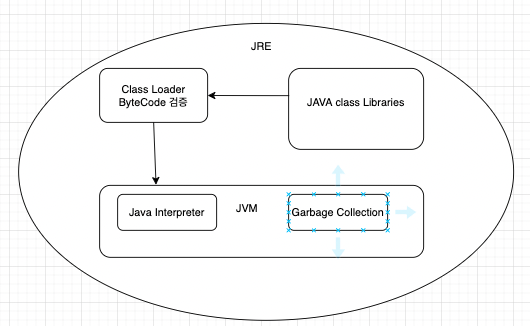
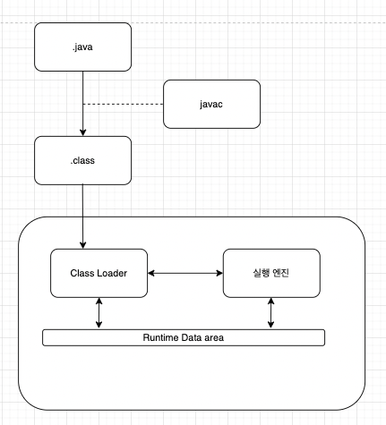
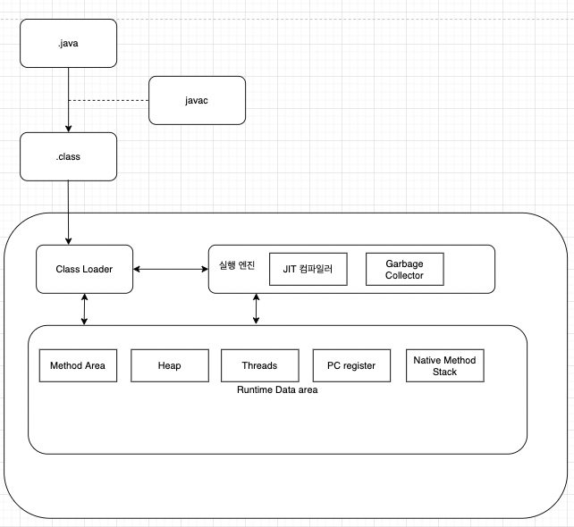
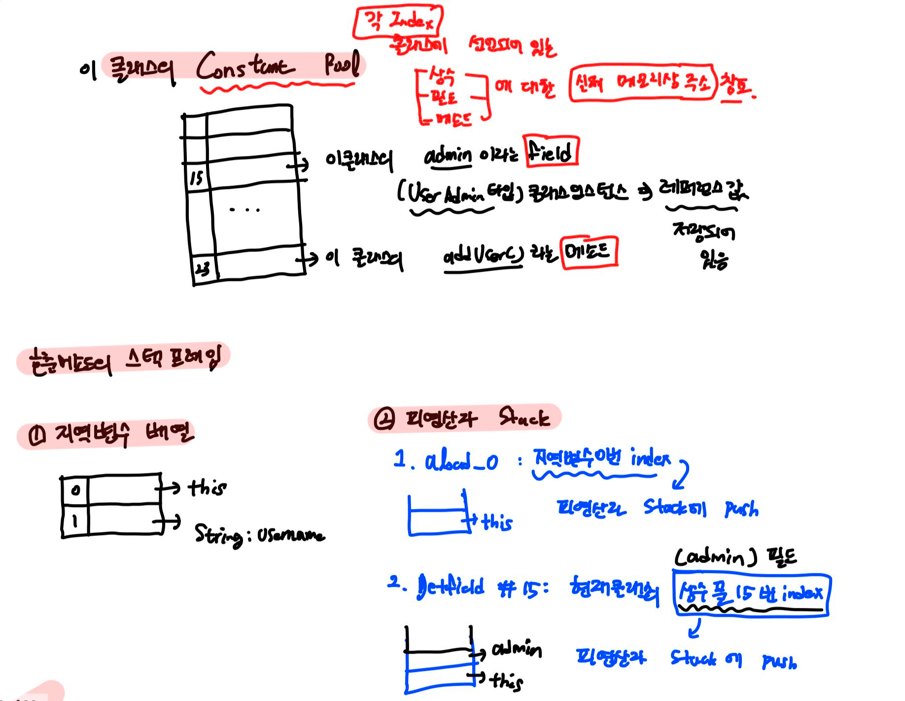

# Java 메모리 관리 그리고 메모리 구조

## 왜 중요할까?

확장가능한 방식으로 동작할 수 있는, 적절하게 튜닝된 어플리케이션을 만들기 위해서는 Java 메모리 관리에 대한 공부는 필수적이라고 한다.

아직은 그 중요성에 대해서는 경험 해 본 바가 없어 와 닿지는 않지만 생성 이후 더이상 사용 되지 않는 객체를 무한 생성하여 OOME 를 만들어 본 경험이 있다. 단순하게 Java 는 GC 를 사용하니 개발자가 직접 메모리 해제를 하지 않아도 알아서 잘 관리 될 거야 라고 생각한다면 이런 상황이 띠용? 스럽게 느껴질 것 같다.

기본적으로 **“메모리 관리 “** 라는 것은 결국, “***새로운 객체를 생성하고, 더 이상 사용 되지 않는 객체를 제거하는 과정”*** 이다.

더 이상 사용 되지 않는 객체를 적절한 시간에 해제하지 못한다면?

- 쌓이고 쌓여서 OOME 가 발생할 것이다

또는 더 이상 사용 되지 않는 객체가 생길 때 마다 GC 가 일어난다면 ?

- Stop the world! 로 인한 성능저하가 심각해질 것이다

지금은 무슨 말인지 몰라도

우리가 객체 생성과 해제와 관련하여 고려해야한다는 것을 알 수 있다.

메모리 관리를 알기 위해서는 당연히 메모리 구조에 대해 알아야 할 필요가 있다. Java 프로그램을 실행시키는 JVM 에서의 메모리 구조에 대해 알아보자.

# JVM 의 구조

[https://www.itworld.co.kr/news/110768](https://www.itworld.co.kr/news/110768)

## JVM 이란 무엇일까요

- JVM 에서는 ***바이트 코드를 기계어로 번역***한다.
- **JVM 은 JRE(Java Runtime Environment) 에 포함**되어있다.
- 컴파일된 자바 코드가 어느 운영체제 상에서도 실행될 수 있게 하는 것.
- 메모리 관리 및 최적화를 한다. ( 하지만 이 JVM 의 메모리 관리와 관련된 설정값들은 개발자들이 적절하게 설정 해줘야 최적화가 된다 )

### JRE?? ( 자바 런타임 환경 )

- JRE 에는 **JVM 외에도 필수 라이브러리,자바 클래스 로더 등이 포함**되어있다.
    - ( 클래스로더가 JRE 에 있는 것인지 JVM에 있는것인지 명확구분하기 어려운 듯 하다.
- 자바런타임 환경?
    - 자바의 경우, OS 위에  따로 꾸려지는 “소프트웨어 계층" 인 자바 런타임 환경이 존재한다.
    - JRE 는 자바 프로그램을 위한 일종의 운영체제 라고 볼 수 있다.
- Java 의 경우에는, 컴파일 결과, JVM 에 의한 번역이 필요한 “바이트 코드" 를 생성한다. → JRE 의 클래스로더는 이 자바 코드를 메모리로 로드한다.
    - (참고)C 언어의 경우에는, 컴파일 결과 특정 플랫폼(OS) 에 대한 기계어 코드를 생성한다.
- JRE 는 “자바 코드"를 받아, “필요한 라이브러리와 결합" 한 다음 ***이 코드를 실행할 JVM을 시작***한다.
    - **클래스 로더 : 컴파일된 자바코드를 메모리로 로드하고, 적절한 자바 클래스 라이브러리에 이 코드를 연결한다.**

## JVM 의 동작방식?

[https://www.guru99.com/java-virtual-machine-jvm.html](https://www.guru99.com/java-virtual-machine-jvm.html)

1. byteCode 로 컴파일 → 2. Class Loader 에 의해 메모리로 로드 되면서 Bytecode verifier 에 의해 보안과 관련한 위반을 검증한다. → 3. 실행 엔진이 Bytecode를 Native Machine code 로 번역되며 실행됨 (JIT. C 언어와 달리 이런식으로 실행시킬 때 컴파일링 하는부분이 존재하기에 상대적으로 느림_참고로 JIT 는 JVM의 일부임)

# JVM 의 메모리

메모리 관리는 JVM 내부의 GC 를 통해 이루어진다고 한다.

그럼 그 생성되는 객체들이 올라가는 메모리, 그리고 로드된 클래스의 정보는 어떻게 관리되고 있는걸까??

JVM의 메모리 구조부터 먼저 파악해보자.

[https://www.betsol.com/blog/java-memory-management-for-java-virtual-machine-jvm/](https://www.betsol.com/blog/java-memory-management-for-java-virtual-machine-jvm/)

## 런타임 데이터 영역

JVM이 OS 위에서 실행되면서 OS로부터 할당받는 메모리 영역이다.

여기에는 **“스레드들이 공유하는 영역"** 과 **“스레드 마다 생성되는 영역"** 으로 나뉜다.

### 🔗  스레드 마다 생성되는 영역

> PC 레지스터
>
> - ***스레드가 시작될 때*** 생성
> - **현재 수행중인 JVM 명령의 주소를 가리킨**다.

> JVM stack
>
> - **스레드가 시작 될 때** 생성
> - **스택 프레임이라는 구조체를 저장**한다
> - 스택 프레임?
    >     - JVM 내에서 “**메소드가 실행 될 때 마다!” 하나의 프레임이 생성**된다.
>     - 생성된 스택 프레임은 “해당 스레드의 JVM 스택" 에 추가된다.
>     - **메소드가 종료 → 해당 스택 프레임 제거**
> - 스택 프레임의 구조(저장되는 데이터)
    >     - Local Variable Array, Operand Stack, Reference to Constant Pool
>     - **지역 변수 배열**
        >         - 이 메소드가 속해 있는 클래스 인스턴스의 ***this 레퍼런스 ( 묵시적으로 해당 인스턴스에 대한 this 를 항상 갖고 있음. 그러니까 메소드 파라미터 이름과 겹치지 않는 한, 인스턴스의 필드이름으로 메소드 내부에서 참조가 가능한 것)***
>         - ***메소드에 전달된 파라미터들***
>         - ***메소드의 지역변수들***
>     - **피연산자 스택**
        >         - ***메소드의 실제 작업공간***
>         - 각 메소드는 **“피연산자 스택”과 “지역 변수 배열"사이에서 데이터를 교환**
>     - Reference to Constant Pool : 현재 실행중인 **메소드가 속한 클래스의 런타임 상수 풀에 대한 참조값**

> Native Method stack
>
> - **자바 외의 언어로 작성된 네이티브 코드를 위한 스택**
> - JNI 를 통해 호출하는 C, C++ 코드를 수행하기 위한 스택이다.
> - native stack 에 대한 성능은 OS 에 달려있다.

### 🔗 모든 스레드가 공유해서 사용하는 영역

> 레지스터를 사용하는 x86 아키텍쳐와 달리 JVM 은 레지스터를 사용하지 않고, 자체적으로 메모리를 관리한다. 따라서 “실제 메모리 주소 대신" 인덱스 번호를 사용한다.
>
>
> 이 때, 인덱스 번호는 “클래스가 갖는 상수 풀” 의 인덱스다.
>
> JVM 은 각 클래스마다 상수 풀을 생성하여, 레퍼런스를 보관하고 있다.
>

> Heap 영역 ( 기본 크기 : 64MB )
>
> - 런타임에 동적으로 할당된다.
> - 각종 객체와 배열 인스턴스가 저장되는 곳이다.  힙 영역의 객체들은 스토리지 관리 시스템(gc)에 의해 자동으로 회수된다.
> - 어플리케이션이 시작될 때 사이즈가 초기화 되기는 하지만, 동적으로 커질 수 있다.
> - heap size 는 VM 옵션에 명시할 수도 있음.
> - GC 전략에 따라서 고정된 크기 또는 가변 크기를 가질 수 있음
> - 기본적으로 max heap size 는 64 MB 로 세팅되어있다고 한다.

> **Method Area**
>
> - 어플리케이션에서 사용되는 ***클래스, 메소드에 대한 메타데이터를 포함***하고 있다.
    >     - **클래스 구조 ( 런타임 상수, 정적 변수 등 ), 메소드 및 생성자에 대한 코드를** 저장
            >         - **객체에대한 Reference(** , 필드 정보, 런타임 상수 풀, 메소드 정보, 메소드 테이블 등
> - **JAVA 8 이전에는 Perm Gen 공간에 있던 영역**.
>
> > 참고!! **Java 8 에서는 Perm Gen —> Metaspace**
> >
> > - Why??
      > >     - PermGen은 고정된 사이즈를 가져야 했는데, 그 사이즈를 예측하기가 어려웠기 때문에  PermGen 에서 OOME 가 자주 발생했음.
> > - Perm Gen 은 항상 고정된 max 사이즈를 갖고 있던 것과 달리 Metaspace 는 기본으로 제한된 크기를 갖고 있지 않다 . 또한 필요한만큼 자동으로 사이즈를 늘릴 수 있다 ( OS 가 제공해주는 범위까지 )
> > - **Perm Gen 은 Java heap 공간의 일부였었던** 것 과 달리, **메타스페이스는 힙의 일부가 아님**.
      > >     - **Native memory 에 속하게** 되었음. → 따라서 **host OS 에 의해 공간의 사이즈가 관리**된다.
> > - 메타스페이스로 변하면서 , 클래스 로더가 살아있는한, 메타 스페이스 내부의 메타데이터들 역시 해제되지 않고 살아있게 되었음. (
> - *Perm gen 객체들은 Full garbage collection 시 가비지 컬렉션의 대상*이 된다. 하지만 밴더사 마다 다를 수 있음. ( 이건 추후 GC에서 )
> - JVM 밴더 마다 다양한 형태로 구현 가능
>
> > ***Runtime Constant Pool***
> >
> >
> > > 예시) Naver D2 에 있는 예시  ([https://d2.naver.com/helloworld/1230] )
> > >
> > >
> > > 
> > >
> > - 메소드 영역에 포한되는 영역이다
> > - 각 클래스, 인터페이스의 **“상수" 뿐만 아니**라, **메소드,필드**에 해단 모든 “레퍼런스"까지 담고 있는 **“테이블"** 이다.
> > - 어떤 메소드 또는 필드를 참조할 때 JVM 은 **런타임 상수 풀 을 통해 해당 메소드 또는 필드의 실제 메모리상 주소를 찾아** 참조한다. → JVM 에서는 이렇게 실제 메모리상 주소를 찾아 참조하고 있는 테이블의 “인덱스" 를 사용한다.

---
