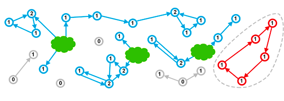
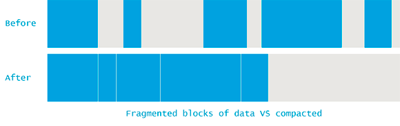
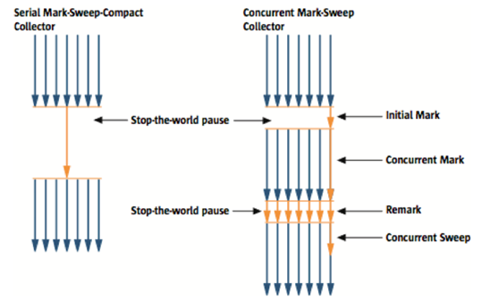
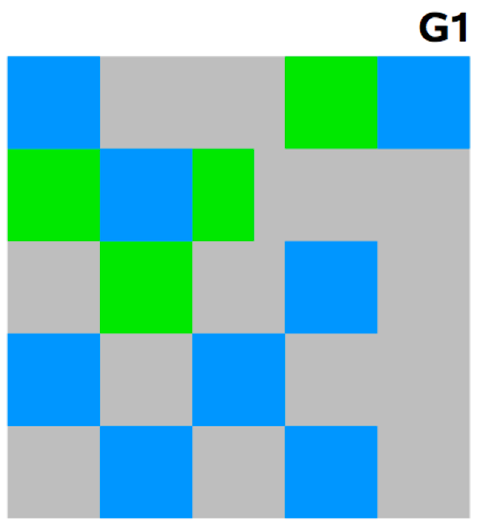

# GC 가 왜 있어야 할까?  GC는 왜 알아야 할까?

C나 C++ 같은 언어에서는, 객체의 생성과 파괴에 대한 책임을 개발자가 갖고 있다. **개발자가 어떤 객체를 파괴하는 것을 까먹을 경우,** **그 객체에 할당된 메모리가 해제되지 않는 상황**이 생긴다. 이런 **상황이 많이 일어난다면, 시스템 내의 사용중인(하지만 실질적으로는 사용되지 않는...) 메모리가 계속해서 증가**하여 결국에는 할당 할 메모리가 남아있지 않게 된다. 이런 상황을 ***“메모리 누수가 있다"*** 라고 한다. 어느 시점부터는 새로운 객체를 생성할 충분한 메모리가 없게 될 것이고, 이 경우 프로그램은 OOME(OutOfMemoryErrors)로 인해 비정상 종료하게 된다.

이 문제는 **메모리 해제하는 것을 까먹었기 때문에,  즉 프로그래머가 사람이기 때문에 발생**하게 되는 상황이다.

그렇다면 ***만약 더이상 사용 되지 않는 메모리를 자동으로 해제해준다면*** 어떨까?

Java에서는 garbage collection 이 일어나 프로그램의 라이프 타임동안 자동으로 메모리를 관리해 준다. 따라서 개발자가 직접 객체를 release 하는 책임을 갖지 않아도 되며 이는 어찌보면 메모리 누수를 피할 수도 있는 것 처럼 보인다.

하지만 실제로 가비지 컬렉션이 일어나는 동안 “stop the world” 라는 것이 일어나기 때문에 프로그램의 성능에 영향을 미친다. 또한 가비지 컬렉션이 일어나기전에 OOME 가 발생할 수 있기 때문에 개발자는 여전히 메모리 상에 존재하는 객체들에 대해 고려하며 개발해야한다. **특히 Java의 경우 해당 객체가 여전히 “사용되고 있는지" 가 해당 객체가 Garbage 가 될지 말지에 영향을 끼치기 때문에 스코프를 잘 고려해 주어야 한다고 생각한다**

[NAVER D2](https://d2.naver.com/helloworld/1329)

[What Is Garbage Collection? | Plumbr - User Experience & Application Performance Monitoring](https://plumbr.io/handbook/what-is-garbage-collection)

# GC 에 대해 들어가자

## Stop the world

GC에 대해 알아보기 전 “stop-the-world” 에 대해 알아보자.

이는 GC를 실행하기 위해 JVM이 어플리케이션 실행을 멈추는 것이다.

> **GC를 실행하는 스레드를 제외한 나머지 스레드 모두가 작업을 멈춘다.**
>

GC 에는 다양한 알고리즘이 존재하는데 어떤 알고리즘을 사용하더라도 stop-the-world 는 발생한다.

**주로 GC 튜닝이란 “stop-the-world” 시간을 줄이는 것을 의미**한다.

- 그런데.. **왜 collection 이 일어난다고 Stop-the-world 를 해야하는걸까???🤔**
    - JVM 의 GC 에서는 **reachable 객체임을 확인함 + 레퍼런스 카운트**를 하는데, 계속해서 참조상황이 변하고 있는 와중에 이런 것을 할 수는 없기 때문이다.

---

GC 는 garbage 를 청소(?메모리해제?) 한다.

그렇다면 Garbage 는 어떻게 알아내는걸까??

> 🤔 **가비지를 알아낸다 보다는, 살아있는 객체들을 파악해나가고 그 외의 것들은 가비지 로 처리하는 것 같다.**
>

쉽게는 레퍼런스 카운팅 이라는 것을 통해서 가비지인지 파악하는 방법이 있다.

## Reference Counting

객체를 참조하는 수 ( reference count) 를 통해 메모리를 관리한다. 최종적으로 해당 객체의 레퍼런스 카운트가 0이 되면, 즉 더이상 참조되지 않을 경우 garbage가 되어  gc에 의해 정리된다.

초록색 구름같은 부분에서 나온 화살표가 가리키고 있는 것은 이 객체가 개발자에 의해 여전히 사용 중인 것임을 가리킨다.  동그라미 안에는 이들에 대한 레퍼런스 횟수가 적혀 있다.

> 문제 상황 : 순환참조
>

순환 참조는, 서로를 참조하고 있는 이 객체들 중 어느 누구도 더이상 살아있는 scope에 들어있지 않음에도( 이들 중 어느누구도 더 이상 사용 중인 객체가 아님에도 ) , 이들 참조관계에 싸이클이 존재하여 어느누구도 레퍼런스 카운트가 0이 되지 않는 상황을 말한다.

이는 **레퍼런스 카운트의 한계로 이런 상황으로 인해 “메모리 누수"가 발생**한다.

따라서 이를 해결하는 방법 ( cycle 탐색을 위한 별도 알고리즘을 둔다거나..) 이 필요하다.

---

단순히 레퍼런스 카운팅을 사용하는 것은 좋지 못한 방법 같다.

실제로는 Marking이라고 부르는 과정을 통해 살아 있는 객체를 찾아낸다고 한다.

## Reachable 객체를 Marking 하기

JVM 의 GC 알고리즘들에서는 살아있는 객체들을 찾아내는 것 부터 시작한다.

GC 에서는 먼저 Garbage collection roots 라는 객체들부터 정의하고 시작한다.

> Garbage Collection root : gc 프로세스의 시작점
>
> - 모든 객체들은 직접 또는 간접적으로 GC root에 의해 참조되고 있다.
    >     - 종류
            >         - 지역 변수
>         - Active threads
>         - Static fields
>         - JNI references
            >
            >         등..
>
>
>     [https://www.baeldung.com/java-gc-roots](https://www.baeldung.com/java-gc-roots)
>
- Marking : GC roots 에서부터 시작해 객체 그래프를 따라( root 로부터의 참조들_ex.인스턴스 필드..을 따라 ) 탐색하며 모든 reachable 객체들에 “살아있다 라는 마킹” 을 한다
    - 마킹 단계가 끝나면, 살아있는 모든 객체는 마크된 상태가 된다. 따라서 다른 객체들은 GC roots 로부터 Uncreachable 하다는 것이고, 이는 현재 어플리케이션에서는 unrechable 객체들을 더이상 사용하지 않는다는 것을 의미한다. 이는 가비지에 해당하는 것이고 GC 에서는 다음단계에서 이들을 제거해줘야 한다.
    - 마킹이 일어나는 동안 stop-the-world pause 가 일어나는데, 이 pause의 지속시간을 결정하는 요인은 다음과 같다.
        - heap 내의 객체의 수 ?? ❌
        - heap 의 사이즈  ❌
        - 살아있는 객체의 수 ⭕️

      따라서 단지 힙의 사이즈를 늘리는 것 만으로는 직접적으로 마킹 단계에 걸리는 시간에 영향을 끼치진 않는다고 한다. ( 살아있는 객체의 수가 늘어난다면 영향이 있을 듯 하다 )

즉 이 과정에서는 이제 reachable 객체와 unreachable 객체를 확인하기 때문에 더이상 레퍼런스 카운팅에서 일어나던 메모리 누수는 없다.

하지만 문제는, collection 이 일어나기 위해서는 다른 application thread 들이 멈춰야 한다. ( 참조 상태가 계속 변하고 있는 중인데 레퍼런스 카운트를 세는 것은 말이 안되니까 )

각종 GC 들에서는 이러한 stop-the-world 의 시간을 줄이려고 노력하고 있다.

## 사용되지 않는 객체 제거하기

GC 알고리즘마다 사용되지 않는 객체를 제거하는 방식이 조금씩 다르지만 마킹 이후의 과정은 다음과 같이 나눠볼 수 있다. .

- Sweeping
- Compacting
- Copying

---

## Memory fragmentation 과 Compaction

Sweeping 이 일어날 때 JVM 에서는 unreachable 객체들로 채워져 있는 공간을 다른 목적으로 사용될 수 있도록(새로운 객체를 위해..) 해제 해 줘야 한다.

이런 과정에서 Memory fragmentation(메모리 단편화) 가 발생하는데 이는 두 가지 문제점을 낳는다.

- Write 연산에 걸리는 시간이 증가한다.
    - 현재 필요한 사이즈의 free block 을 찾는데 시간이 걸림.
- 새로운 객체를 생성 할 때면, JVM 은 연속된 블락으로 이루어진 메모리를 할당해준다. 그런데 메모리 단편화 상황의 문제점은, 그 free block 조각 조각들 을 합한다면, 그 객체에게 할당해주기에 충분한 메모리이지만, 개개의 조각으로는 새로 생성되는 객체를 담을만큼 충분하지 않다는 것이다.

따라서 JVM 에서는 GC가 일어나는 동안 mark and sweep 이외에도 “메모리 최적화"를 통해, reachable 객체들을 한 곳에 연속적으로 몰아주는 컴팩션 을 해 준다.

---

# Heap 메모리

## 두 개의 영역

> 앞서 GC 동안 Stop-The-World 를 한다고 했다.
>
>
> 그렇다면.. 🤔 ***시스템 내에 객체가 많이 존재할 수록 garbage 를 모으는데 ( 또는 살아있는 모든 객체들을 marking 하는데 ) 걸리는 시간이 늘어나지 않을까??***
>
> **다행히 JVM 은 메모리 영역을 쪼개놓았**고, 해당 영역에서 관리하는 객체에 대한 GC 가 일어나는 식으로 동작한다.
>
> 이에 대해 살펴보자.
>

Heap 영역은 두 개의 영역으로 나뉘어져 있는데, 이는 객체 할당에서 관찰된 특징 때문에 생긴 가설('weak generational hypothesis’) 때문이다.

- **대부분의 객체는 금방 unreachable 해 진다**.
- **오래된 객체에서 젊은 객체로의 참조는 아주 적게 존재**한다.

이렇게 나누어진 공간은 각각 Young, Old Generation 이라고 불린다.

각 공간은 개별적으로 gc 가 일어나기 때문에, 서로 다른 알고리즘을 통해 GC 성능을 높일 수도 있다.

- **Young Generation 영역 : 새롭게 생성한 객체 대부분이 여기에 위치한다. 대부분의 객체가 접근 불가능해지기 때문에 많은 객체가 Young 에 생성되었다가 사라진다.**
    - 이 영역에 대한 GC가 일어나는 것 →  Minor GC가 발생한다고 함
- **Old Generation 영역 : *Young 에서 살아남은 객체들(즉 오랜 시간 Unreachable 해 지지 않은 객체들) 이 여기로 복사*된다.**
    - 대부분 Young 영역보다 큰 공간을 할당.
    - 크기가 큰 만큼 이곳에 대한 GC 가 일어나면 효율이 떨어질 것. Young 보다 GC 가 적게 발생.
    - 이 영역에 대한 GC가 일어나는 것 →  Major GC( Full GC) 가 발생한다고 함
- 참고로 Java8 이전 JVM 에는 Permanent Generation 이라는 영역도 존재 했는데
    - 오해하면 안 되는게, “Old Generation 에서 살아남은 애들이 오는 곳인가봐..” 가 아니라는 것!!
    - 이 영역도 GC 의 대상
        - 여기서 일어나는 GC ⇒ Major GC 에 포함

---

## Young 영역

- 객체가 제일 먼저 생성되는 영역이다.
- 아까도 말했지만 여기서 일어나는 GC → Minor GC
- 3가지 영역으로 나뉜다.
    - Eden
    - Suvivor1, Survivor2

> ***Survivor 영역 중 하나는 반드시 비어있는 상태로 남아있어야 한다***
>
> - 비정상 상황
    >     - Survivor 1, 2 모두에 데이터가 존재
>     - Survivor 1, 2 모두 사용량이 0

각 영역에 객체가 위치하게 되는 순서는 이렇다.

1. 새로 생성하는 대부분의 객체는 Eden 에 위치
2. Eden 에서 GC 발생 + 비어있지 않은 Survivor 에서도 GC —> 비어있는 Survivor 영역으로 이동
3. 하나의 Survivor 영역이 가득차면, 여기서 살아남은 객체를 다른 Survivor 로 이동시켜, 가득 차 있던 Survivor 은 아무 데이터도 없는 상태가 되게 한다.

위의 과정을 반복하다보면, Survivor 영역에 존재하는 어떤 한계점(threshold) 에 도달한 객체들은 ( 예를들어 15번의 GC cycle 동안 살아남음) “오랜 시간 사용될 객체" 라고 예상되어진다. 따라서 이런 객체들은  Old generation 으로 승급(?promoted) 한다.

- 즉 GC 는 어떤 객체의 collection 에서 살아남은 횟수를 추적하고 있다. 이걸 age 라고 하면, GC가 끝날 때 마다 각 객체들은 한 살 씩 더 먹는다고 생각하면 된다.

> 참고로 이 Threshold 는 JVM 에 의해 동적으로 조정되고 있는데, 우리가 직접 max 값을 세팅 해 줄 수 있음. 대부분 JVM의 기본 threshold 값은 15 GC cycle 이라고 함 )
>
- 그리고 Survivor 영역에서 Young generation 에서 살아있는 모든 객체들을 가져가기에 공간이 충분하지 않은 경우에도 Promotion 이 발생한다고 한다.

---

## Old 영역

- 데이터가 가득차면 GC 를 실행한다. 이 영역에는 Young 에 있는 객체들보다 garbage 가 될 확률이 적은 객체들이 존재한다.
    - 즉, Old generation 에 존재하는 대부분의 객체들은 Young 처럼 “곧 사라질 애들” 이 아니라 “ 오랫동안 살아있을 애들" 이라고 생각 되는 것들이기 때문에 여기서는 Young 에서 일어나던 공간사이에 객체를 복사시키는 과정보다는 ***“단편화를 최소화 시키는 과정" 이 일어난***다.
        1. GC root 를 통해 접근 가능한 모든 객체들을 mark
        2. unrechable 객체들은 삭제
        3. 살아있는 객체들이 연속적으로 존재하게 하기 위한 Compaction - 객체들이 연속된 공간에서 존재하도록 Copy. ( Old 영역의 시작점 부터 채워나간다 )
- Young 에서 GC 보다 적은 횟수의 GC 가 일어난다.
- GC 방식에 따라 처리가 달라진다. 우리가 말하던 GC 방식이 다르다는 것은 Old 영역의 GC 방식이 다름을 의미한다.

  다양한 GC 방식들이 있지만 ...😥

    - Serial GC
    - Parallel GC
    - G1 GC

---

# Old 영역의 각종 GC

## Serial GC

Old 영역의 GC 가 Serial GC 방식인 경우 **mark-sweep-compact** 라는 알고리즘을 사용한다.

이 알고리즘의 과정은 다음과 같다.

1. Old 영역에서 살아있는 개체를 식별 (Mark)
2. heap 의 앞 부분부터 확인하여, 살아있는 것만을 남긴다 ( sweep)
3. 메모리 **컴팩션을 진행**한다 (스위핑 과정 이후 메모리 단편화가 일어나겠죠?)

- 장단점
    - CPU 코어가 하나만 있을 때 사용하기 위해 만들어진 방식
    - 성능이 매우 좋지 않다.

## Parallel GC

- Serial GC 는 GC 처리 스레드가 하나인 것에 비해, Parallel GC 는 GC 처리 스레드가 “여러개"
- 따라서 Serial GC 보다 빠른 처리가 가능하다.
- 장단점
    - 스레드가 여러개라고 하니, 코어의 개수가 많을 때 유리하다.
    - **하지만 collection 의 모든 과정이 일어나는 동안 어떤 interruption 도 일어나면 안되기( interrupt 라는 것은 여러 태스크에서 cpu 를 공유하면서 다른 태스크에서도 발생 할 수 있는 것으로 알고 있다.) 때문에, 매우 긴 stop - the -world 시간**을 갖는다.

## Parallel Old GC

- JDK 5 update 6 부터 제공한 GC 방식

이 방식은 Mark-Summary-Compaction 단계를 거친다.

1. Old 영역에서 살아있는 개체를 식별 (Mark)
2. GC 를 수행했던 영역에 대해 별도로, 살아있는 객체를 식별한다.
3. 메모리 컴팩션을 진행한다

## CMS GC (Concurrent Mark Sweep)

> Old generation 에서의 collection 동안 일어나는 긴 stop-the-world 를 피하기 위해 만들어졌다.
>
>
> 다른 스레드가 실행하는 동안 mark, sweep 을 하는 과정들이 존재하기 때문에 **stop-the-world 시간이 짧다는 특징이 있다.**
>

[http://java.sun.com/j2se/reference/whitepapers/memorymanagement_whitepaper.pdf](http://java.sun.com/j2se/reference/whitepapers/memorymanagement_whitepaper.pdf)

Initial Mark, Remark 동안은 stop-the-world 를 하지만

Concurrent Mark,Sweep 는 다른 스레드가 실행중인 상태에서도 동시에 진행한다.

- Initial Mark 에는 클래스로더에서 가장 가까운 객체 중 살아 있는 객체를 찾는 것 만을 하기 때문에 매우 짧은 시간이 걸린다.
- Concurrent Mark 에서는 해당 마크에서 살아있다고 확인한 객체들을 루트로하여 이들이 참조하고 있는 객체들을 따라가 확인한다.
- Remark : Concurrent mark 에서 새로 추가 or 참조가 끊긴 객체를 확인
- Concurrent Sweep : 쓰레기를 정리한다.

> 단점
>
> - 다른 GC 방식보다 메모리,CPU 를 더 많이 사용한다
    >     - 즉, 현재 머신의 물리적인 코어의 1/4 정도를 GC 알고리즘에 사용하게 된다.
> - 컴팩션 단계는 기본으로 제공되지 않는다. → 메모리 fragment가 매우 많은 상황 → 컴팩션이 필요하니 나중에라도 컴팩션을 하게 되면, 다른 GC 에서 일어나던 stop-the-world 시간보다 이 때 GC 에서 이 compaction 실행하는데 걸리는 stop-the-world 시간이 더 길수도 있다. 따라서 Compaction 작업의 횟수, 걸리는 시간을 확인하며 진행해야한다.
    >     - 기본적으로 free-list (

---

## G1 GC

- G1 GC 는 CMS 처럼 이 역시 멀티 프로세스 머신을 위해 만들어졌으며 CMS collector 를 대체하기 위해 만들어졌다고도 볼 수 있다. 성능면에서 훨씬 효율적이다.

앞서 얘기한 Young, Old 영역을 머리속에서 지우자.

- 전통적인 GC의 heap 구조와 다른 모습이다. 각 영역의 사이즈는 필요에 따라 동적으로 바뀔 수 있다.
- 물리적으로 각 영역의 개념이 존재하는 것은 아니지만, 메모리 할당, survivor 공간으로 카피, old generation 으로 이동하는 등의 개념은 존재한다.

여기서는 heap 영역을 동일한 사이즈의 region들로 쪼개놓는다. 각 region은 가상 메모리상에서 연속적인 공간이다. 각 region은 eden, survivor, old 영역 중 하나에 해당된다.

출처: "The Garbage-First Garbage Collector" (TS-5419), JavaOne 2008, p. 19

- 메모리가 바둑판과 같다고 생각 할 때, 각 영역에 객체를 할당하고 GC 를 실행 → 해당 영역이 꽉 차면 다른 영역에서 객체를 할당하고 GC 실행.
- Garbage Collection 수행 시 , concurrent global marking을 통해 heap 전체에서 객체의 생존 여부를 파악 한다.
    - 이 과정을 끝내면 어떤 영역이 empty 한지 알고 있다.
    - *이를 통해, 살아있는 객체가 최대한 적게 들어있는 region 을 수집한다.  이러한 영역을 먼저 collect 한다*.

> **최대 장점 :  G1 GC는 CMS GC, Parallel Old gc 에 비해 stop-the-world 가 예측 가능한 시간 안에 이루어진다**.
>

# 참조

[NAVER D2](https://d2.naver.com/helloworld/1329)

[GC Algorithms: Basics | Plumbr - User Experience & Application Performance Monitoring](https://plumbr.io/handbook/garbage-collection-algorithms)

[Luavis' Dev Story - G1: Garbage first garbage collector](https://luavis.me/server/g1-gc)

## 추가적으로 공부가 필요하다고 생각되는 부분

- G1이 중요하다고 하는데 G1에 대한 조사를 거의 하지 못함.
- Recachability ?
- GC root ?

[NAVER D2](https://d2.naver.com/helloworld/329631)

