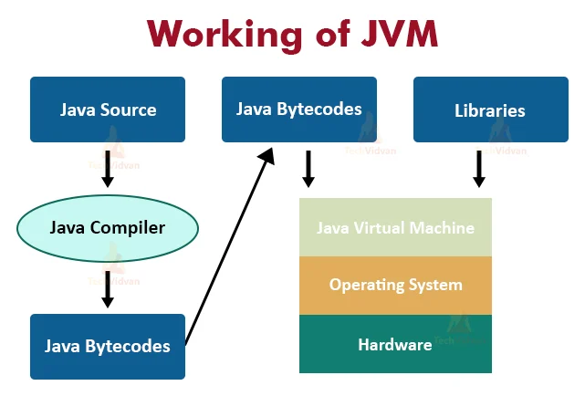

# JVM

## 스터디 날짜

2022/04/26

## 0. table
1. JVM 은 무엇인가?
2. JVM 이 하는 역할은 무엇인가
3. JVM 의 필요성
4. JVM 3 Architecture in Java
   - ClassLoader
   - Memory Area
   - Execution Engine

5. call by value _vs_ vall by reference


### 1. JVM 은 무엇인가?
자바는 source code 를 실행하기 전에 compile 과 interpret 2개의 과정이 필요하다
1. compiler : Java program 을 Java Byte Code(Binary form) 으로 compile 을 한다.


- Java ByteCode : Java Virtual machine(JVM) 에 사용되는 machine language(아직은 컴퓨터가 읽을수 없는 언어)
  - 컴퓨터가 읽게 하기 위해서 Interpreter 가 필요하다.

2. Special Java Interpreter : compiled binary byte code 를 specific machine languate 로 convert 한다.

즉 JVM 을 통해 source code 를 compile 하고 interpret 하여 컴퓨터가 이해할 수 있게 바꾸는 역할을 한다.


### 2. JVM 이 하는 역할은 무엇인가?
Java application 은 **WORA**(Write One Run Anywhere)입니다. 즉 Java program 은 한번만 적으면 되고, 이것은 Java program 에 변화를 주지 않으면서 다른 platform 에서도 돌아가야 합니다.

java file 을 compile 할때 compiler 는 .class file(byte-code 포함) 을 만듭니다. 이때 같은 이름의 .java file 과 함께 만듭니다.

OS가 다 달라도 JVM 버전이 OS마다 있기 때문에 JVM은 OS에 의존적이지만 자바 파일은 OS에 의존적이지 않고 JVM에서 실행될 수 있는 것입니다.(WORA 의미)
- Kotlin과 Java 소스 코드가 상호 운용이 가능한 이유도 Kotlin으로 작성한 내용이 결국에 JVM에 의해 ByteCode로 변환되기 때문



### 3. JVM 의 필요성
프로그램을 돌리기 위해 JVM 은 많은 역할을 수행합니다.
- Loads the code.
- Verifies code.
- Executes the code.
- Provides a run-time environment for various applications.
- JVM provides a Memory area.
- Provides a Register set.
- JVM provides the garbage collection heap.
- Reports fatal errors.
- Provides a class file format

### 4. JVM 3 Architecture in Java
JVM Architecture 에는 3개의 main subsystem 이 존재합니다.
1. ClassLoader

2. Memory Area

3. Execution Engine

### 4.1.1 Java ClassLoader
classLoader 는 class 를 memory 에 load 하는 JVM Architecture 의 일부이다.

모든 JVM 은 ClassLoader 로 구성되어 이고, 그 안에는 built-in 된 3개의 classloaders 가 존재한다.


**1. Bootstrap classLoader**
   이것은 Extenstion classloader 의 super class 이다. 이것은 rt.jar file 을 load 한다.
   1. 최상위 클래스 로더로 유일하게 JAVA 가 아니라 네이티브 코드로 구현이 되어있다.
   2. JVM이 실행될 때 같이 메모리에 올라간다
   3. Object 클래스를 비롯하여 JAVA API 들을 로드한다.
**2. Extenstion ClassLoader**
   이것은 현재 directory 에 있는 jar files 를 load 하는 classloader 이다. 이것은 Bootstrap 의 child 이고, System classloader 의 parent 이다
   4. 기본 JAVA API 를 제외한 확장 클래스들을 로드한다(다양한 보안 확장기능 로드)
**3. System/Application ClassLoader**
   이것은 classpath 에서 class files 을 load 하는 classLoader 이다. 이것은 extension 의 child 이다.
   5. 어플리케이션의 클래스들을 로드한다
   6. 사용자가 지정한 classpath 내의 클래스들을 로드한다.

```java
public class Test1 {
    public static void main(String[] args) {

        Class c = Test1.class;

        //Application/System classloader will load this class
        System.out.println(c.getClassLoader());

        //If we print the classloader name of String, it will print null because it is an
        //in-built class which is present in rt.jar, Bootstrap classloader loads it.
        System.out.println(String.class.getClassLoader());
    }
}
```


### 4.1.2 ClassLoader 과정
이 3개의 ClassLoader 의 중요한 기능은 Initialization, Loading, Linking 이다.


**1. Loading**

**클래스 파일을 가져와서 JVM 메모리에 로드한다.**

이 작업은 file 을 실행하기 위해 secondary memory 에서 main memory(RAM) 로 load 하는 작업입니다.

> Classloader 는 .class file 을 읽고, 그 에 상응하는 binary data 를 만들고, 이것을 method area 에 저장합니다.

> JVM 은 method area 에 각각의 .class file 에 맞는 정보를 저장합니다. 이 정보에는
> - fully qualified name of the loaded class 와 its immediate parent class
> - .class file 이 인터페이스인지 enum 인지 class 판단한다.
> - Modifier, Variables and Method information, etc.

> .class file 을 loading 한 후 JVM 은 이 file 을 heap memory 에 represent 하기 위해 class 유형의 객체(object) 를 만든다.

> .class 파일을 로드한 후 JVM은 힙 메모리에 이 파일을 나타내기 위해 Class 유형의 객체를 생성합니다.

> 프로그래머는 이 클래스 오브젝트를 class level information 을 얻기 위해 사용할 수 있다.(클래스 이름, parent 이름, methods, variable information 등)

> 이 Object reference 를 얻기위 해 우리는 getClass() method 를 사용할 수 있다.

**2. Linking**

   1. Verifying
      - .class file 이 자바 언어 명세(Java Language Specification) 및 JVM 명세에 명시된 대로 구성되어 있는지 검사합니다.
      - verification 에 실패시 java.lang.Verify Exception 을 얻게 됩니다.
   2. Preparing
      - 클래스가 필요로 하는 메모리를 할당한다. 필요한 메모리란 클래스에서 정의된 필드, 메서드, 인터페이스들을 나타내는 데이터 구조들 등등을 말한다.
   3. Resolving
      - symbolic references(참조하는 대상의 이름을 지칭) 를 direct references 로 변경하는 과정이다.
      - method area 에서 찾아 참조된 엔터티를 찾습니다.
      
**3. Initialization**

   - 이것은 모든 static variables(with their specific values in the block of the program) 를 할당하는 작업이 포함되어 있다.
   - 실행은 클래스에서는 위에서 아래로, 클래스 계층에서는 부모에서 자식으로 실행된다.

1. Initialization
   이것은 모든 static variables(with their specific values in the block of the program) 를 할당하는 작업이 포함되어 있다.

이 단계에서 values 를 가진 모든 static variables in the code and static block 을 할당한다.


### 4.2 JVM Memory area


**1. Method Area** 
- structure of each class 를 저장한다
- 예를 들어 method data, field data, runtime pool, metadata 가 있다.

클래스를 처음 올릴 때 초기화되는 대상을 저장하기 위한 메모리 공간이다.

Runtime Constant Pool 이라는 상수 자료형을 저장 및 참조하여 중복을 막는 별도의 관리 영역도 함께 존재한다.

Heap과 마찬가지로 GC의 관리 대상에 포함된다.

올라가는 클래스 정보의 종류 :

Field Information :
- 맴버변수의 이름, 데이터 타입, 접근 제어자에 대한 정보
Method Information :
- 메서드의 이름, 리턴타입, 매개변수, 접근제어자에 대한 정보
Type Information :
- class인지 interface인지의 여부 저장
- Type의 속성, 전체 이름, super class의 전체 이름

**2. Heap** 
- Object(객체) 할당이 일어나는 runtime area 이다

클래스가 아닌 객체를 저장하는 가상 메모리 공간이다.

Method Area에 들어가는 데이터들과 다르게
인스턴스는 소멸 방법과 시점이 다르기에 Heap이라는 별도의 공간이 마련되어있는 것이다.

Heap에 저장된 인스턴스가 참조되지 않거나 더 이상 사용되지 않을 때 GC가 소멸시킨다.

힙의 3부분 :

Permanent Generation :
- 생성된 객체들의 주소값이 저장된 공간으로 Class Loader에 의해 로드되는 Data(Class,Methiod)의 Meta Data가 저장되는 영역이다.

- Reflection을 사용하여 동적으로 클래스가 로딩되는 경우에 사용되며 Spring의 경우 내부적으로 Reflection 기능을 사용하기에 이 영역에 대한 고려가 필요하다.

New/Young 영역 :
- Eden : 객체들이 최초로 생성되는 공간을 말한다.
- survivor: Eden에서 참조되는 객체들이 저장되는 공간을 말한다.
- Old 영역 :
  - New area에서 일정 시간 참고되고 있는, 살아남은 객체들이 저장되는 공간이다.
  - Eden 영역에 객체가 가득차게 되면 첫 번째 GC가 발생
  - Eden 영역에 있는 값들을 Survivor 1영역에 복사
  - 이 영역을 제외한 나머지 영역의 객체를 삭제한다.

**3. Stacks** 
- 프로그램의 partial result 와 local 변수들이 저장된다. 쓰레드가 생성될때마다 JVM 스택이 동시에 생성된다. 메서드를 호출하면 호출 프로세스가 완료되는 동시에 새 프레임이 생성되고 소멸된다.

- 프로그램 실행과정에서 임시로 할당되었다가 메서드를 빠져나가면 바로 소멸되는 데이터를 저장하기 위한 영역이다.
- 메서드 호출 시 각각의 스택 프레임(해당 메스드만을 위한 공간)이 생성되며 이 안에 각종 형태의 변수나 임시 데이터, 스레드나 메서드 정보를 저장한다.
- 메서드 수행이 끝나면 프레임별로 삭제를 진행한다.

**4. PC Registers** 
- 현재 실행중인 JVM instructions 의 주소가 저장된다.

**5. Native Method stacks** 
- application 에서 필요로 하는 모든 native methods 들이 포함된다. java 로 쓰이지 않는다.
- 바이트코드가 아닌 기계어로 작성된 프로그램을 실행시키는 영역이다.
- 커널이 스택을 잡아 독자적으로 프로그램을 실행시킨다.

실습 : https://deepu.tech/memory-management-in-jvm/

### 4.3 Execution Engine
1. Interpreter: 
   - 바이트코드 스트림을 읽은 다음 명령을 실행합니다.
   - 바이트 코드 명령어를 하나씩 읽어서 해석하고 실행합니다. 하나하나의 실행은 빠르나, 전체적인 실행 속도가 느리다는 단점을 가집니다.


2. Just-In-Time(JIT) compiler: 
   - 성능을 향상시킵니다. JIT는 유사한 기능을 가진 바이트 코드의 일부를 동시에 컴파일하고 컴파일에 필요한 시간을 줄입니다.
   - 인터프리터의 단점을 보완하기 위해 도입된 방식으로 바이트 코드 전체를 컴파일하여 바이너리 코드로 변경하고 이후에는 해당 메서드를 더이상 인터프리팅 하지 않고, 바이너리 코드로 직접 실행하는 방식입니다. 하나씩 인터프리팅하여 실행하는 것이 아니라 바이트 코드 전체가 컴파일된 바이너리 코드를 실행하는 것이기 때문에 전체적인 실행속도는 인터프리팅 방식보다 빠릅니다.

### 마무리


### 5. call by value _vs_ vall by reference
call by value:
- 을 호출하는 것을 의미합니다. 
- 전달받은 값을 복사하여 처리합니다. 
- 즉 전달받은 값을 변경하여도 원본은 변경되지 않습니다.

call by reference:
- 참조에 의한 호출을 의미합니다. 
- 전달받은 값을 직접 참조합니다. 
- 즉 전달받은 값을 변경할 경우 원본도 같이 변경이 됩니다.

```java
public class A {
    public int value;
    public A(int i) {
        this.value = i;
    }
}
```
```java
public class Test2 {

    public static void main(String[] args) {
        A a1 = new A(1);
        A a2 = new A(2);

        run(a1, a2);
        System.out.println(a1.value); // 111
        System.out.println(a2.value); // 2
    }

    static void run(A arg1, A arg2){
        arg1.value = 111;
        arg2 = arg1;
    }
}
```
주소 값을 복사해서 넘기기 때문에 이는 call by value입니다. 복사된 주소 값으로 참조가 가능하니 주소 값이 가리키는 객체의 내용 변경되는 것입니다.

https://deveric.tistory.com/92
