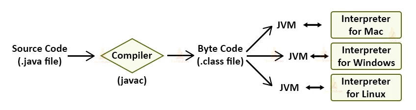
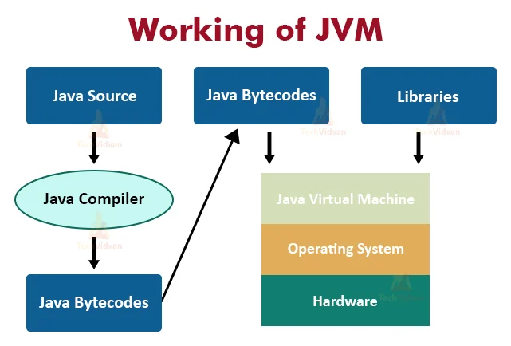
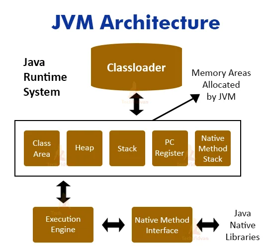
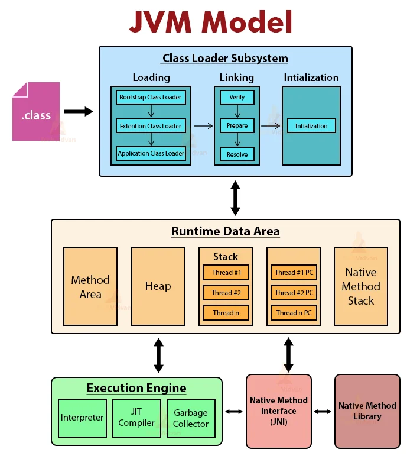

# JVM

## 스터디 날짜

2022/04/26

## 0. table
JVM 메모리영역 (04.26) - [3명_당일선택]
- 1부 
  - 전반적인 자바의 메모리 할당 및 실행 과정 
  - 각 메모리 영역 역할 
- 2부 
- call by value 메모리 할당 
  - os와 상호작용 과정 
  - 그림 설명
  - 라이브 코딩
- 3부 
  - 클래스로더 
  - 동작원리 
  - 클래스 로딩 과 초기화 차이
  

## 1. 전반적인 자바의 메모리 할당 및 실행 과정
### What is JVM – Java Virtual Machine?
source code 를 execute 하기 전에 compile 혹은 interpret 의 과정이 필요하다.

Java 는 두개의 compile 과 interpreter 2개의 combination 이 필요하다.

Java program 은 첫번째로 Java Byte Code(Binary form) 으로 compile 을 한다.

그 후 special Java interpreter 가 그것들을 specific platform 으로 interpret 한다.

여기서 Java ByteCode 는 Java Virtual machine(JVM) 에 사용되는 machine language 이다.

JVM 은 compiled binary byte code 를 specific machine languate 로 convert 한다.

JVM 은 이때 Java Runtime Environment(JRE) 의 subpart 로 역할을 수행한다.

JVM 은 abstract machine 으로 top of existing processes 에서 works 한다.

JVM 은 Java APIs 와 결합되어 Java Platform 을 만든다.

JVM 이 필수적으로 사용되는 곳은 HotSpot 이라고 한다.

JVM 을 3가지 방식으로 정의할 수 있다.
1. specification : JVM 의 일을 specifies 한다
    - implementation 을 제공하는 사람은 algorithm 을 선택하는 것과 독립적이다.
2. Implementation : JRE 라고 부른다.
3. Runtime : JVM instance 가 만드는 instance 로 너가 Java class 를 돌리기 위해 command prompt 위에 command 를 작성할 때 생긴다.

### Working of JVM
JVM 은 Java application 을 돌리기 위한 run-time engine 과 같이 행동을 합니다.

이떄 JVM 은 JRE 의 부분입니다.

Java application 은 WORA(Write One Run Anywhere)입니다. 즉 Java program 은 한번만 적으면 되고, 이것은 Java programd 에 변화를 주지 않으면서 다른 platform 에서도 돌아가야 합니다.

java file 을 compile 할때 compiler 는 .class file(byte-code 포함) 을 만듭니다. 이때 같은 이름의 .java file 과 함께 만듭니다.

.class 파일을 우리가 실행시킬때 다양한 step 을 거칩니다.

### Need for Java Virtual Machine(JVM)
프로그램을 돌리기 위해 JVM 은 많은 역할을 수행합니다.
- Loads the code.
- Verifies code.
- Executes the code.
- Provides a run-time environment for various applications.
- JVM provides a Memory area.
- Provides a Register set.
- JVM provides the garbage collection heap.
- Reports fatal errors.
- Provides a class file format

### JVM Architecture in Java
JVM Architecture 에는 3개의 main subsystem 이 존재합니다.
1. ClassLoader

2. Memory Area

3. Execution Engine

1. Java ClassLoader

classLoader 는 class 를 memory 에 load 하는 JVM Architecture 의 일부이다.

모든 JVM 은 ClassLoader 로 구성되어 이고, 그 안에는 built-in 된 3개의 classloaders 가 존재한다.

1. Bootstrap classLoader
이것은 Extenstion classloader 의 super class 이다. 이것은 rt.jar file 을 load 한다.
2. Extenstion ClassLoader
이것은 현재 directory 에 있는 jar files 를 load 하는 classloader 이다. 이것은 Bootstrap 의 child 이고, System classloader 의 parent 이다
3. System/Application ClassLoader
이것은 classpath 에서 class files 을 load 하는 classLoader 이다. 이것은 extension 의 child 이다.

이 3개의 ClassLoader 의 중요한 기능은 Initialization, Loading, Linking 이다.

1. Initialization
이것은 모든 static variables(with their specific values in the block of the program) 를 할당하는 작업이 포함되어 있다.

이 단계에서 values 를 가진 모든 static variables in the code and static block 을 할당한다.

실행은 클래스에서는 위에서 아래로, 클래스 계층에서는 부모에서 자식으로 실행된다.

2. Loading
이 작업은 file 을 실행하기 위해 secondary memory 에서 main memory(RAM) 로 load 하는 작업입니다.

Classloader 는 .class file 을 읽고, 그 에 상응하는 binary data 를 만들고, 이것을 method area 에 저장합니다.

JVM 은 method area 에 각각의 .class file 에 맞는 정보를 저장합니다. 이 정보에는
- fully qualified name of the loaded class 와 its immediate parent class
- .class file 이 인터페이스인지 enum 인지 class 판단한다.
- Modifier, Variables and Method information, etc.

.class file 을 loading 한 후 JVM 은 이 file 을 heap memory 에 represent  하기 위해 type Class 의 object 를 만든다.

.class 파일을 로드한 후 JVM은 힙 메모리에 이 파일을 나타내기 위해 Class 유형의 객체를 생성합니다.

프로그래머는 이 클래스 오브젝트를 class level information 을 얻기 위해 사용할 수 있다.(클래스 이름, parent 이름, methods, variable information 등)

이 Object reference 를 얻기위 해 우리는 getClass() method 를 사용할 수 있다.

3. Linking
이 작업은 main program 에 다른 파일들을 같이 combine 한다. 이것은 verification, preparation, (optinally) resolution 을 수행한다.
- verification : 이 단계에서 .class file 의 correctness 를 체크한다. 
  - 이것은 file formation 과 generation 이 유효한 컴파일러인지 아닌지를 확인합니다.
  - verification 에 실패시 java.lang.Verify Exception 을 얻게 됩니다.
- Preparation : JVM은 클래스 변수에 대한 메모리를 할당하고 메모리를 기본값으로 초기화합니다.
- Resolution : symbolic references 를 direct references 로 변경하는 과정이다. 
  - method area 에서 찾아 참조된 엔터티를 찾습니다.

### JVM Memory area
1. Method Area - structure of each class 를 저장한다 
  - 예를 들어 method data, field data, runtime pool, metadata 가 있다.
2. Heap - ObjecT(객체) 할당이 일어나는 runtime area 이다 
3. Stacks - 프로그램의 partial result 와 local 변수들이 저장된다. 쓰레드가 생성될때마다 JVM 스택이 동시에 생성된다. 메서드를 호출하면 호출 프로세스가 완료되는 동시에 새 프레임이 생성되고 소멸된다. 
4. PC Registers - 현재 실행중인 JVM instructions 의 주소가 저장된다.
5. Native Method stacks - 어느 application 에서 필요로 하는 모든 native methods 들이 포함된다. java 로 쓰이지 않는다.

### Execution Engine in Java
1. Virtual Processor

2. Interpreter: 바이트코드 스트림을 읽은 다음 명령을 실행합니다.

3. Just-In-Time(JIT) compiler: 성능을 향상시킵니다. JIT는 유사한 기능을 가진 바이트 코드의 일부를 동시에 컴파일하고 컴파일에 필요한 시간을 줄입니다.

