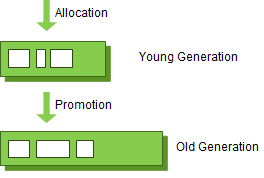
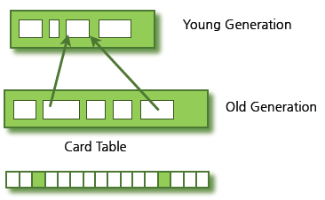
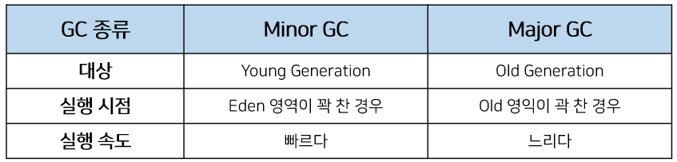
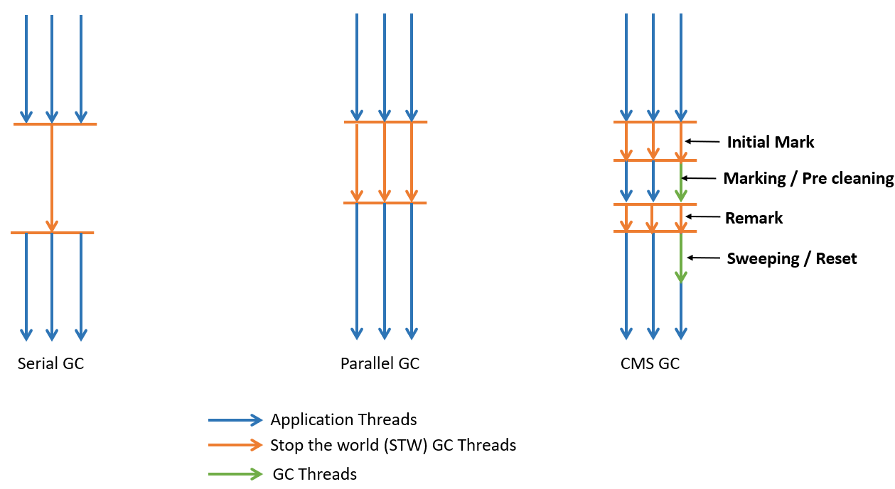

# GC

## 스터디 날짜

2022/04/29

## 1. Garbage Collection(가비지 컬렉션) GC 란 무엇인가?
개발을 하다 보면 유효하지 않은 메모리인 가비지(Garbage)가 발생하게 된다. Java 나 Kotlin 은 JVM 의 가비지 컬렉터가 메모리를 알아서 정리해 주기 때문에 개발자가 직접 신경쓸 필요는 없다.
대신 JAVA에서 명시적으로 불필요한 데이터를 표현하기 위해 일반적으로 null 선언을 한다.

```java
Person person = new Person(); 
person.setName("Yong"); 
person = null; 

// 가비지 발생 
person = new Person(); 
person.setName("YongHoon");
```
null 선언으로 더이상 참조를 하지 않으므로 Garbage 가 되었다.
GC 가 주기적으로 검사하여 메모리를 청소해 준다.

## 2. Minor GC, Major GC
JVM 의 Heap 영역은 객체는 대부분 일회성이고 메모리에 오랫동안 남아있는 경우는 드물다는 전제로 설계되엇다.

따라서 Young, Old 총 2가지 영역으로 설계되었다.



- Young 영역(Young Generation)
  - 새롭게 생성된 객체가 할당(Allocation)되는 영역
  - 대부분의 객체가 금방 Unreachable 상태가 되기 때문에, 많은 객체가 Young 영역에 생성되었다가 사라진다.
  - Young 영역에 대한 GC 를 Minor GC 라고 부른다.

- Old 영역(Old Generation)
  - Young 영역에서 Reachable 상태를 유지하여 살아남은 객체가 복사되는 영역
  - Young 영역보다 크게 할당되며, 영역의 크기가 큰 만큼 가비지가 적게 발생한다.
  - Old 영역에 대한 가비지 컬렉션을 Major GC 또는 Full GC 라고 부른다.

Old 영역이 Young 영역보다 크게 할당되는 이유는 Young 영역의 수명이 짧은 객체들은 큰 공간을 필요로 하지 않으며 큰 객체들은 Young 영역이 아니라 바로 Old 영역에 할당되기 때문이다.

예외적인 상황으로 Old 영역에 있는 객체가 Young 영역의 객체를 참조하는 경우도 존재할 것이다. 이러한 경우를 대비하여 Old 영역에는 512 bytes의 덩어리(Chunk)로 되어 있는 카드 테이블(Card Table)이 존재한다.



카드 테이블에는 Old 영역에 있는 객체가 Young 영역의 객체를 참조할 때 마다 그에 대한 정보가 표시된다.

Yound 영역에서 Minor GC 가 실행될때 모든 Old 영역을 검사하는것은 비효율적이다.

따라서 Minor GC 실행 시 카드 테이블만 조회하여 GC 의 대상인지 식별할 수 있다.

## 3. GC 의 동작 방식
1. Stop the word
GC 를 실행하기 위해 JVM 이 애플리케이션의 실행을 멈추는 작업니다.
GC 실행 시 GC 를 실행하는 쓰레드를 제외한 모든 쓰레드들의 작업이 중단되고, GC 가 완료되면 작업이 재개된다.
stop-the-wold 의 시간을 줄이기 위해 GC 성능 튜닝이 진행되기도 한다.

2. Mark and sweep
- Mark: 사용되는 메모리와 사용되지 않는 메모리를 식별하는 작업
- Sweep: Mark 단계에서 사용되지 않음으로 식별된 메모리를 해제하는 작업

### Minor GC 의 동작 방식
Yound 영역 : 1개의 Eden 영역 + 2개의 Survivor 영역
- Eden 영역: 새로 생성된 객체가 할당(Allocation)되는 영역
- Survivor 영역: 최소 1번의 GC 이상 살아남은 객체가 존재하는 영역

1. 객체가 새로 생기면 Eden 영역에 할당
2. Eden 영역이 꽉차면 Minor GC 발생
3. Eden 영역에 존재하는 객체는 1개의 Survivor 영역으로 옮겨진다
   1. Survivor 영역은 총 2개이지만 1개의 영역에만 데이터가 존재해야 한다.
4. 1,2,3 과정이 반복되다가 Survivor 영역이 가득 차게 되면 Survivor 영역의 살아남은 객체를 다른 Survivor 영역으로 이동시킨다.(1개의 Survivor 영역은 반드시 빈 상태가 된다.)
5. 이러한 과정을 반볻하다 살아남은 객체는 Old 영역으로 이동(Promotion)된다

객체의 생존 횟수를 카운트하기 위해 Minor GC 에서 객체가 살아남은 횟수를 의미하는 age 를 Object Header 에 기록한다.

Minor GC 때 Object Header 에 기록된 age 를 보고 Promotion 여부를 결정한다.


HotSpot JVM 에서는 Eden 영역에 객체를 빠르게 할당하기 위해 2가지 기술을 사용한다
- bump the pointer
- TLABs(Thread-Local Allocation Buffers)

### bump the pointer
Eden 영역에 마지막으로 할당된 객체의 주소를 캐싱해두는 것

bump the pointer를 통해 새로운 객체를 위해 유효한 메모리를 탐색할 필요가 없어진다.

### TLABs
멀티쓰레드 환경에서 객체를 Eden 영역에 할당할 때 Lock 을 걸어 동기화를 해주게 되고 이런 경우 성능 문제가 존재한다.

각각의 쓰레드마다 Eden 영역에 객체를 할당하기 위한 주소를 부여함으로써 동기화 작업 없이 빠르게 메모리를 할당하는 기술이다.


### Major GC 동작 방식
Major GC 는 객체들이 계속 Promotion 되어 Old 영역의 메모리가 부족해지면 발생한다.

Young 영역은 일반적으로 Old 영역보다 크키가 작기 때문에 GC가 보통 0.5초에서 1초 사이에 끝난다. 
그렇기 때문에 Minor GC는 애플리케이션에 크게 영향을 주지 않는다. 
하지만 Old 영역은 Young 영역보다 크며 Young 영역을 참조할 수도 있다. 
그렇기 때문에 Major GC는 일반적으로 Minor GC보다 시간이 오래걸리며, 10배 이상의 시간을 사용한다.



## 4. 다양한 GC 알고리즘
1. Serial GC
Young 영역 : Mark Sweep 수행<br>
Old 영역 : Mark Sweep Compact 수행<br>

Compact 는 Heap 영역을 정리하기 위한 단계로 유효한 객체들이 연속되게 쌀이도록 Heap 의 가장 앞 부분부터 채워서 객체가 존재하는 부분과 객체가 존재하지 않는 부분으로 나누는 것이다.<br>
1개의 쓰레드만 이용한다.

2. Parallel GC
Parallel GC는 여러 개의 쓰레드를 통해 Parallel하게 GC를 수행함으로써 GC의 오버헤드를 상당히 줄여준다.

3. Parallel Old GC
Parallel GC와 Old 영역의 GC 알고리즘만 다르다. 
Parallel Old GC에서는 Mark Sweep Compact가 아닌 Mark Summary Compaction이 사용되는데, Summary 단계에서는 앞서 GC를 수행한 영역에 대해서 별도로 살아있는 객체를 색별한다는 점에서 다르며 조금 더 복잡하다.

4. CMS(Concurrent Mark Sweep) GC
Serial GC나 Parallel GC와는 다르게 Mark Sweep 알고리즘을 Concurrent하게 수행하게 된다.



이러한 CMS GC는 다른 GC 방식보다 메모리와 CPU를 더 많이 필요로 하며, Compaction 단계를 수행하지 않는다는 단점이 있다. 이 때문에 시스템이 장기적으로 운영되다가 조각난 메모리들이 많아 Compaction 단계가 수행되면 오히려 Stop The World 시간이 길어지는 문제가 발생할 수 있다.

CMS GC는 Java9 버젼부터 deprecated 되었고 결국 Java14에서는 사용이 중지되었기 때문

5. G1(Garbage First) GC
G1(Garbage First) GC는 장기적으로 많은 문제를 일으킬 수 있는 CMS GC를 대체하기 위해 개발되었고, Java7부터 지원되기 시작하였다.

기존의 GC 알고리즘에서는 Heap 영역을 물리적으로 Young 영역(Eden 영역과 2개의 Survivor 영역)과 Old 영역으로 나누어 사용하였다.

G1 GC는 Eden 영역에 할당하고, Survivor로 카피하는 등의 과정을 사용하지만 물리적으로 메모리 공간을 나누지 않는다. 대신 Region(지역)이라는 개념을 새로 도입하여 Heap을 균등하게 여러 개의 지역으로 나누고, 각 지역을 역할과 함께 논리적으로 구분하여(Eden 지역인지, Survivor 지역인지, Old 지역인지) 객체를 할당한다.


G1 : Eden, Survivor, Old + Humongous, Available/Unused

Humonguous : Region 크기의 50%를 초과하는 객체를 저장하는 Region을 의미

Availabe/Unused : 사용되지 않은 Region을 의미

G1 GC의 핵심: Heap을 동일한 크기의 Region으로 나누고, 가비지가 많은 Region에 대해 우선적으로 GC를 수행하는 것이다.

- G1's Minor GC
  - 한 지역에 객체를 할당하다가 해당 지역이 꽉 차면 다른 지역에 객체를 할당하고, Minor GC가 실행
  - 가비지가 가장 많은(Garbage First) 지역을 찾아서 Mark and Sweep를 수행
  - Eden 지역에서 GC가 수행되면 살아남은 객체를 식별(Mark)하고, 메모리를 회수(Sweep)
  - 살아남은 객체를 다른 지역으로 이동
  - 복제되는 지역이 Available/Unused 지역이면 해당 지역은 이제 Survivor 영역이 되고, Eden 영역은 Available/Unused 지역이 된다

- G1's Major GC
  - 기존의 다른 GC 알고리즘은 모든 Heap의 영역에서 GC가 수행되었으며, 그에 따라 처리 시간이 상당히 오래 걸렸다.
  - G1 GC는 어느 영역에 가비지가 많은지를 알고 있기 때문에 GC를 수행할 지역을 조합하여 해당 지역에 대해서만 GC를 수행
  - 이러한 작업은 Concurrent하게 수행되기 때문에 애플리케이션의 지연도 최소화할 수 있는 것


G1 GC는 다른 GC 방식에 비해 잦게 호출될 것이다. 하지만 작은 규모의 메모리 정리 작업이고 Concurrent하게 수행되기 때문이 지연이 크지 않으며, 가비지가 많은 지역에 대해 정리를 하므로 훨씬 효율적이다.

출처: https://mangkyu.tistory.com/119?category=872426 [MangKyu's Diary]
