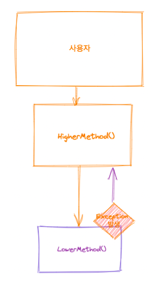
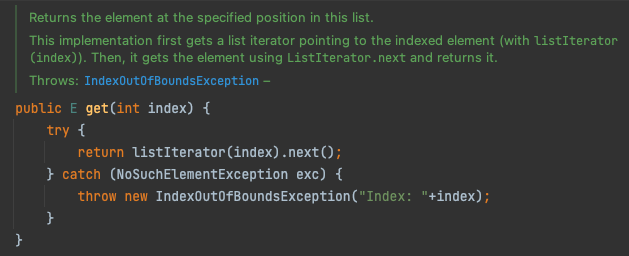
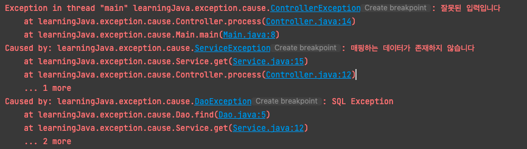

**이런 상황이 있다고 가정 해보자!**



## 저수준 예외를 처리 하지 않으면서, 그대로 바깥으로 전파할 때 생기는 일?

- 예외 발생 시, **수행하려는 일과 관련 없어 보이는 예외가 나올 수도** 있다. → 어떤 로직 에서 이러한 예외가 발생했는지 파악하기가 힘들어져 **디버깅 이 어려워**진다
    - 그리고 보통(?) 이 예외와 관련된 예외 메시지를 응답으로 보내주기 때문에, 사용자 입장에서는 뜬금없는 SQLException 과 관련된 에러 메시지를 응답으로 받게 될 수도 있다..고 생각한다.
- 내부 구현 방식을 드러낸다
    - 이를 사용하는 클라이언트가 오염된다. 다음 릴리즈 에서 내부 구현을 변경하며 예외도 달라지 면, 이를 사용하던 기존 코드가 깨진다.

## 저수준 예외를 처리하지 못한다면, 어떻게 해줘야 할까?

예외가 발생하면 우리는 흔히들 아래와 같이 처리한다

- 복구
    - 이는 예외 처리가 가능한 경우에 가능하다.
- 회피
    - 위에서 말했던, 예외가 발생했을 때 이를 처리해주지 않으면서 그대로 바깥으로 전파해버리는 경우에 해당한다.
- 전환(번역 )
    - 앞으로 말할 내용이 포함되는 부분이다.
    - 발생한 예외를 처리하지 는 않으면서, 다른 예외로 감싸서 바깥으로 전파시키는 방법이다.

> 지금처럼 **저수준 예외를 예방하거나, 스스로 처리 할 수 없는 경우**
>
>
> **저수준 예외를 잡아, 현재 상황에 맞는 추상화 레벨로 바꿔서 던지는 것**이 좋다
>

```java
try {
	.....
} catch (LowerLevelException e ) {
	throw new HigherLevelException(..);
}
```



`AbstractSequentialList` 의 get 메소드

### 예외 연쇄는?(exception chaining)

예외를 **번역 할 때, 저수준 예외가 디버깅에 도움이 된다면, 근본원인(cause) 를 감싼 예외를 생성하여 던지는** 것이 좋다.

```java
		try {
			// .......
		} catch (IllegalArgumentException e) {
			throw new CreationFailException(e);
		}
```

```java
public CreationFailException(Throwable cause) { ... }
```

예외 연쇄는, 문제의 원인을 프로그램에서 접근할 수 있게 해 주며, 원인을 **상위 레벨 예외의 스택 추적 정보에 잘 통합** 해 준다.

아래와 같이 상위 레벨 예외의 스택 추적 정보에 잘 통합되어 출력되는 것을 확인할 수 있다.



## 하지만 , 예외 번역을 남용 하지는 말자

- 무턱대고 예외를 그대로 전파하는 것보다는, 번역이 나을 것이다.
- 하지만 이 역시 남용 해서는 안된다.
    - **저수준에서 예외가 발생하지 않도록** 하는 것이 최선이다.
        - 상위 계층 메소드에서, **메소드(저수준의 메소드를)를 호출 하며 전달할 매개변수를, “미리 검사” 하는 방법**을 사용할 수 있다. (Ex. 존재하는 회원인지 확인 —> 해당 회원 정보 가져오기)
    - **상위 계층에서 처리해 줄 수 있다면 이를 처리하여, 더 높은 레벨까지 전파 하지 않도록** 하는 것이 좋다.
        - 이 때는, **발생 했던 예외에 대한 기록이 필요 → 로그를 남기자**