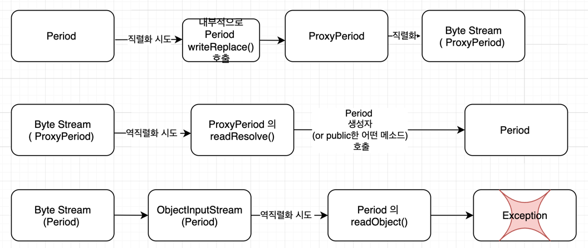
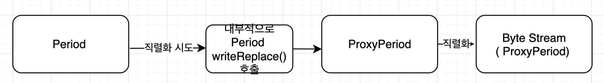
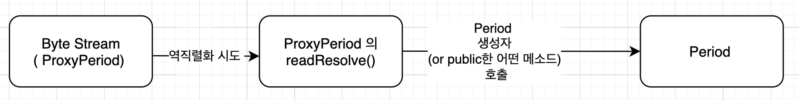
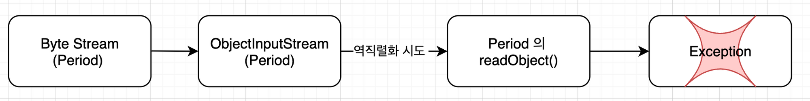

# Intro  ( Item 88 을 상기 해 보자 )

앞서 Item 88 에서, **Serializable 을 구현한 클래스의 경우 “ 생성자 외의 객체 생성 방법이 존재 “** 하므로 주의해야 한다는 것을 알 수 있었다.

당시 readObject 를 아래와 같이 방어적으로 복사하는 코드를 통해 해결할 수 있었다.

```java
private void readObject(ObjectInputStream s) throws IOException, ClassNotFoundException {
    s.defaultReadObject();

    // 방어적 복사
    start = new Date(start.getTime());
    end   = new Date(end.getTime());

    // 검증
    if (start.compareTo(end) > 0) {
        throw new InvalidObjectException(start + "가 " + end + "보다 늦다.");
    }
}
```

> 하지만 이러한 “방어적 복사” 코드를 생성자가 아닌 인스턴스 메소드에 위치 시키는 것이 되기 때문에
>
>
> 인스턴스 필드들은 더이상 final 키워드를 사용한 선언이 불가능 해 졌었다.
>

“직렬화 프록시” 를 사용할 경우 , 직렬화 대상 객체는 여전히 final 선언이 가능해 진다.

---

# 직렬화 프록시 패턴

## 요약

- **효과**
    - **타겟 클래스 에서는 public 한 메소드들에 대해서만 “불변식을 검증하고”, 인스턴스 메소드들에서 “불변식을 잘 지켜주기만 하면”** 된다. 즉, **객체 생성의 또 다른 방식(readObject )을 고려하며 방어적 코드를 중복 적으로 작성하지 않아도** 된다.
    - Item 88 에서 보았던 “가짜 바이트 스트림 공격” 이나 “내부 필드 탈취 공격” 을 프록시 수준에서 차단하게 된다.
    - Period 의 **start, end 는 여전히 final → Serializable 을 구현하는 Period 을 완전한 불변으로 만들어 줄 수** 있다. ( Item 88 에선 불가능 )

요약하자면

아래와 같은 흐름으로 프록시가 동작하게 된다



---

## 직렬화 프록시 패턴 구현하기 Step 1 :  단 하나의 생성자를 가진 “중첩 클래스”

- **private static** class 여야 한다
    - **Outer class 내부에서만 접근 가능, 사용하는 중첩 클래스** 인 것이다.
- **외부클래스(Outer class) 와 완전히 같은 필드**로 구성
- **“외부클래스( Outer class ) 를 인자 “ 로 전달 받는 “단 하나의 생성자”** 를 갖는 중첩 클래스를 선언해야 한다.
    - 방어적인 readObject 를 작성하던 것과 달리, **그저 “Outer class 인스턴스의 데이터를 복사” 하면 된**다
        - **검증이나 방어적 복사 x**
- 외부클래스, 중첩 클래스 **모두 implements Serializable**

### Serializable class 의 메커니즘 커스터마이징  ( 참고 사항 )

> **책에서는 직렬화 프록시 패턴을 구현할 때, Outer class 의 경우 writeReplace 를 정의 해 주면 된다고 했다**. 이에 대해 살펴보기 전에 나는 궁금증을 먼저 해결 하고 싶어졌다.
>
>
> *이쯤 되니 궁금해진 것 이 있었기 때문이다.*
>
> 직렬화 역직렬화 가 일어날 때, Item 88 이나 현재 Item 90 처럼 , **private 하게 readObject() 라던가 writeReplace() 메소드들을 정의 하라고 했다**. **해당 메소드들이 어떻게 활용이 되는걸까?? 이게 내부적으로 사용이 되고 있는 걸까?**
>

결론적으로는 **Serializable 을 구현하는 메소드는 이들 메소드에 대한 “기본 메커니즘” 을 갖고** 있다.

그런데 **이들 메소드들을 직접 선언해 줄 경우, 커스터마이징을 하는 것이 되고, 이들이 자동으로 호출된다.**

Java 공식 문서를 살펴보면 serial 과 관련해서 다음 내용을 살펴볼 수 있다.

> The class can **optionally define the following methods:**
>
> - A `writeObject` method to control what information is saved or to append additional information to the stream
> - A `readObject` method either to read the information written by the corresponding `writeObject` method or to update the state of the object after it has been restored
> - A `writeReplace` method to allow a class to nominate a replacement object to be written to the stream
>
> (See [Section 2.5, "The writeReplace Method](https://docs.oracle.com/javase/7/docs/platform/serialization/spec/output.html#5324)" for additional information.)
>
> - A `readResolve` method to allow a class to designate a replacement object for the object just read from the stream
>
> (See [Section 3.7, "The readResolve Method](https://docs.oracle.com/javase/7/docs/platform/serialization/spec/input.html#5903)" for additional information.)
>
> 즉 Serializable 을 구현하는 클래스에서는 위의 메소드들을 선택적으로 정의 해 둘 수 있다.
> 원래는 Serializable 을 구현한 클래스의 객체를 read 하거나 write 하기 위해서 “기본 메커니즘” 을 사용한다.
>
> 예를들어 **해당 클래스에서 writeObject 나 readObject 메소드를 제공하고 있다면** 직렬,역직렬화 를 위해 사용 되는 기본 메커니즘을 호출하기 위해서는 , defaultWriteObject 나 defaultReadObject 를 따로 호출해줘야 한다. ( 보통 custom 하게 선언한 writeObject, readObject 내부에서 이를 호출한다 )
>

### 

## 직렬화 프록시 패턴 구현하기 Step 2 : Outer class 의 writeReplace 메소드 정의 , Proxy class 에서는 readResolve

- ***외부 클래스***에서는 `**writeReplace**` 메소드 를 ***다음과 같이 선언  하고***

```java
private Object writeReplace() {
    return new SerializationProxy(this);
}
```

- ***Proxy 클래스***에서는 `**readResolve()**` 를 선언한다

```java
private Object readResolve() {
    return new Period(this.start, this.end);
}
```

## writeReplace 와 readResolve

Oracle 공식문서에서는 `**writeReplace**` 메소드 에 대해  다음과 같이 말하고 있다.

> [https://docs.oracle.com/javase/7/docs/platform/serialization/spec/output.html#5324](https://docs.oracle.com/javase/7/docs/platform/serialization/spec/output.html#5324)
>
>
> The `writeReplace`  method is called when `ObjectOutputStream`  is preparing to write the object to the stream. The `ObjectOutputStream`  checks whether the class defines the `writeReplace`  method. If the method is defined, the `writeReplace`  method is called to allow *the object to designate its replacement* in the stream. *The object returned should be either of the same type as the object passed in or an object that when read and resolved will result in an object of a type that is compatible with all references to the object*. If it is not, a `ClassCastException` will occur when the type mismatch is discovered.
>

즉

- `**ObjectOutputStream` 이 어떤 객체를 직렬화 하는 과정에서 해당 메소드를 호출**하게 된다는 것이다.
    - 먼저, 해당 클래스에서 이 메소드를 선언하고 있는지 확인한다.
    - 만약 **해당 메소드를 선언해 두었다면, 해당 메소드가 호출된다.**
    - **해당 클래스 객체를 대체하여 stream 에 들어가게 될 대체 객체를 리턴** 하게 된다.
    - 해당 타입은 ***read, resolved 결과, 원래 클래스와 compatible 해야*** 한다. ( **바깥 클래스와 논리적으로 동일해야** 한다 )
        - 즉,     
          **A 타입 객체 를 직렬화 → “B 타입 객체**” 이도록 구현 했다면 ,
          “**B 타입 바이트스트림 “ 을 역직렬화 → “A 타입 객체”** 가 되도록 resolve 하는 뭔가가 필요하다는 것이다  —> **Proxy 클래스(대체 타입 클래스) 에서는 readResolve() 를** 선언

- `writeReplace` 를 정의해 둠으로서 , Period 객체를 직렬화 하려 할 경우, 다음과 같은 과정이 내부적으로 일어나게 된다.

    

> 따라서, **Java 직렬화 시스템으로는 결코 “ 외부클래스인 Period 의 직렬화 된 인스턴스 를” 만들어낼 수가 없어 “ 진**다.
>

- 또한 **Proxy class 에서는 readResolve 를 선언해 둠으로서 , 다음과 같은 흐름으로 역직렬화**가 일어난다.

    
    - 즉!! 🐳 **Period 객체의 생성에 대해서는 public 한 메소드들만을 통해서 일어나게 되는 것**이다 .🐳
      **타겟 클래스 에서는 public 한 메소드들( 생성자, 정적팩토리 메소드 등등 ) 에 대해서만 “불변식을 검증하고”, 인스턴스 메소드들에서 “불변식을 잘 지켜주기만 하면”** 된다.

### Outer class 의 readObject 는 예외를 발생시키도록 한다

그럼에도 불구하고, 혹시나 Period 의 직렬화된 형태인 byte stream 을 통해 생성한 ObjectInputStream 을 통해, Period 의 역직렬화를 하려는 공격 을 할 수도 있다.

( 공격이라고 표현하는 것은, Period 에 대한 직렬화 역직렬화가 직접적으로 가능하다는 것은 , 결국 Item 88 에서 처럼, readObject, writeObject 를 통한 공격이 가능하기 때문이다. )

직렬화 프록시 패턴은 “타겟 클래스에 대한 직접적 직렬화, 역직렬화 를 막음으로서, readObject 와 같이 public 한 생성자 역할을 하는 메소드가 존재함으로 인해 불변식 이 깨지거나 하는 일을 막기 위함” 이었다.

따라서, 이러한 경우에 대해서도 방어하기 위해서는

- ***외부 클래스의 readObject 에서는 예외를 발생시키도록 선언*** 하면 된다.



## 최종 코드

```java
public final class Period implements Serializable {
    private final Date start;
    private final Date end;

    public Period(Date start, Date end) {
        // 방어적 복사
        this.start = new Date(start.getTime());
        this.end = new Date(end.getTime());

        // 검증 코드
        if (this.start.compareTo(this.end) > 0) {
            throw new IllegalArgumentException(
                this.start + " after " + this.end);
        }
    }

    public Date start() {
        return new Date(start.getTime());
    }

    public Date end() {
        return new Date(end.getTime());
    }

    private Object writeReplace() {
        return new SerializationProxy(this);
    }

    private static class SerializationProxy implements Serializable {
        private final Date start;
        private final Date end;

        private static final longserialVersionUID= 11111111L;

        public SerializationProxy(Period p) {
            this.start = p.start;
            this.end = p.end;
        }

        private Object readResolve() {
            return new Period(this.start, this.end);
        }
    }
}
```

## 결론

- 장점
    - 제 3자가 확장할 수 없는 클래스가 가진 불변식을 안정적으로 직렬화 해주는 가장 쉬운 방법이다.
- 한계점
    - 제 3자가 확장 할 수 있는 class(non final class) 에는 적용할 수 없다.
    - 객체 그래프에 순환이 있는 클래스에는 적용할 수 없다.
        - 이런 객체의 메소드를, 직렬화 프록시의 readResolve 에서 호출하려고 하면 ClassCaseException 이 발생할 것이다. ( 직렬화 프록시만 가졌을 뿐, 실제 객체는 아직 만들어진 것이 아니기 때문이다 )
    - 성능상 저하가 존재한다.

# 참조

[https://docs.oracle.com/javase/7/docs/platform/serialization/spec/serial-arch.html](https://docs.oracle.com/javase/7/docs/platform/serialization/spec/serial-arch.html)