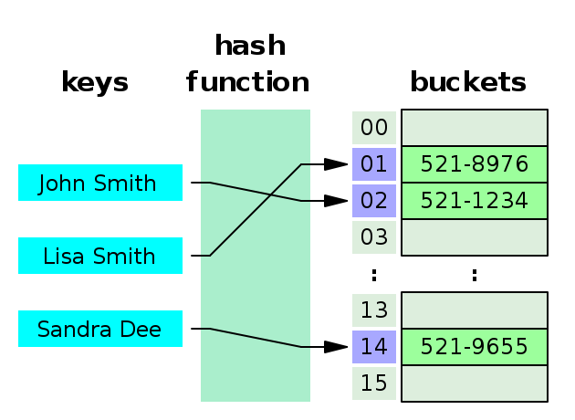
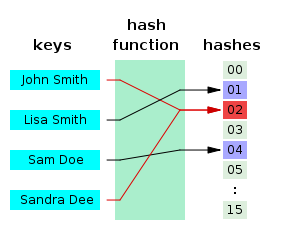
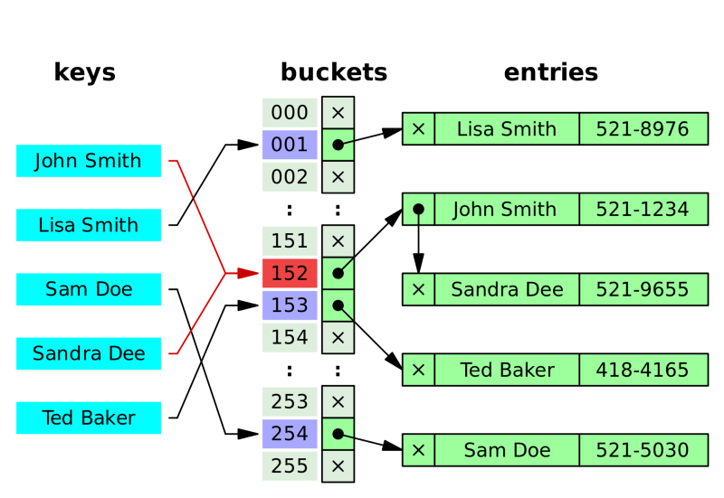

# Item11. equals를 재정의하려거든 hashCode도 재정의하라

## 스터디 날짜

2022/04/08

## 1. hashCode

- equals 를 재정의한 클래스 모두에서 hashCode도 재정의해야 한다.
- 그렇지 않는다면 hashCode 일반 규약을 어기게 되어 해당 클래스의 인스턴스를 HashMap이나 HashSet 같은 컬렉션의 원소로 사용할 때 문제를 일으킬 것이다.

### hashCode 규약

> equals 비교에 사용되는 정보가 변경되지 않았다면, 애플리케이션이 실행되는 동안 그 객체의 **hashCode 메서드는 몇 번을 호출해도 일관되게 항상 같은 값을 반환해야 한다**. 단, 애플리케이션을 다시 실행한다면 이 값이 달라져도 상관없다.

> equals(Object)가 **두 객체를 같다고 판단했다면, 두 객체의 hashCode는 똑같은 값을 반환해야 한다.**

> equals(Object)가 두 객체를 다르다고 판단했더라도, 두 객체의 hashCode가 서로 다른 값을 반환할 필요는 없다. 단, 다른 객체에 대해서는 다른 값을 반환해야 해시테이블의 성능이 좋아진다.

- equals는 물리적으로 다른 두 객체를 논리적으로 같다고 할 수 있다.
- 하지만 Object의 기본 hashCode 메서드는 이 둘이 전혀 다르다고 판단하여, 규약과 달리 (무작위처럼 보이는) 서로 다른 값을 반환한다.
- hashCode를 재정의하지 않으면 논리적 동치인 두 객체가 서로 다른 해시코드를 반환하여 두 번째 규약을 지키지 못한다

```java
public final class PhoneNumber {
    private final short areaCode, prefix, lineNum;

    public PhoneNumber(int areaCode, int prefix, int lineNum) {
        this.areaCode = rangeCheck(areaCode, 999, "지역코드");
        this.prefix = rangeCheck(prefix, 999, "프리픽스");
        this.lineNum = rangeCheck(lineNum, 9999, "가입자 번호");
    }

    @Override
    public boolean equals(Object o) {
        if (o == this)
            return true;
        if (!(o instanceof PhoneNumber))
            return false;
        PhoneNumber pn = (PhoneNumber) o;
        return pn.lineNum == lineNum && pn.prefix == prefix
                && pn.areaCode == areaCode;
    }

    // 나머지 코드는 생략 - hashCode 메서드는 꼭 필요하다(아이템 11)!
}
```

```java
public class Main {
    public static void main(String[] args) {
        Map<PhoneNumber, String> m = new HashMap<>();
        m.put(new PhoneNumber(707, 867, 5309), "제니");
        String s = m.get(new PhoneNumber(707, 867, 5309));
        System.out.println(s); // null 출력

        // 기존 hashCode
        PhoneNumber original = new PhoneNumber(707, 867, 5309);
        m.put(original, "제니");
        String jenni = m.get(original);
        System.out.println(jenni); //제니 출력

    }
}
```

## 2. hashCode 해결해보자

### 최악의 (하지만 적법한) hashCode 구현 - 사용 금지!

```java
public class Item11 {
    @Override
    public int hashCode() {
        return 42;
    }
}
```

- 이 코드는 동치인 모든 객체에서 똑같은 해시코드를 반환하니 적법하다.
- 하지만 모든 객체에게 똑같은 값만 내어주므로 모든 객체가 해시테이블의 버킷 하나에 담겨 마치 연결 리스트(linked list)처럼 동작한다.
- 그 결과 평균 수행 시간이 O(1)인 해시테이블이 O(n)으로 느려져서, 객체가 많아지면 도저히 쓸 수 없게 된다.

### 해시, 해시테이블에 대해 잠깐만 복습해보자



**해시테이블**<br>
Insertion(저장) 시간복잡도 : O(1)<br>
Deletion(삭제) 시간복잡도 : O(1)<br>
Search(검색) 시간복잡도 : O(1)<br>
Hash Collision(해시 충돌) 의 가능성이 존재한다<br>



**해시 충돌 해결법(Collision Resolution)**<br>

1. **Separate Chaining(간추려서 Chaining)**<br>



Sandra가 들어가는데 충돌이 일어나니 기존에 있던 John의 값에 연결시켰다.<br>
체이닝(Chaining)은 자료 저장 시, 저장소(bucket)에서 충돌이 일어나면 해당 값을 기존 값과 연결시키는 기법이다.

2. **Open Addressing(개방주소법)**<br>

개방주소법은 데이터의 해시(hash)가 변경되지 않았던 chaining과는 달리 비어있는 해시(hash)를 찾아 데이터를 저장하는 기법이다.

두개 알고리즘 모두 최악의 경우 O(n) 의 시간 복잡도를 가지게 된다.

**Hash Table Data Structure의 단점**

- 순서가 있는 배열에는 어울리지 않는다.<br>
  : 상하관계가 있거나, 순서가 중요한 데이터의 경우 Hash Table은 어울리지 않다. 순서와 상관없이 key만을 가지고 hash를 찾아 저장하기 때문이다.
- 공간 효율성이 떨어진다.<br>
  : 데이터가 저장되기 전에 미리 저장공간을 확보해 놓아야 한다. 공간이 부족하거나 아예 채워지지 않은 경우가 생길 가능성이 있다.
- Hash Function의 의존도가 높다.<br>
  : 평균 데이터 처리의 시간복잡도는 O(1)이지만, 이는 해시 함수의 연산을 고려하지 않는 결과이다. 해시함수가 매우 복잡하다면 해시테이블의 모든 연산의 시간 효율성은 증가할 것이다.

### 전형적인 hashCode 메서드

```java
public class Item11 {
    @Override
    public int hashCode() {
        int result = Short.hashCode(value1);
        result = 31 * result + Short.hashCode(value2);
        result = 31 * result + Short.hashCode(value3);
        return result;
    }
}
```

**좋은 해시 함수**

- 좋은 해시 함수라면 서로 다른 인스턴스에 다른 해시코드를 반환해야 한다. 이는 hashCode의 세 번째 규약이 요구하는 속성이다.
- 이상적인 해시 함수는 주어진 (서로 다른) 인스턴스들을 32비트 정수 범위에 균일하게 분배해야 한다.
    - 자바 int 의 범위 : -2^31 ~ (2^31 - 1)

**해시코드 계산하는 방법**

- primitive type은 boxing class의 hashCode(f)를 수행한다.
- 참조 타입 필드의 경우, hashCode를 작성하고 있는 클래스가 이 필드의 equals를 재귀적으로 호출하여 비교한다면, hashCode 또한 재귀적으로 호출하도록 짜야 한다.
- 만약 재귀적인 계산이 복잡할 것 같으면, 표준형(Canonical representation)을 만들어 그 표준형의 hashCode를 호출한다.
- 필드가 배열이라면, 핵심원소 각각을 별도 필드처럼 다루어야 한다. 모든 필드가 핵심 필드라면, Arrays.hashCode를 사용하고 그렇지 않은 경우 상수(일반적으로 0)을 사용한다.

**hashCode() 구현하기**

- int 변수 result를 해당 객체의 첫 번째 핵심 필드의 해시코드로 초기화 한다
- 나머지 핵심 필드에 대해서는 각 필드의 해시코드를 계산한 값 c를 가지고 다음 작업을 수행한다
- result = 31 * result + c;
- result로 반환한다.


**왜 31인가?**<br>
책에서 소개하는 31을 선택하는 이유

- 홀수이면서 소수(prime number)이다.
- 시프트 연산과 뺄셈으로 대체하여 최적화하기 쉽다. 31⇒((1 << 5) - 1

**세 가지의 데이터셋을 가지고 해싱을 해보았는데 여러 소수와 다른 방식(WAIS, Weingberger 등)을 가지고 테스트 해 보았으나, hash함수 대신 true random generator를 가지고 나올 수
있는 것을 제외하고는 모두 비등비등한 성능을 보였지만, 31이 모든 아키텍쳐에서 빠르게 계산할 수 있다는 장점이 있어서 선택되었다는게 내용입니다.**

https://daebalpri.me/entry/Effective-Java-3E-3%EC%9E%A5-%EB%AA%A8%EB%93%A0-%EA%B0%9D%EC%B2%B4%EC%9D%98-%EA%B3%B5%ED%86%B5-%EB%A9%94%EC%84%9C%EB%93%9C


**구현 이후 주의사항**

- 구현 이후에 이 메서드의 unit test를 작성해야 하는 것은 equals()와 같다.
- 파생 필드는 계산에서 제외해도 되지만, equals 비교에 사용되지 않은 필드는 **'반드시'** 제외해야 한다.
- 성능을 높이겠다고 해시코드를 생략한다면, 핵심 필드를 생략해서 안된다. 해시 품질이 떨어져 충돌이 많이 일어나게 된다. 같은 해시 버켓에 여러개의 엔트리가 있다면, 그 모든 버켓을 탐색하여야 하므로 해시 테이블의
  속도가 O(n)에 가깝게 변할 것이다.
- hashCode() 의 생성 규칙을 API User에게 알려주지 않는다. 클라이언트가 이 값에 의지하여 코드를 작성하게 되면 추후 계산 방식이 바뀔 때 문제가 발생할 수 있다.


### 한 줄짜리 hashCode 메서드 - 성능이 살짝 아쉽다.

```java
public class Item11 {
  @Override
  public int hashCode() {
    return Objects.hash();
  }
}
```

- 이 메서드를 이용하면 hashCode 함수를 단 한 줄로 작성할 수 있다.
- 하지만 입력 인수를 담기 위한 배열이 만들어지고, 입력 중 기본 타입이 있다면 박싱과 언박싱도 거쳐야하므로 속도는 조금 느리다.
- 따라서, hash 메서드는 성능에 민감하지 않은 상황에서만 사용해야 한다.

### 해시코드를 지연 초기화하는 hashCode 메서드 - 스레드 안정성까지 고려해야 한다.
```java
public class Item11 {
    //  ======================================== 해시코드를 지연 초기화하는 hashCode 메서드 - 스레드 안정성까지 고려해야 한다.
    private int hashCode; // 자동으로 0으로 초기화된다.

    @Override
    public int hashCode() {
        int result = hashCode;
        if (result == 0) {
            // doSomething ...
            hashCode = result;
        }
        return result;
    }
}
```
- 클래스가 불변이고 해시코드를 계산하는 비용이 크다면, 매번 새로 계산하기 보다는 캐싱하는 방식을 고려해야 한다.
- 이 타입의 객체가 주로 해시의 키로 사용될 것 같다면 인스턴스가 만들어질 때 해시코드를 계산해둬야 한다.
- 해시의 키로 사용되지 않는 경우라면 hashCode가 처음 불릴 때 계산하는 지연 초기화(lazy initialization) 전략을 고려해본다.
- 이때, 필드를 지연 초기화하려면 그 클래스를 스레드 안전하게 만들도록 신경 써야 한다.
- 또한, hashCode 필드의 초깃값은 흔히 생성되는 객체의 해시코드와는 달라야 한다.

### 정리
- 성능을 높이기위해 해시코드를 계산할 때 핵심 필드를 생략해서는 안 된다.
- 속도는 빨라지겠지만, 해시 품질이 나빠져 해시테이블의 성능을 심각하게 떨어뜨릴 수도 있다.
- hashCode가 반환하는 값의 생성 규칙을 API 사용자에게 자세히 공표하지 말아야 한다. 그래야 클라이언트가 이 값에 의지하지 않게 된다.