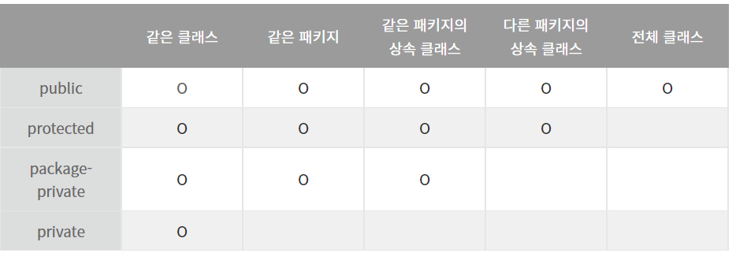

# Item16. public 클래스에서는 public 필드가 아닌 접근자 메서드를 사용하라

## 스터디 날짜

2022/04/20

## 1. public 메서드
public 클래스가 지향해야 하는 특징
- 캡슐화
- 불변식

public 사용 시 캡슐화의 이점을 사용하지 못하고, 불변식을 보장할 수 없으며, 외부에서 필드에 접근할 때 부수 작업을 수행할 수 없다.<br>
필드를 private 으로 선언하고 관련 로직을 public 으로 선언하자.
```java
class Point{
    private double x;
    private double y;
    
    public Point(double x, double y){
        this.x = x;
        this.y = y;
    }
    
    // getter setter 도 지양하자
}
```

## 2. package-private 클래스와 private 중첩 클래스
package-private 클래스 혹은 private 중첩 클래스라면 데이터 필드를 노출한다 해도 하등의 문제가 없다.<br>
그 클래스가 표현하려는 추상 개념만 올바르게 표현해주면 된다.



```java
public class OuterClass {

    private int open = 10;
    private int close = 20;

    private class InnerClass{
        public int open2 = 100;
        public int close2 = 20;
    }
}
```

```java
public class Main {
    public static void main(String[] args) {
        OuterClass outerClass = new OuterClass();
        //outerClass.InnerClass.open2; 
        // 접근 불가
    }
}
```

## 3. 불변 필드를 노출한 public 클래스는 과연 좋을까?
```java
public final class Time{
    public final int hour;
    
    public Time(int hour){}
}
```
- 불변을 보장할 수 있다.
- 하지만 상태를 다른 객체에게 알려주기 때문에 그 객체 상태에 종속적인 행위를 하게 된다.
- 즉 클래스간의 결합도가 높아지게 된다.
- 캡슐화 정보은닉 뭐하나 이루어지는게 없다.
- 객체지향적인 설계가 아니다.

## 4. getter setter 을 지양하자
객체는 자율적인 객체가 되고 외부의 영향을 받지 않음으로써 느슨한 결합과 유연한 협력을 이룰 수 있게 된다.<br>

- getter와 setter는 자신의 상태정보를 외부에 노출하게 된다.
- 한 객체의 변화가 여러 객체에게 영향을 주는 이러한 코드가 많아질수록, 훗날 유지보수가 어려워 질 것이다

### Getter 지양하기
- getter를 남발하는 습관을 막을 수 있다.
- 객체는 독립적이어야하는데 getter를 통한 로직처리를 하는 메소드가 많아질수록 getter에 대한 의존성은 매우 높아질 것이다.
  - 상태를 알려주면 상대 객체는 그 객체 상태에 종속적인 행위를 하게 된다.
  - 상대가 상태를 몰라도 자신에게 책임을 맡길 수 있도록 디자인 해야 한다.
  - 둘째, getter메소드만으로 외부에서 객체의 상태를 변경하지는 못하지만, 그 결과값이 객체의 상태를 변경시키는데에 사용될 수 있다.
    


### Getter 대신에 쓸 수 있는 방법
- getter를 통해 얻은 상태값으로 하려고 했던 '행동'을 그 상태값을 가진 객체가 하도록 '행동'의 주체를 옮기는 것이다.
  - 예를 들어 값을 비교할 때 get을 사용해 객체의 변수를 꺼내와서 비교했다면 isSame()과 같은 메소드를 객체에 위치시켜 비교하고자 하는 값을 메소드의 파라미터로 넘겨 객체가 판별하도록 하는 것이다.
```java
public static List<String> extractWinners(List<Car> cars, int winnerPosition) {
        List<String> winners = new LinkedList<>();
        for (Car car : cars) {
            if (car.getPosition() == winnerPosition) {
                winners.add(car.getName());
            }
        }
        return winners;
    }
```
- 위의 메소드는  getPosition()메소드를 통해 car객체의 position이라는 상태값을 꺼내고, 그 값과 winnerPosition값을 비교한다.
```java
public static List<String> extractWinners(List<Car> cars, int winnerPosition) {
        List<String> winners = new LinkedList<>();
        for (Car car : cars) {
            if (car.isWinner(winnerPosition)) {
                winners.add(car.getName());
            }
        }
        return winners;
    }
```
- car객체에게 winnerPosition을 넘겨주고, '너의 position값이 winnerPosition값과 같니?'라고 메시지를 보내는 것

### getter메소드만으로 외부에서 객체의 상태를 변경하지는 못하지만, 그 결과값이 객체의 상태를 변경시키는데에 사용될 수 있다?
```java
public Car {
	private int number;
    
    public Car(int number) {
    	this.number = number;
    }
    
    public void update(int newNumber) {
    	this.number = newNumber;
    }
    
    public int getNumber() {
    	return number;
    }
    
    public void move(int number) {
    	if (this.number >= number) {
        	this.number++;
        }
    }
}
```

```java
public class Game {

	public void run(Car car) {
		int number = car.getNumber();
        
		if (number >= 4) {
        	car.update(number+1);
		}
	}
    
	public void run2(Car car) {
    	car.move(4);
	}

}
```
- run 메소드 의 경우 get 으로 숫자를 받아오고 조건을 판단한 후 car 객체의 update 를 수행한다
- run2 메소드의 경우 car 에게 스스로 조건을 확인하고 update 를 진행하게 한다.

**주목할 점은, 1만큼 증가시키는 판단을 누가 하는가 이다.**<br><br>
**run 메서드는 객체의 상태값을 바꾼다는 판단을 외부에서 하고 있는 것이다!!!**<br><br>
**getter메소드가 직접적으로 상태값을 바꾸지는 않지만, 이것이 사용되는것은 외부에게 '상태값 변경에 대한 판단권'을 줘버리게 될 수 있다.**<br><br>
**'독립적인 객체'설계에 위배되는 행위이다.**

### _getter의 사용보다는 객체에게 메시지를 보내어 로직을 처리하는것이 더 옳은 설계_

### State 패턴도 getter 대용으로 생각해볼 수 있다.
스테이트 패턴은 객체가 특정 상태에 따라 행위를 달리하는 상황에서,<br>
자신이 직접 상태를 체크하여 상태에 따라 행위를 호출하지 않고,<br>
상태를 객체화 하여 상태가 행동을 할 수 있도록 위임하는 패턴을 말합니다.<br>


즉, 객체의 특정 상태를 클래스로 선언하고, 클래스에서는 해당 상태에서 할 수 있는 행위들을 메서드로 정의합니다.<br>
그리고 이러한 각 상태 클래스들을 인터페이스로 캡슐화 하여, 클라이언트에서 인터페이스를 호출하는 방식을 말합니다.<br>


자세한 것은 아래 사이트를 참고하세요^^<br>
https://victorydntmd.tistory.com/294


### Setter 지양하기
- 변경되지 않는 인스턴스에 대해서도 setter로 접근이 가능해져 객체의 일관성, 안정성이 보장받기 힘들다. (setter가 가능하다는 것은 불변하지 않다는 것이다)

### Setter 대신에 쓸 수 있는 방법
1. 객체를 생성하는 경우 생성자를 통해 데이터를 받아서 처리하기
2. 빌더 패턴 이용하기


