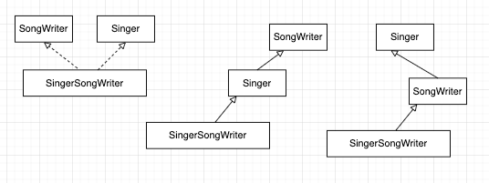
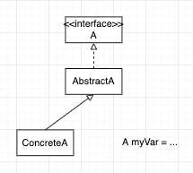
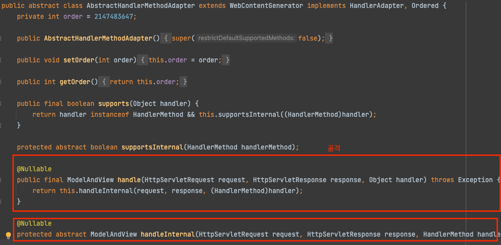

# 추상클래스보다는 인터페이스를 우선하라

## Intro : 다형성

- 다형성 : 다양한 형태를 띌 수 있는 성질

코드 속의 다형성을 생각해보면, 어떤 상위 타입으로 선언한 참조타입 변수에, 동적으로 인스턴스가 들어오는 경우가 많다.  ( 다형성이 의미있는 경우는 외부에서 인스턴스를 주입받는 경우라고 생각한다)

따라서 우리는 동일한 타입의 참조변수로 다양한 방식의 행위를 할 수 있어진다.

```java
public void run(ElectricCar car){
	car.autoDrive();
}
// Tesla car
// HyunDai car
```

실제로 해당 참조변수 car는 다양한 타입의 인스턴스를 동적으로 참조할 수 있다.

이것이 가능하기 위해서는, **“어떤 타입에 대해 다양한 구현체가 들어올 수 “ 있어야** 한다.

> **Java 에서는 이러한 것이 가능하게 하는 메커니즘**으로
>
> - 인터페이스
> - 추상 클래스
>
> 가 존재한다.
>

## 추상클래스와 인터페이스의 차이 - Java 문법으로부터 오는 차이

먼저 Java 는 “상속"과 관련하여 다음과 같은 특징을 갖고 있다.

Java 는 단일 상속만을 지원한다.

```java
public class Car extends ElectricCar,H2Car {  ❌
	...
} 
```

반면, 인터페이스에 대한 다중 상속은 지원한다

```java
public class Car implements Electric,Chemical { ⭕️
 ...
}
```

그런데 추상 클래스와 관련해서는 다음에 주의해야 한다.

- **추상클래스 타입이기 위해서는 , 반드시 추상 클래스의 하위 클래스**가 되어야 한다.
- 그런데, **추상클래스를 정의한 클래스는 더 이상 다른 클래스는 상속할 수 없다.**
    - 인터페이스에 대한 다중 상속은 가능하다
- 인터페이스의 경우는, **인터페이스가 선언한 메소드만 모두 잘 선언했다면, “다른 어떤 클래스를 상속" 했던 “같은 타입으로 취급"** 된다.

## 인터페이스 장점 : 기존 클래스도 인터페이스 타입이 될 수 있다.

기존 클래스에도, 새로운 인터페이스를 구현하도록 하면 되기 때문에 기존 클래스도 인터페이스 타입이 될 수 있다.

- Comparable, Iterable, AutoCloeable 인터페이스가 새로 추가되었을 때, 자바의 수많은 기존 클래스가 해당 인터페이스들을 구현한 채 릴리즈 되었다.

반면 기존 클래스가 새로운 추상 클래스가 되도록 하는 것은 매우 어렵다.

## 인터페이스는 mixin 정의에 안성맞춤이다

> mixin 타입?
>
> - “주된 타입(주된 기능)" 외에도, “특정 선택적 행위를 제공"한다고 선언하는 효과
- 추상 클래스가 mixin 을 정의할 수는 없죠? 얘가 주된 타입이어야 하니까요.
- 반면, 기존 클래스가 Comparable 을 implemet 한다고 한다면, 해당 클래스의 주된 기능 외에도 Comparable 과 관련된 추가적인 행위를 제공한다고 선언하는 것이 된다.

## 인터페이스로는 계층구조 없는 타입 프레임워크를 만들 수 있다.

> 계층을 엄격하게 구분하기 어려운 개념들이 존재한다.
>
>
> 예를들어 “작곡가" 과 “가수" 는 둘 중 어느 누구가 부모고 자식이고 이런 계층구조로 말하기 어려운 부분이다.
>
> 그렇다고 모든 조합을 클래스로 만드려고 한다면, 계층구조가 엉망이 될 것이다
>

추상클래스를 사용하면 엄격하게 부모-자식 관계가 되는 반면, 인터페이스는 “어떤 기능을 제공한다" 개념으로 볼 수 있다.



> 이 예시를 보니 떠오르는 것 -> ISP ( 인터페이스 분리 원칙 _ 인터페이스 별로 하나의 책임을 갖도록 정의하고 -> 두 가지 기능이 필요하면 두 개의 인터페이스를 확장하거나 구현하는 식으로 할 수 있다)

각각을 인터페이스로 해서, 어떤 클래스가 “ 하나만 구현" 하던 “ 둘 다를 구현” 하던 상관 없이 만드는게 더 적절하다.

```java
public interface SigerSongWriter extends Singer, Songwriter {
	..
}
```

## 타입이 추상클래스, 타입이 인터페이스 그리고 래퍼 클래스

Wrapper class 는 “타입이 인터페이스"다.

래퍼 클래스에 기능을 추가하려면, 인터페이스 구현체를 갖다 끼우기만 해도 가능하다.

```java
public class Wrapper implements A {
	private final A myA;
	.......
```

반면에, “타입을 추상클래스"로 정의하면, 해당 타입에 기능을 추가하는 방법은 , “상속을 통해 하위클래스를 만드는 것" 뿐이다.

# 인터페이스 디폴트 메소드

Java8 부터 인터페이스에도 디폴트 메소드 제공이 가능해졌다. 인터페이스 기능중 구현이 명백한 것만을 디폴트 메소드로 제공할 수 있다.

- 장점? → 구현체에서 반복될 코드 중복을 없앨 수 있다.
- 디폴트 메소드 제공시 문서화 필요 → @impleSpec
- 제약?
    - Object 의 메소드 부분들은 디폴트 메소드로 제공해서는 안된다. 
    - 인터페이스는 인스턴스 필드, private static 필드를 가질 수 없어  디폴트 메소드에서 사용가능한 public 하지 않은 필드가 없음.

## 인터페이스와 추상 골격 구현 클래스 제공

> ⭐️ **복잡한 인터페이스는, 구현에 대한 수고를 덜어주기 위해 “골격 구현 (추상클래스,Concrete class)” 를 함께 제공하는 것을 고려하자**
>
> - 인터페이스의 디폴트 메소드로 골격구현을 제공하는 방법
    >     - 인터페이스 구현체에서 골격 구현을 사용한다
> - 골격 구현을 추상클래스에서 제공하는 방법
    >     - 추상 클래스 하위 클래스에서 골격 구현을 사용한다.
            >         - ConcreteA 는 “A<<interface>>” 타입으로 사용이 가능하다.

- 인터페이스와, 추상 클래스의 장점을 모두 취하기 위함.
- Interface 로 타입을 정의 → 즉, 인터페이스 타입으로 사용될 수 있음.
    - 인터페이스에는 매우 적은 디폴트 메소드만을 구현하고
- 추상 클래스로는 나머지 메소들을 구현 → 내부적으로는, 추상클래스를 확장한 클래스 구현체들의 인스턴스들이 들어올 수 있음.

> 템플릿 메소드 패턴 의 모습
>
> - 추상클래스에서 어느정도의 골격을 구현 해 두는 것.
> - 따라서 그 하위 클래스들에서는 **인터페이스 구현에 필요한 일 대부분을 생략할 수** 있다.
> - ConcreteA 클래스를 사용할 때 “타입"은 AsbtactA(추상클래스 타입) 가 아닌 A (인터페이스 타입)로 사용할 수 있다!!



(❓🤔  아래에 작성방법을 보고 나니 이것이 적절한 예시인지 잘 모르겠슴다_ handleInternal 은 인터페이스에는 정의되지 않은, 추상 클래스 내부에서 하위 클래스에 위임하는 메소드부분이네요. 하지만 추상 클래스에서 어느정도 골격을 제시했다고는 생각하는데 다른 분들은 어떻게 생각하시는지 궁금합니다 )



## 인터페이스 구현체 내부에 private 골격 구현 클래스 두는 방법 : Simulated Multiple Inheritance

> 실제 각 메소드 호출은, 내부 클래스 인스턴스로 전달하는 방법을 취할 수도 있다.
>

```java
public class MyConcrete implements MyInterface{
	private final MyInner myInner = new MyInner();
	
	@Override
	public void hello() {
		myInner.hello();
	}

	private class MyInner implements MyInterface{
		@Override
		public void hello() {
			System.out.println("I'm real");
		}
	}
}
```

## 단순 구현

- 추상 클래스가 아닌 클래스에, 골격 구현과 같은 상속을 위해 인터페이스를 구현하는 것.
- 동작하는 가장 단순한 코드.
- 이거 그대로 사용하기도, 아니면 확장해서 사용하기도 한다.

## 작성 방법

1. 추상메소드 선정
    1. 다른 메소드들의 구현에 사용되는 기반 메소드들
2. 디폴트 메소드
    1. 기반 메소드 기반으로, 직접 구현할 수 있는 메소드
3. 1,2 번 결과 다른 메소드가 없다면, ( 인터페이스 - 구현체 )로 바로 사용해도 되고, 그게 아닌 경우에는 ( 인터페이스 - 골격구현추상클래스 - 구현체 ) 이런식으로 사용하는 것을 권하는 듯 하다.

## 결론

추상클래스보다는 인터페이스가 적합한 경우가 더 많다 ( 확장성.. 유연성 측면에서, 기존 클래스에도 인터페이스 구현만을 추가해서 기능 추가가 가능함. 인터페이스 타입으로 사용이 가능해짐)

인터페이스가 복잡한 경우라면 추상클래스나 기본적인 구현을 한 구현 클래스 등을 사용해서 골격구현을 함께 제공하는 방법을 고려하자.

해당 골격 구현은 인터페이스 내 디폴트 메소드로 제공할 경우, 그 인터페이스 구현 모든 곳에서 활용할 수 있는 것이 좋다.

인터페이스 내부에는 private 필드 정의가 불가능하기에 보통은 추상 클래스로 골격 구현을 제공하는 경우가 더 많다.