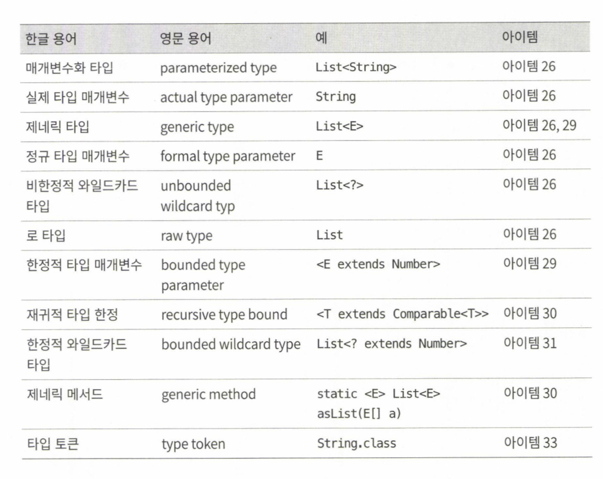
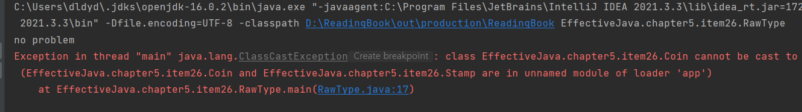
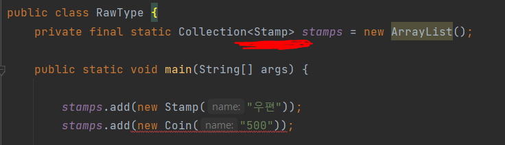
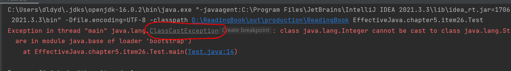
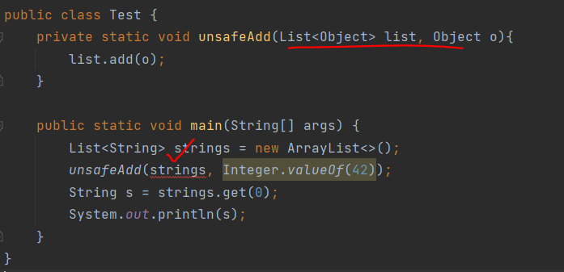
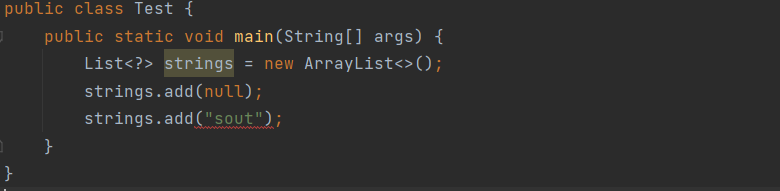

# Item26. 로 타입은 사용하지 말라

## 스터디 날짜

2022/05/24

## 1. 용어정리


- 클래스와 인터페이스 선언에 타입 매개변수(type parameter)가 사용되면 : 제네릭 클래스, 제네릭 인터페이스 라 부른다.<br>
- ex) `List` 인터페이스의 타입 매개변수 : `E` -> `List<E>`<br>
- 제네릭 타입(generic type) : 제네릭 클래스, 제네릭 인터페이스를 통틀어 지칭<br>
- 제네릭 타입 : 일련의 매개변수화 타입(parameterized type) 을 정의한다.
- 로 타입(raw type) : 제너릭 타입에서 타입 매개변수를 전혀 사용하지 않을 때

## 2. 로 타입(raw type) 쓰지마 1
> 로 타입은 제네릭이 도래하기 전 코드와 호환되도록 하기 위한 궁여지책이다.

```java
public class Stamp {
    private String name;

    public Stamp(String name) {
        this.name = name;
    }

    public void check() {
        System.out.println("no problem");
    }
}
```
```java
public class Coin {
    private String name;

    public Coin(String name){
        this.name = name;
    }
}
```
```java
import java.util.ArrayList;
import java.util.Collection;
import java.util.Iterator;

public class RawType {
    private final static Collection stamps = new ArrayList();

    public static void main(String[] args) {

        stamps.add(new Stamp("우편"));
        stamps.add(new Coin("500"));


        for (Iterator i = stamps.iterator(); i.hasNext(); ) {
            Stamp stamp = (Stamp) i.next();
            stamp.check();
        }
    }
}
```


- 위 코드에서 본것 같이 실수로 stamps 에 Stamp 가 아닌 Coin 을 넣어도 컴파일 상에 에러는 발생하지 않는다.(심지어 경고 메세지가 뜨지 않았다.)
- 하지만 런타임시점에서 오류가 발샘함을 봉 수 있다.
- 런타임에 문제를 겪는 코드와 원일을 제공한 코드가 물리적으로 상당히 떨어져 있을 가능성이 커진다.
- 결국 코드 전체를 훑어보며 검사해야 한다.



- 매개변수화된 컬렉션 타입시 타입 안정성을 확보 할수 있다.
- 컴파일 시점에서 오류를 체크할 수 있다.

> 로타입을 쓰면 제너릭이 안겨주는 안정성과 표현력을 모두 잃게 된다! 절대로 써서는 안 된다!!

## 3. 로 타입(raw type) 쓰지마 2
```java
import java.util.ArrayList;
import java.util.List;

public class Test {
    private static void unsafeAdd(List list, Object o){
        list.add(o);
    }

    public static void main(String[] args) {
        List<String> strings = new ArrayList<>();
        unsafeAdd(strings, Integer.valueOf(42));
        String s = strings.get(0);
        System.out.println(s);
    }
}

```


- 컴파일 상에는 문제가 없지만 제너릭을 통한 타입 안정성을 이용하지 않았기 때문에 `Integer` 을 `String` 으로 `cast` 할 수 없다는 `ClassCastException` 에러가 발생한다.



- `List<Object>` 로 변경시 타입이 다르다는 컴파일 오류를 띄운다

## 3. 로 타입(raw type) 쓰지마 3
```java
static int numElementsInCommon(Set s1, Set s2){
    int result = 0;

    for(Object o1 : s1){
        if(s2.contains(01)){
            result++;
        }
    }
    return result;
}
```
- 로 타입을 사용해 안전하지 않다.
- 비한정적 와일드카드 타입(unbounded wildcard type) 을 대신 사용하는 게 좋다.
- 제너릭 타입을 쓰고 싶지만 실제 매개변수가 무엇인지 신경 쓰고 싶지 않다면 물음표(?) 를 사용하자.
- 이것은 어떤 타입이라도 담을 수 있는 가장 범용적인 매개변수화 타입이다.
```java
static int numElementsInCommon(Set<?> s1, Set<?> s2){ ...}
```

### 비한정적 와일드카드 타입인 Set<?> 와 로 타입 Set 의 차이는 무엇인가?
1. 와일드 카드 타입은 안전하고, 로 타입은 안전하지 않다.
2. 로 타입 컬렉션에는 아무 원소나 넣을 수 있어 타입 불변식을 훼손하기 쉽다(`unsafeAdd` 참조)
3. `collection<?>` 에는 (`null` 외에는) 어떤 원소도 넣을 수 없다.


4. 위 사진처럼 컴파일 에러가 발생하므로 컴파일러는 제역할을 한 것이고, 타입 불변식을 훼손하지 못하게 막았다.
5. 이 를 통해 어떤 원소도 넣을 수 없으며, 컬렉션에서 꺼낼 수 있는 객체의 타입도 전혀 알 수 없게 했다.

### 여기서 잠깐! 비한정적 와일드카드느 정확히 왜 있는거고 언제 쓰이는 거지?
> 1. `Object class` 에서 제공하는 메서드일때
> 2. 매개 변수 타입에 의존하지 않는 제네릭 클래스의 메서드를 사용할 때

printList(List<Object>) 의 경우 어떤 타입이라도 상관없이 출력하라고 만들었지만, 정작 List 의 원소로 Object 타입만 허용한다.
> `List<String>` 은 `List<Object>` 의 하위 타입이 아니다.
> `List<String>` 은 `List<Object>` 가 하는 일을 제대로 수행하지 못하니 하위 타입이 될 수 없다.

반면 `printList(List<?>)` 에서는 `List<String>` 이나 `List<Integer>` 등 모든 타입이 `List<?>` 의 하위 타입이기 때문에 보존 가능하다
`List<?>`에 어떤 타입의 `List` 가 올지 모르기 떄문에 타입이 존재하는 값을 넣을 수 없다.

## 4. 로 타입(raw type) 이번엔 써야돼
### 1. class 리터럴에는 로 타입을 써야 한다.
```java
List.class (O)
String[].class (O)
int.class (O)

List<String>.class (X)
List<?>.class (X)
```

### 2. instanceof 연산자
- 런타임에는 제너릭 타입 정보가 지워진다.
- `instanceof` 연산자는 비한정적 와일드카드 타입 이외의 매개변수화 타입에는 적용할 수 없다.
- 로 타입이든 비한정적 와일드카드 타입이든 `instanceof` 는 환전히 똑같이 동작한다.
- 비한정적 와일드카드 타입의 꺾쇠괄호와 물음표는 아무런 역할 없이 코드만 지저분하게 만드므로 로 타입을 쓰는 것을 권장한다.
```java
if(o instanceof Set){
    Set<?> s = (Set<?>) o;
        }
```
## 정리
1. 로 타입은 컴파일 에러가 아닌 런타임 에러를 일으켜 오류 파악을 어렵게 만든다.
2. 로 타입은 제네릭 이전 코드와의 호환성을 위한 목적이 주요하다
3. 로 타입은 특정 케이스를 제외하고는 쓰지 마라
