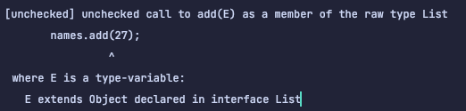

## Item27 - 비검사 경고를 제거하라

### 비검사 경고란? (unchecked)
* 비검사는 자바 컴파일러가 type-safe를 보장하기 위해서 필요한 타입정보가 충분히 존재하지 않다는 것을 뜻한다.
* 기본적으로 자바 컴파일러는 비검사 경고를 활성화하지 않으며 이를 위해서는 컴파일러에 -Xlint:uncheck 옵션을 주어야한다.

```java
public class Item27 {

    public static void main(String[] args) {
        Set<String> set_1 = new HashSet();
        Set<String> set_2 = new HashSet<>(); // 자바 7부터 다이아몬드 연산자로 해결가능
    }

}
```


* 인스턴스로 생성한 HashSet을 Raw 타입으로 사용하고 있기 때문에 나타나는 비검사 경고이다.
  * 이를 해결하기 위해서는 자바7부터 지원하는 다이아몬드 연산자<>를 통해 해결할 수 있다.


### 제네릭을 사용하게 되면서 만나게 되는 컴파일러 경고
* **비검사 변환 경고**
  * 아래의 예시를 보면 반환타입이 Raw 타입으로 되어있다. 따라서 호출하는 곳에서는 아래와 같은 경고를 확인할 수 있다.
```java
public class Item27 {

    public static void main(String[] args) {
        List<String> elements = getElements();
    }

    private static List getElements() {
        return new ArrayList<String>();
    }

}
```


* **비검사 형변환 경고**
  * 비검사 변환 경고에서 발생한 문제를 강제로 형변환을 통해 해결해보려 한다면 아래와 같은 경고를 확인할 수 있다.
  * 이 경우에는 자바 컴파일러가 List의 제네릭 타입을 String으로 정할 수 있는 방법이 없기 때문이다.
    * type erasure때문인 것 같다. 제네릭은 타입 정보가 소거가 되기 때문에 알 수 없어서 나타나는 경고인 것 같다.
```java
public class Item27 {

    public static void main(String[] args) {
        List<String> elements = (List<String>) getElements();
    }

    private static List getElements() {
        return new ArrayList<String>();
    }

}
```


* **비검사 메서드 호출 경고**
  * 이 경우에는 Raw 타입으로 선언이 되어 있기때문에 어떤 타입의 값이 들어가도 컴파일 시점에 잡을 수 없게된다.
  * 그리고 아래와 같은 경고를 확인할 수 있다. 이런 형식을 지원하는 이유는 제네릭이 나오기 전의 자바 버전에서는 존재하지 않는 개념이였기에 호환성을 위해 허용하고 있는 것 뿐이지 이런 방식으로 사용해서는 안된다.
```java
public class Item27 {

    public static void main(String[] args) {
        List names = new ArrayList();
        names.add("김형욱");
        names.add(27);

        System.out.println(names.contains("김형욱"));
        System.out.println(names.contains(27));
    }

}   
```


* **비검사 매개변수화 가변인수 타입 경고**
  * 가변인수를 제네릭과 함께 사용하면 문제가 될 수 있다. 
    * 그 이유로 가변인수는 암묵적으로 배열을 생성하는데 제네릭은 배열을 허용하지 않기 때문이다. 이러한 불일치로 인해서 나타나는 경고다.
    * **heap pollution?**
      * 제네릭 타입에서 변수화된 타입이 실제 다른 것을 의미한다.
```java
public class Item27 {

  public static void main(String[] args) {
    List list = toList("1", 2, "3");
    Iterator<String> iterator = list.iterator();

    while (iterator.hasNext()) {
      String next = iterator.next();
      System.out.println(next);
    }
  }

  private static <T> List<T> toList(T... elements) {
    return Arrays.asList(elements);
  }

}
```


### 할 수 있는 한 모든 비검사 경고를 제거하라
* 위의 예시 외에도 어려운 경고도 많이 존재하지만, 곧바로 해결되지 않는 경고가 나타나도 모든 비검사 경고를 제거해야 한다.
* **모두 제거한다면 그 코드는 타입 안정성이 보장된다. 즉 런타입에 ClassCastException이 발생할 일이 없으며 의도한 대로 잘 동작할 것이다.**
* **경고를 제거할 수 없지만 타입 안전성을 확신할 수 있다면 @SuppressWarnings("unchecked") 애너테이션을 달아 경고를 숨기도록하자.**
* **@SuppressWarnings 애너테이션은 개별 지역번수 선언부터 클래스 전체까지 어떤 선언에도 달 수 있지만 가능한 좁은 범위에 적용하도록 하자.**
  * 보통  변수선언, 아주 짧은 메서드, 생성자가 될 것이다.
  * 심각한 경고를 놓칠 수 있기 때문에 절대 클래스 전체에 적용해서는 안된다.
  * 애노테이션을 사용할 때 이 경고를 무시해도 되는 이유를 주석으로 남겨야 다른 사람이 그 코드를 이해할 수 있으며 잘못 수정하는 상황을 방지한다.

### SuppressWarnings 사용방법
* 코드가 안전성이 보장될 때 사용해야한다.
```java
  @SuppressWarnings("unchecked")
  private static <T> List<T> toList(T... elements) {
    return Arrays.asList(elements);
  }
```