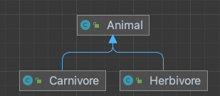
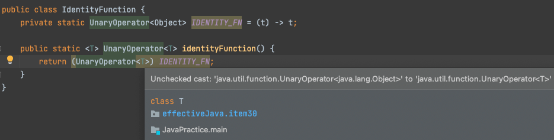
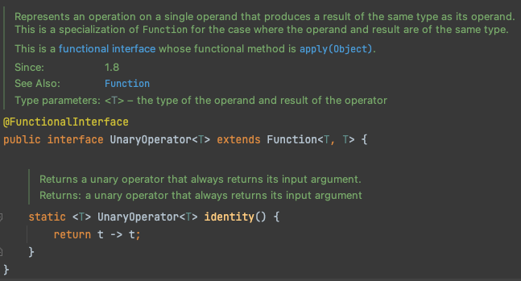

# Generic method

제네릭 타입을 선언할 때 처럼, 타입 파라미터를 사용하여 메소드를 선언하는 것을 말합니다.

하지만 **제네릭 타입을 선언할 때와 달리 “타입 파라미터의 scope” 이, 선언된 메소드로 제한**됩니다.

- static, non-static 모두 허용되며, 생성자 역시 제네릭 메소드일 수 있습니다.

아래와 같은 모습을 띠게 됩니다

```java
public static <K, V> boolean compare(Pair<K, V> p1, Pair<K, V> p2)
```

## 타입 추론

```java
public class Pair<K, V> {

    private K key;
    private V value;

    public Pair(K key, V value) { // 이 역시 제네릭 메소드입니다 
        this.key = key;
        this.value = value;
    }
```

이를 사용하면 아래와 같습니다

```java
Pair<Integer, String> p1 = new Pair<>(1, "apple")
Pair<Integer, String> p1 = new Pair<Integer, String>(1, "apple")
```

***타입 추론을 통해, 제네릭 메소드를 사용할 때, <> 사이에 타입을 명시하지 않고 일반 메소드 처럼 사용하는 것이 가능***합니다.  ( 물론 명시해줘도 됩니다)

> “타입 추론"
>
> - 자바 컴파일러에서는
    >     - “메소드 호출"과 “ 해당 메소드의 선언" 을 본다 → 인자 or 리턴 타입을 결정(추론) 한다
> - 추론 알고리즘을 통해, 모든 인자들에 맞는 가장 구체적인 타입을 찾을 수 있다.


## 단순한 제네릭 메소드

```java
public static Set<Integer> union2(Set<Integer> s1, Set<Integer> s2) {
   Set<Integer> result = new HashSet<>(s1);
   result.addAll(s2);

   return result;
}
```

```java
public static Set<String> union2(Set<String> s1, Set<String> s2) {
   Set<String> result = new HashSet<>(s1);
   result.addAll(s2);

   return result;
}
```

두 개의 Set 의 원소들을 합해주는 메소드를 타입마다  정의해줘야 할까요?

```java
public static Set union1(Set s1, Set s2) {
   Set result = new HashSet<>(s1);
   result.addAll(s2);

   return result;
}
public static <E> Set<E> union2(Set<E> s1, Set<E> s2) {
   Set<E> result = new HashSet<>(s1);
   result.addAll(s2);

   return result;
}
public static void main(String[] args) {
   Set<String> guys = Set.of("Tom", "Dick", "Harry");
   Set<String> stooges = Set.of("Larry", "Moe", "Curly");

   Set<String> result1 =union2(guys, stooges);
   System.out.println(result1); // [Moe, Tom, Harry, Larry, Curly, Dick]

   Set<String> result2 =union1(guys, stooges);
   System.out.println(result2); // [Moe, Tom, Harry, Larry, Curly, Dick]
}
```

(참고 - 제네릭은 타입소거가 발생하기 때문에, 다음과 같은 시그니쳐들은 타입 소거 결과 동일한 모습을 띠게 됩니다 )

`**both methods have same erasure**`

```java
public static Set union(Set s1, Set s2) {
public static <E> Set<E> union(Set<E> s1, Set<E> s2) {
```

> **위의 제네릭 union 메소드 덕분에** 우리는 Set<Integer> set1, Set<Integer> set2 를 합하기 위한 메소드와, Set<String> set1, Set<String> set2 를 합하기 위한 **메소드, 즉 각 타입에 대한 메소드를 개별적으로 선언하지 않아도 될 수 있게 되었습니다**.
>

## 한정적 와일드카드 타입을 사용한다면?

“좀 더 유연하게" 두 개의 Set 으로부터 원소들을 받아와 합친 Set 을 생성하기 위해 위의 메소드와는 다른 형태의 메소드를 사용해 보겠습니다.
사실 위의 union 메소드에는 한계가 존재했습니다

- ***완전히 동일한 타입에 대한 Set 들만을 합할 수 있다는 것***이죠
- 이번에는, 어떤 타입의 하위 타입 B,C 가 있을 때, 각 타입에 대한 Set 을 합치는 제네릭 메소드를 정의해보죠.

이를 위해서는 Item 31 에서는 “한정적 와일드 카드 타입 은 producer 에 사용 "한다고 표현하는, 그 개념을 사용해볼 것입니다.

```java

public class Animals {

	public static Set<Animal> union(Set<? extends Animal> set1, Set<? extends Animal> set2) {
		Set<Animal> animals = new HashSet<>(set1);

		animals.addAll(set2); //     boolean addAll(Collection<? extends E> c);

		return animals;
	}

	public static boolean hasAllElementsOf(Collection<? extends Animal> storage, Collection<? extends Animal> target) {
		return !target.stream()
			.map(targetAnimal -> storage.stream()
					.anyMatch(storageAnimal -> storageAnimal.equals(targetAnimal))
			).anyMatch(result -> result == false);
	}

```

```java

        Set<Carnivore> carnivores = Set.of(new Carnivore("Lion"), new Carnivore("Tiger"));
	Set<Herbivore> herbivores = Set.of(new Herbivore("코끼맄"), new Herbivore("토끼"));

	Set<Animal> animals = Animals.union(carnivores, herbivores);

	Assertions.assertThat(
	Animals.hasAllElementsOf(animals, carnivores))
	.isTrue();

	Assertions.assertThat(
	Animals.hasAllElementsOf(animals, herbivores))
	.isTrue();
```

## 제네릭 싱글톤 팩토리

아래와 같이 , ***요청한 타입 매개변수에 맞는 타입의 객체를 생성*** 하는 것

```java
// Collections 클래스 
public static final <T> Set<T> emptySet() {
        return (Set<T>) EMPTY_SET;
}

public static final Set EMPTY_SET = new EmptySet<>();
private static class EmptySet<E> { ... }
```

immutable 한 empty set 을 생성하여 리턴합니다. parameterized method 의 모습을 띠고 있는데요

왜 굳이 이렇게 하는 걸까요?? 장점이 있을까요?

> 위의 메소드를 사용하면 Parameterized empty Set 을 획득할 수 있습니다.
>
>
> 우리는 **이를 사용하여 type safe empty Set 을 획득**하는 것입니다.
>

```java
		Set<Carnivore> set = Collections.emptySet();

		set.add(new Carnivore("라이언"));
		// set.add(new Herbivore("토끼")); 컴파일 에러
```

언뜻 보면, 해당 메소드 호출 결과를 할당받는 참조변수 에만 타입이 명시되어 있어 이상하다고 생각할 수도 있는데요(심지어 이번에는 <> 이것도 안 보이죠 ),  “타입 추론" 이 일어난다는 것을 상기하면 좋을 것 같습니다.

### 항등 함수

항등함수는 이름과 같이 “항상" 입력으로 들어오는 인자를 그대로 리턴하는 함수를 말합니다.

제네릭 싱글톤 팩토리의 형태를 띠고 있는 것을 볼 수 있습니다.

```java
		// Collections 클래스
    static <T> Function<T, T> identity() {
        return t -> t;
    }
```

- **항등함수 객체는 “상태가 없는 객체"** 이므로, ***같은 항등함수 객체를 사용해도 무방***합니다.
    - **오히려 요청할 때 마다 새로 생성하는 것이 낭비**일 것입니다.
- 직접 만들어본다면 아래와 같이 해 볼 수 있을 것입니다. ( 사실 둘다 원래 존재하던 클래스인데.. 굳이 이걸 사용해서 다시 만들어 보는 이유가 뭘까요..?🤔)
    - 이 때, UnaryOperator<Object> 는 UnaryOperator<T> 가 아니기 때문에 Unchecked cast 경고가 발생합니다 → identityFunction 에 @SuppressWarnings(”unchecked”) 를 통해 해결할 수 있겠죠? 왜냐하면 항등함수는 입력값에 대한 수정없이 그대로! 반환하는 함수이므로, ***우리는 UnaryOperator<T> 를 사용해도 괜찮음을 알고 있으니***까요.





## 재귀적 타입 한정(Recursive type bound)

> **자기 자신이 들어간 표현식을 사용해 타입 매개변수의 허용범위를 한정**하는 것
>

```java
<E extends Comparable<E>>
```

위의 bounded type 은 **“ 모든 타입 E 는 자기 자신과 비교할 수 있다" 라고** 읽을 수 있습니다.

즉, **해당 타입 원소들끼리 “comapreTo() 메소드를 호출한 상호 비교가 가능하다는 뜻" 을 명확하게 표현하고 있습**니다.

따라서 만약 아래와 같은 메소드 에서는

```java
public static <E extends Comparable<E>> Optional<E> max (Collection<E> c){.. }
```

컬렉션에서 **iteration 을 돌면서 컬렉션에 담긴 원소에 대하여 `compareTo()` 메소드를 호출**하며

Max 를 계산할 수 있을 것입니다.

> 참고 : Item2 에 나왔던 예시입니다 [https://github.com/jbloch/effective-java-3e-source-code/blob/master/src/effectivejava/chapter2/item2/hierarchicalbuilder/Pizza.java](https://github.com/jbloch/effective-java-3e-source-code/blob/master/src/effectivejava/chapter2/item2/hierarchicalbuilder/Pizza.java)
>
>
> ```java
> 		abstract static class Builder<T extends Builder<T>> {
>         EnumSet<Topping> toppings = EnumSet.noneOf(Topping.class);
>         public T addTopping(Topping topping) {
>             toppings.add(Objects.requireNonNull(topping));
>             return self();
>         }
> 
>         abstract Pizza build();
> 
>         // Subclasses must override this method to return "this"
>         protected abstract T self();
>     }
> ```

# 결론

제네릭 타입에서와 마찬가지로, 제네릭 메소드를 사용할 경우 클라이언트에서는 명시적인 타입 변환을 하지 않을 수 있다. 제네릭 메소드에서 이러한 것이 가능한 것은 “타입 추론"이라는 것에 의해서다.

메소드 역시 사용하는 측에서의 형변환을 하지 않고 사용하는 것이 좋다.

형변환을 해줘야 하는 코드가 존재한다면 제네릭 메소드로 리팩토링 해보자.

# 참조

[Generic Methods](https://docs.oracle.com/javase/tutorial/java/generics/methods.html)

- 이펙티브자바 Item30