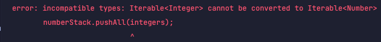

# Item31 -한정적 와일드카드를 사용해 API 유연성을 높이라

<aside>
💡 아이템28내용처럼 매개변수화 타입은 불공변이다. **즉 서로 다른 타입 Type1 과 Type2가 있을 때List<Type1> 과 List<Type2> 는 하위타입도,상위타입도 아니다.**
List<String>은 List<Object> 의 하위타입이 아니라는 뜻을 말해주고 있다. 뭔가 아닌 것 같지만 곰곰이 생각해보면 이쪽이 말이 된다.
그이유는 List<Object>은 어떤 객체든 넣을 수 있지만 List<String>은 문자열만 넣을 수 있다.
그렇기 때문에 List<String>은 List<Object>가 해야할 일을 제대로 수행하지 못한다.
**즉 리스코프 치환원칙에 어긋난다.(아이템10)**

</aside>

## 무공변 / 반공변 / 공변 ?

### 무공변이란?

- A가 B의 타입이긴 하지만 List<A>와 List<B>는 아무 관계가 없는 경우 무공변 or 무변성 이라고 말한다. (책에서는 불공변이라고 나와있습니다.)
- **자바의 제네릭은 기본적으로 무공변을 따르고 있습니다.**

### 반공변이란?

- 공변의 반대로 B가 A의 하위타입일 때 List<A>가 List<B>의 하위타입인 경우를 말한다.

### 공변이란?

- A가 B의 하위타입일 때  List<A>가 List<B>의 하위타입인 경우를 말한다.
    
    ```java
    Object[] objects = new String[100];
    ```
    

## 불공변의 문제점?

### 하지만 때론 불공변 방식보다 유연한 무언가가 필요하다.

```java

public class Stack<E> {
	public Stack();
	public E pop();
	public boolean isEmpty()
}
```

- 만약 이 코드에 일련의 원소를 스택에 넣는 메서드를 추가해야 한다고 가정해보자

```java
public void pushAll(Iterator<E> src) {
	for(E e : src) {
		push(e);	
	}
}
```

- 이 메서드는 컴파일은 깨끗하게 되지만 완벽하진 않다. 그 이유는?
    - Iterable src 원소 타입이 스택의 원소 타입과 일치하면 잘 작동하지만 Stack<Number>로 선언 후 pushAll(intVal)을 호출하면 잘 동작할까?
        - 매개변수화 타입이 불공변 이기 때문에 다음과 같은 예외가 발생한다.
            
            

## 불공변의 해결책

- 자바는 이런 불공변 상황에 대처할 수 있는 **한정적 와일드카드 타입**이라는 특별한 매개변수화 타입을 지원한다. 한정적 와일드카드 타입으로 변경하면 E 타입의 하위타입을 자바 컴파일러가 인식할 수 있다.
    - **따라서 아래의 코드는 정상적으로 동작한며 이를 공변이라고 말할 수 있다.**
- pushAll의 입력 매개변수 타입은 E의 Iterable이 아니라 E의 하위타입의 Iterable이어야 하며, 와일드카드 타입 Iterable<? extends E> 정확히 이런 의미이다.
    - 사실 extedns라는 키워드는 이 상황에 딱히 어울리진 않는다. 하위타입이란 자기 자신도 포함하지만, 그렇다고 자신을 확장한 것은 아니기 때문이다.(아이템29참조)
    - 수정된 코드 - 아래 방법으로 수정하게 되면서 클라이언트 코드도 말끔히 컴파일 된다 !
        
        ```java
        public void pushAll(Iterator<? extends E> src) {
        	for(E e : src) {
        		push(e);	
        	}
        }
        ```
        
- popAll메서드는 어떻게 작성해야 할까?
    
    ```java
    public void popAll(Collection<E> dst) {
    	while(!isEmpty()) {
    		dst.add(pop());	
    	}
    }
    ```
    
    - 위의 코드 또한 컴파일은 잘 동작하지만 완벽하지 않다. Stack<Number>의 원소를 Object용 컬렉션으로 옮긴다고 가정하면 어떻게 될까?
        
        ```java
        Stack<Number> numberStack = new Stack();
        Collection(Object) objects = ~~~;
        numberStack.popAll(objects);
        ```
        
        - Collection<Object>는 Collections<Number>의 하위타입이 아니다. pushAll과 비슷한 오류가 발생하게 된다. 이러한 상황에도 와일드카드 타입으로 해결이 가능하다.
        - 하지만 popAll의 입력 매개변수의 타입이 E Collection이 아니라 E의 상위타입의 Collection이어야 한다.(모든 타입은 자기 자신의 상위타입이다.)
            - **Collection<E>에서 Collection<? super E>로 변경하면 문제없이 동작하게 된다. 그 이유는 Object가 Integer의 상위 타입이기 때문이다. 이를 반공변 이라고 말할 수 있다.**
        
        ```java
        public void popAll(Collection<? super  E> dst) {
        	while(!isEmpty()) {
        		dst.add(pop());	
        	}
        }
        ```
        

<aside>
💡 유연성을 극대화 하려면 원소의 생산자나 소비자용 입력 매개변수에 와일드카드 타입을 사용하자.

</aside>

- 하지만 입력 매개변수가 생산자와 소비자 역할을 동시에 한다면 와일드카드 타입을 써도 좋을 게 없다.
    - 타입을 정확히 지정해야 하는 상황으로 이때는 와일드카드 타입을 쓰지 말아야 한다.
- **PECS(producer-extends, consumer-super)**
    - 매개변수화 타입 T가 생산자라면 <? extends T>를 사용하고, 소비자라면 <? super T>를 사용하라.
        - pushlAll의 src 매개변수는 stack이 사용 할 E 인스턴스를 생성한다.
        - popAll의 dst 매개변수는 stack으로부터 E 인스턴스를 소비한다.
    - PECS 공식은 와일드카드 타입을 사용하는 기본 원칙이다.
    - 반환 타입에는 한정적 와일드카드 타입을 사용하면 안된다.
        - 유연성을 높여주지도 않고 클라이언트 코드에도 와일드카드 타입을 써야하기 때문이다.

## 타입 매개변수와 와일드카드

- 매개변수 vs 인수
    - 매개변수(Parameter) : 메서드 선언에 정의한 변수
    - 인수 : 메서드 호출 시 넘기는 실제 값
- 타입 매개변수와 와일드카드에는 공통되는 부분이 있기 때문에 메서드를 정의하는 순간에 선택하기 어려울 때가 있다.

```java

public static <E> void swap(List<E> list, int i, int j);
public static void swap(List<?> list, int i, int j);
```

- **둘 중 어떤게 나은 선택이신 것 같나요?**
    
    public API라면 두번째가 더 나은 선택이다. 어떤 리스트든 두번째 메서드를 통해서 넘기게 되면 명시한 인데스의 원소들을 교환해준다.
    

### 메서드 선언에 타입 매개변수가 한 번만 나오면 와일드카드로 대체하라

- 비한정적 타입 매개변수라면 비한정적 와일드카드로 바꾸고, 한정적 타입 매개변수라면 한정적 와일드카드로 바꾸면 된다.

```java
public static void swap(List<?> list, int i, int j) {
	list.set(i, list.set(j, list.get(i)));
}
```

- 위 코드는 컴파일하면 오류가 발생한다.
    - 리스트 타입이 List<?>인데 List<?>에는 null 외에는 어떤 값도 넣을 수 없다는 데 이유가 있다.
    - 형변환이나 로타입을 사용하지 않고도 해결이 가능하다.
- 와일드카드 타입의 실제 타입을 알려주는 메서드를 private 도우미 메서드로 따로 작성하여 활용하는 방법이다.

```java
public static void swap(List<?> list, int i, int j) {
	swapHelper(list,i,j);
}
private static <E> void swapHelper(List<E> list, int i, int j) {
	list.set(i, list.set(j, list.get(i)));
}
```

- swapHelper 메서드는 리스트가 List<E>(타입)임을 알고 있는 것이기 때문에 에러 없이 동작하게 된다.

## 결론

- PECS(Producer-Extends, Consumer-Super)를 기억하고 사용하도록 하자.
- 반환 타입에는 한정적 와일드카드 타입을 사용하지 말자.
- 메서드 선언에 타입 매개변수가 한번만 나온다면 와일드카드로 대체하자.