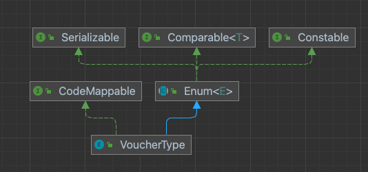
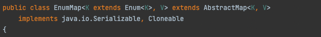
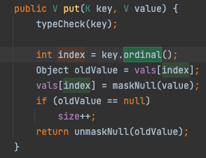
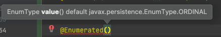

대부분 열거타입 상수는 “하나의 정수값에 대응” 하고 있다. 열거타입 상수는 내부에 ordinal 이라는 필드를 갖고 있다.

- 이는, **해당 상수가 그 열거타입에서 “ 몇 번째 위치” 인지를 나타내는 정수값**이다.
- 열**거타입에서는 ordinal() 을 통해 이를 반환**해준다.

공식 문서에서도, 개발자가 직접 ordinal 값을 사용할 일은 없을 거라고 하고 말하고 있다.

```java
		/**
     * The ordinal of this enumeration constant (its position
     * in the enum declaration, where the initial constant is assigned
     * an ordinal of zero).
     *
     * Most programmers will have no use for this field.  It is designed
     * for use by sophisticated enum-based data structures, such as
     * {@link java.util.EnumSet} and {@link java.util.EnumMap}.
     */
    private final int ordinal;
```

# 열거타입 상수와 연결된 정수값이 필요하다면?

## ordinal을 사용할까?

추천하지 않는다. ordinal을 개발자가 직접 코드에서 사용하게 된다면

- 유지보수가 끔찍해 진다.

> 특히 언제?
>
> - **상수의 선언 순서를 바꿀 때**
> - ***중간에*** 상수를 ***추가***할 때

또한 **“ 중간에 값을 비워 둘 수도 없다”**

- **필요하지 않은 정수값을 위해 , dummy 상수를 추가해줘야만** 하게 된다.

## 열거 타입 상수 관련 값은, “인스턴스 필드”를 선언하여 여기에 저장하자

- “열거타입 상수와 관련된 값"을 저장하기 위한 “인스턴스 필드" 를 두고,  이 값을 리턴하는 게터 메소드를 작성 해주자!
    - 이제는 열거타입 상수의 순서에 얽메이지 않은 값을, 각 상수들에게 부여해놓고 사용할 수 있다.

```java
public enum VoucherType implements CodeMappable {
		FIXED(1),
		PERCENT(2);
		
    private final int code;
		
		VoucherType(int code) {
		this.code = code;
		}

		@Override
		public int getMappingCode() {
			return this.code;
		}

}
```

### 그럼 ordinal 은 언제 쓰이나?

> Enum API 문서 : 대부분의 프로그래머는 이 메소드를 쓸 일이 없다. EnumSet, EnumMap 같은 열거타입 기반 범용 자료구조에 쓸 목적으로 설계되었다.
>

EnumMap 을 살펴봅시다





간략하게 EnumMap 이 무엇인지 알아보면

- ordered Collection 입니다 <-- -->  HashMap 은 unordered Collection 이라 iterate 할 때 마다 일정한 순서로 원소들을 순회하는 것이 보장되지 않죠
    - 여기서 순서는 해당 열거 타입 내부에서, 상수들이 선언되어있는 순서와 같습니다
- 내부적으로 배열을 사용하여 열거타입 객체를 저장합니다. 따라서 put 연산을 할 때면 배열에 값을 저장하게 되는데요



key 로 사용되는 Enum 타입 객체의 ordinal() 을 사용하여 HashMap 내부적으로 관리하는 테이블의 index 로 사용하고 있음을 볼 수 있습니다

## JPA 에서 @Enumerated



- 기본적으로 ORDINAL 을 사용하고 있다.
- 따라서 이 때 생기는 문제점은 DB에서 해당 필드와 매핑되는 column에는 이미 0 (A) 과  1(B) 이라는 정수 값으로  저장되어있는데 우리의 enum 클래스에서 B 를 없애고 C 선언을 추가한 경우 → DB 에는 여전히 B 에대한 의미의 1이 저장되어있는 상태에서, C에 대한 의미를 가진 1 이 저장되기 시작한다. 
  - 즉 DB 에 저장되어있는 1은 B,C 모두를 의미하게 되어버린다.

추가적으로 다른 방법을 찾고 싶지 않으면 일단은 EnumType.String 을 사용하자.

이 외에는 추가적으로 Converter 를 정의하는 방법이 있을 것 같다.

# 결론

개발하면서 직접 ordinal 을 사용하지말자. ordinal 은 열거타입을 위한 자료구조 내부적으로만 사용한다고 생각하자