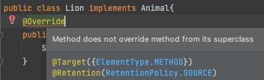
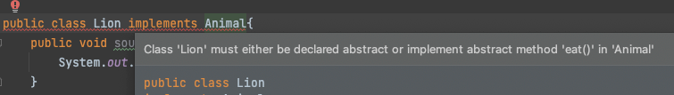

# 휴먼 에러를 방지하기 위해 @Override 어노테이션을 일관되게 사용하자

## 사람의 실수

나는 상위타입의 메소드를 재정의한다고 생각하고 작성했지만, “인자 타입을 다르게" 한다던가" 메소드 이름에 오타"를 낸다던가 하는 경우, “재정의"가 아닌 “오버로딩" 을 하게 될 위험이 존재한다
- 내 생각과는다른 코드 --> 디버깅 하기 전까지는 상위타입의 메소드가 호출되고 있음을 알아차리지 못할 것이다.

```java
public interface Animal {
    default void sound() {
        System.out.println("왈 냥 아르르");
    }
}
```

```java
public class Lion implements Animal{
    public void sount() { // 오타가 나버림
        System.out.println("어흥?");
    }

//    @Override
//    public void sound() {
//        Animal.super.sound();
//    }
}
```

```java
Animal lion = new Lion();
lion.sound(); // "어흥" 이 아닌 " 왈 냥 아르르" 
```

## @Override 을 사용하면?

> 컴파일러에게 “나는 상위타입 메소드를 재정의할거야" 라는 의도를 명시하게 된다.
>

적어도 아래 조건중 하나는 만족해야하는 메소드 이도록 만들어준다

- 슈퍼타입에 선언된 메소드를 “오버라이드” or “구현"한다

따라서 @Override 를 명시해놓고는 슈퍼타입에 있는 메소드에 대한 재정의가 아니라면 “컴파일타임 에러" 를 발생시킨다



## 추상메소드

추상메소드를 재정의 할 때는 @Override 를 달아주지 않아도, 구현되지 않은 추상 메소드가 남아있다면 해당 클래스를 “abstract class” 로 만들라는 에러 메시를 컴파일타임에 출력해준다.



따라서 이 경우에는 @Override 를 달아주지 않아도 컴파일 에러를 띄워주지만

“모든 재정의 메소드는 일관되게 @Override 를 사용하도록 “ 하고자 한다면 이 경우에도 @Override 를 사용해 주면 좋다

# 결론

개인적으로는 재정의 하는 상황이라면 Override 를 일관되게 사용하는게 실수를 방지하는 일이라고 생각한다. 
재정의 하는 모든 상황이라면 @Override 를 사용하는게 일관된 코드를 만들어주기 때문에, 코드를 읽는 사람 역시 재정의 메소드임을 쉽게 알아차릴 수 있다는 장점이 있다고 생각한다.

인텔리제이에서는 기본적으로 Implement 나 Override 를 선택하면 모두 자동적으로 @Override 를 달아주고 있으니 이를 적극 활용해보자.

이런 의미에서 추상 메소드를 구현하는 경우에는, 어차피 구현되지 않은 추상메소드가 남아있으면 알아서 컴파일 에러를 내 주기는 하지만, 역시 일관되게 모든 재정의 메소드는 @Override 를 달아주기로 했다면 이 역시 어노테이션을 달아주면 좋을 것 같다.