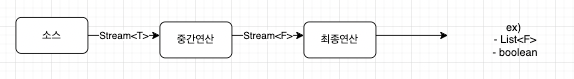

# Stream API 가 제공하는 핵심 추상개념 두가지

- 스트림은, 데이터 원소의 유한한 or 무한한 시퀀스
    - 스트림의 데이터원소 : 객체 참조 or Primitive type 값
        - 참고로 int, long, double 만 지원 (char , float 지원 안함 )
- 스트림 파이프라인은, 데이터 원소들로 수행 하는 연산 단계

# 스트림 파이프 라인?



- 중간연산은, 스트림을 변환하는 연산이 주로 온다.
    - 함수를 적용 ( 하여 매핑 )
    - 필터링
- 종단 연산은, 중간 연산 중, 마지막 중간연산이 내놓은 스트림에 최후의 연산을 가한다.
    - anyFirst()
    - collections
    - ..
- Lazy evaluation ( 지연 평가 ) : 즉, evaluation 은 “종단연산이 호출 될 때 “ 이루어진다는 것으로, 종단 연산에 사용되지 않는 데이터 원소는, 계산에 쓰이지 않는다.

> 스트림 파이프 라인에서 종단 연산(terminal operation) 이 반드시 필요합니다
>
> - 없으면 중간 연산도 실행 안됨
> - 그리고, 종단 연산은 “단 한 번" 만 적용 가능함.
> - Consumer 라고 볼 수 있겠죠?

---

## 메소드 체이닝

Stream API 에서는, 메소드 체이닝을 지원하는 fluent API 이기 때문에, 여러 메소드(파이프)들을 체이닝 하여, 하나의 표현식으로도 만들 수 있다. ( 근데 가독성은 보장 못하죠?!!)

## 스트림 파이프라인

스트림 파이프라인은 기본적으로 “순차적으로 수행” 된다.

- 순차적의 반대는 병렬이라고 볼 수도 있죠.
    - 파이프라인을 병렬로 실행하려면, 파이프라인 구성 스트림 중 하나에서 parallel 메소드를 호출해주면 된다. ( 실제로 효과 볼 수 있는 상황은 많지 않다고… )

## 가독성 주의~~

스트림은 잘못 사용하면 읽기 어렵고 유지보수도 어렵다.

> 참고
>
> - computeIfAbsent 메소드를 사용해, 각 key 에 다수의 값을 매핑하는 map 을 쉽게 구현 가능 ( 해당 키가 존재하지 않으면, 새로운, 다중값을 위한 collection 생성 메소드를 통해 컬렉션 생성하여 맵에 넣으면서, 이 컬렉션을 또 바로 리턴하여, 여기에 바로 add() 가능)
>
> ```java
> Map<String,Set<String>> groups;
> 
> groups.computeIfAbsent(alphabetize(word),
> 	(unused) -> new TreeSet<>()).add(word)
> ```
>

따라서 가독성을 위해서는

- 의미있는 스트림 변수 ( 이자 람다 맥변수 ) 네이밍!!
    - 람다에선 타입을 자주 생략하므로, 매개변수 이름을 잘 지어야 스트림 파이프라인의 가독성을 유지한다.

    ```java
    v -> v.discount() 보다는
    voucher -> voucher.discount() 가 훨씬 가독성이 좋겠죠?
    ```

- 스트림 리턴 메소드는 이왕이면 “복수명사”로 네이밍

    ```java
    static Stream<BigInteger> primes() {
    	return Stream.iterate(TWO, BigInteger::newtProbablePrime);
    }
    ```

- 도우미 메소드를 잘 활용 하자!!!
    - 일정 작업을 수행하는 로직은, 따로 메소드로 빼내서 이를 스트림 내에서 사용하면 가독성이 더 좋아진다!

♻️ 도우미 메소드 예시 )

- 내부에서 메소드 호출 하나만으로도 스트림 코드가 더러워질 수 있슴다

```java
		Optional.ofNullable(createPostRequest.images())
			.orElse(Collections.emptyList()).stream()
			.map(img -> PostImageFile.toImage(post.getId(), img, order.order()))
			.map(file -> postImageRepository.save(
				new PostImage(
					post,
					imageUpload.upload(file)
				)
			));

// upload 하는 부분만 도우미 메소드로 빼내주기만 해도 아래와 같이 됩니다
		Optional.ofNullable(createPostRequest.images())
			.orElse(Collections.emptyList()).stream()
			.map(img -> PostImageFile.toImage(post.getId(), img, order.order()))
			.map(file -> uploadFile(post, file));
```

## char 값 처리에 스트림을 사용하지 말자

자바는 기본타입인 char 에 대한 스트림은 지원하고 있지 않다.

- String 클래스에 chars() 메소드가 존재하는데, 사실 이거는 int 스트림이다.. char stream 이라고 생각하고 사용했다면 매우 헷갈릴 것임.

---

# 반복문 vs 스트림….

반복문도 모두 스트림으로 바꿔야 할까???  ***노노.. 여기선 🔆 가독성을 항상 생각 🔆*** 하자 !!

그리고 **스트림으로 하지 못하는 작업들이 존재**한다.

- 반복문은 { }  ← **코드 블럭**을 가져서, 함수객체로는 할 수 없는 일들을 할 수 있다.
    - 코드 블럭 내 지역변수 선언, “수정!” 가능
        - 반면 람다 내부에서는 공유변수(지역 변수 ) 에 대한 수정이 불가능 하다 ( 따라서 이를 위한 wrapper class 가 필요함 ) . 즉, 람다에선 final 또는 “사실상 final “ 인 변수만 읽을 수 있다.
    - 도중에 return, break, throw exception 하거나, 원하지 않는 부분은 continue 로 건너뛰기가 가능.
        - 람다로는 위의 것들이 불가능..!

- ♻️  예시 ) 람다 내부에서는 변수에 대한 수정이 불가능해서 wrapper 클래스 사용해야합니다
    - 예를들어 아래와 같은 것이 불가능합니다

    ```java
    int order = 0; 
    
    .... 
    	.map(img -> PostImageFile.toImage(post.getId(), img, order++))
    
    ```

    - 따라서 Order 라는 래퍼 클래스를 두는 것을 고려해 봐야할 것입니다

    ```java
    ....
    	.map(img -> PostImageFile.toImage(post.getId(), img, order.order()))
    ```

    - 또는 위의 상황에서는 Java 의 AtomicInteger 를 사용할 수도 있습니다

    ```java
    AtomicInteger order = new AtomicInteger(0);
    
    ....
    	.map(img -> PostImageFile.toImage(savedPost.getId(), img, order.getAndIncrement()))
    ```


그러면 스트림 언제써요?

- 데이터 시퀀스들을 “일관되게 변환” 하는 상황 ( 어느 하나만 변환하는게 아니라, 조건에 맞는 원소면 모두 같은 타입으로 변환해서 Stream<T> 를 내뱉으니까 )
- 시퀀스에 대한 필터링이 필요
- 시퀀스들을, 연산을 통해, 결합하고 싶은 경우 ( 시퀀스 들 끼리 덧붙이기 가능 함 )
- 시퀀스의 데이터들을 컬렉션에 모으려는 경우
- 시퀀스에서, 특정 조건 만족 원소 찾는 경우

### 스트림을 사용하기 어려운 또다른 경우 : 파이프라인 통과 전 데이터를 가져오고 싶은 경우.

코드 블록이 존재한다면, 변환전 값은 지역변수로서 갖고 있을 수 있을텐데, 스트림을 사용하면, 이미 스트림 내의 원소가 파이프라인을 거치며 다른 값으로 매핑되어, 이전 값은 잃는 구조입니다

```java
		public static void main(String[] args) {
        primes().map(p -> TWO.pow(p.intValueExact()).subtract(ONE))
                .filter(mersenne -> mersenne.isProbablePrime(50))
                .limit(20)
								.forEach(System.out::println);
    }
```

- 따라서 원래 값을 얻고 싶다면, 다시 이전값으로 변환하는 매핑 을 또다시 수행해야 합니다

예를들어 위 예시에서는 TWO.pow 를 통해 2^(p.intValueExact()) 를 수행한 후 1을 빼는 연산을 스트림 원소 p 에 적용하고 있는데요

p 값을 다시 얻고 싶다면, 아래의 로직을 사용할 수 있습니다

> 참고로, 2^p  - 1이라는 값에서 지수 p 를 구하려면, 해당 값을2 진수로 표현한 다음 몇 비트인지 세어보면 되기 때문입니다.
>

```java
        primes().map(p -> TWO.pow(p.intValueExact()).subtract(ONE))
                .filter(mersenne -> mersenne.isProbablePrime(50))
                .limit(20)
                .forEach(mp -> System.out.println(mp.bitLength() + ": " + mp));

```

> flatMap (제가 아직 flatMap 에 익숙하지 않아서 부가설명 추가 ): flatMap 은 nested Stream 구조를 피할 수 있게 해줍니다 Stream<Stream<R>> 과 같은 구조를 Stream<R> 로 만들어버리죠. 아래에서도
>
>
> ```java
> private static List<Card> newDeck() {
> 	return Stream.of(Suit.values())
> 		.flatMap( suit ->
> 			Stream.of(Rank.values())
> 				.map(rank -> new Card(suit,rank)) // 여기서 Stream<Card> 가 생기니 , 
> 			// flatMap 이 아닌 map 이었다면 Stream<Stream<Card>> 가 나왔겠죠 
> 		).collect(toList());
> ```
>
> [https://blogs.oracle.com/javamagazine/post/java-streams-flatmap-peek](https://blogs.oracle.com/javamagazine/post/java-streams-flatmap-peek)
>
> [https://www.baeldung.com/java-difference-map-and-flatmap](https://www.baeldung.com/java-difference-map-and-flatmap)
>

### 그냥 둘 다 해 보고 가독성 좋은 거를 쓰자!!!