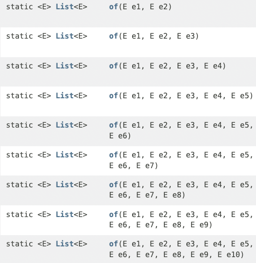
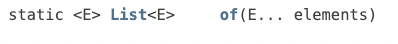
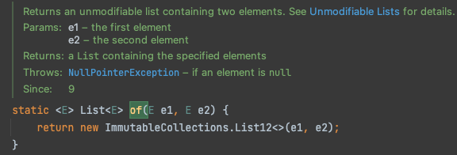
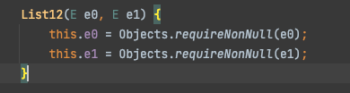
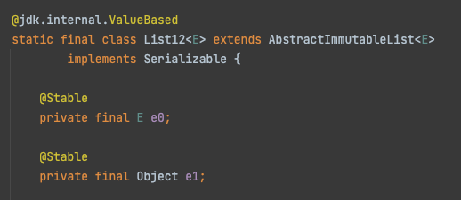
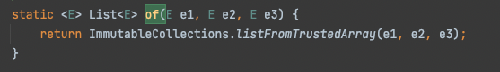
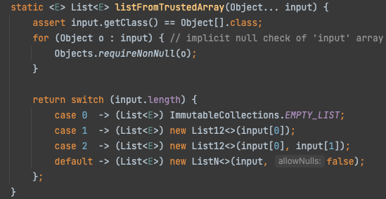
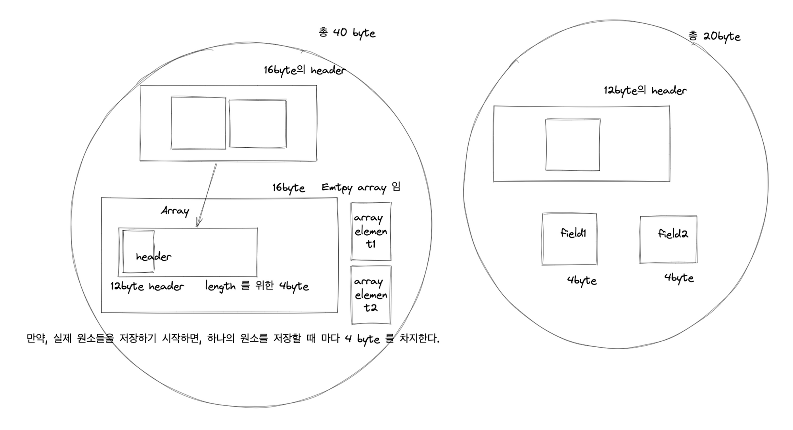

# 가변인수가 등장하기 전에는?

varargs 는 Java 5 에 도입되었다.

그렇다면 그 이전에는 “임의 개수의 인자가 전달되어 올 수 있는 상황" 에 대해 어떻게 다루고 있었을까?

- 배열을 받는 메소드 → 명시적으로 배열을 인자로 받는 메소드 선언

```java
public int sum(int[] args) {
	...
}
```

- N 개의 메소드를 선언 ( 1개,2개,3개,…. 인자를 받는 메소드들)

```java
public int sum() { ... }

public int sum(int value) { ... }

public int sum(int val1, int val2) { ... }
```

# 가변인수?

> 가변인수
>
- 명시한 타입의 인수를 “0개 이상" 받을 수 있다.
- 가변인수 메소드 호출시 무조건 “배열을 생성" 하여 인수들을 배열에 저장하여 해당 메소드에 이 배열을 전달한다.
- 기존의 boilerplate 한 코드들(반복되고 지루한 코드들) 을 없애주었다.

# 인수가 1개 이상이어야 하는 상황이라면?

이런 상황에서 “가변인수만을 통해 상황을 제어하려고 하면”

> 인수 하나를 무조건 받아오도록 하기 위해 코드가 더러워진다.
>

> ***런타임 에러*** 여야만 하게 된다
>

```java
		static int min(int... args) {
        if (args.length == 0)
            throw new IllegalArgumentException("Too few arguments");
        int min = args[0];
        for (int i = 1; i < args.length; i++)
            if (args[i] < min)
                min = args[i];
        return min;
		}
```

```java
		@Test
    @DisplayName("0개의 인자를 전달하여 가변인수 메소드를 호출할 경우 런타임 에러가 발생한다")
    void givenZeroArgs() {
        Assertions.assertThatExceptionOfType(IllegalArgumentException.class)
            .isThrownBy(() -> Varargs.min());
    }
```

하지만 **만약, 가변인수 외에, 다른 매개변수를 하나 더 받도록 한다면**

```java
static int min(int firstArg, int... remainingArgs) {
        int min = firstArg;
        for (int arg : remainingArgs)
            if (arg < min)
                min = arg;
        return min;
    }
```

> 코드가 깔끔해지고
>

> 컴파일 에러를 발생하게 할 수 있다
>

# 성능에 민감한 상황이라면?

- 호출 시 마다 배열을 하나 할당하고 초기화하기 때문에, 성능에 민감한 상황에는 걸림돌이 될 수 있다.

동일한 타입의 변수 여러개를 전달하는 것이 필요한 경우에는

- 1개를 전달
- 2개를 전달
- 3개를 전달
- 4개 이상을 전달…

로 나눠볼 수 있다.

만약 4개 미만을 전달 하는 경우가, 전체 호출양의 대다수를 차지하고 있다면

```java
public int sum() {}
public int sum(int a1, int a2) {}
public int sum(int a1, int a2, int a3) {}
public int sum(int a1, int a2, int a3, int... rest) {}
```

위와 같이 4개 미만의 경우에 대해서는 “가변인수 메소드가 아닌" 메소드들을 다중 정의하고, 4개 이상의 경우에 대해서는 가변인수를 활용하도록 하는 것을 생각해 볼 수 있다.

## ex) List 의 정적 팩토리 메소드

이 패턴을 보고 List 의 불변 List 를 생성하는 정적 팩토리 메소드들이 떠올랐다.

이들은 “공간"을 이유로 이러한 다양한 구현체들을 사용하고 있는 것 같기는 하지만, 한 번 살펴보자.

List.of 구현을 보면 이와 같은 정적 팩토리 메소드들을 지니고 있다.





여기서 인자가 두개만 전달되는 경우에 대해서는







다음과 같이, 배열이 아닌 변수로 값을 저장하는 모습을 볼 수 있다.

반면 인자가 3개 이상만 되더라도,





내부적으로 가변인수 메소드 를 사용하고 있는 것을 볼 수 있다.

그런데 이 때도, 인자가 1개 , 2개인 경우는 위에서 봤던 List12 구현체를 사용한다.

왜 인자가 2개 이하인 경우에는 필드에 저장하고, 그 이상부터 배열에 저장하는 걸까???

왠지 이펙티브 자바의 아이템53에서는 “성능" 을 언급했던 것처럼, 이번에는 성능 or 공간과 관련이 있을 것 같지 않은가??!

요런 느낌이다. 사실 byte 수는 실제와는 좀 다를 수 있는데 ( 추가 학습이 필요함 ),

이런식으로 array 를 위해서 추가적으로 필요한 공간들이 더 많다는 것으로 이해하면 좋을 것 같다.


