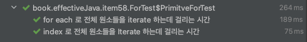

# 일반적인 for 문의 단점

반복자(iterator) 나 index 와 같은 변수들을 사용한다.

> 따라서 ***코드가 지저분해*** 보인다
>

> 어쨋거나 변수가 존재하는 상태이기 때문에, ***“변수를 잘못 사용할 경우", 오류가 발생할 가능성이 존재***한다.  ( advanced for 문에는 이런 변수를 선언하지 않아도 됨 )
>

> 컨테이너에 따라 코드가 달라진다  (List 였다면 get(idx), 배열이었다면 [idx] )
>

예시를 보자.

- ***iterator 라는 변수를 사용하여 접근***하고 있다 → iterator 는 해당 컨테이너 사이즈 만큼의 원소에만 접근이 가능한데, 아래 예시 에서는 ***해당 사이즈를 넘어서는 횟수만큼 iterator 를 사용***하고 있다 → NosuchElementException 이 발생

```java
enum OUTER {A,B};
enum INNER {ONE,TWO,THREE}

static List<OUTER>outers= Arrays.asList(OUTER.values());
static List<INNER>inners= Arrays.asList(INNER.values());

private class Pair {
    private OUTER outer;
    private INNER inner;

    public Pair(OUTER outer, INNER inner) {
        this.outer = outer;
        this.inner = inner;
    }
}
```

```java
private void exceedSize() {
    List<Pair> pairs = new ArrayList<>();
    for(Iterator<OUTER> outer =outers.iterator(); outer.hasNext();) {
        for(Iterator<INNER> inner =inners.iterator(); inner.hasNext();) {
            pairs.add(new Pair(outer.next(), inner.next()));
        }
    }
}
```

```java
main.exceedSize(); //  NoSuchElementException💥
```

이와 같은 상황을 해결하기 위해서는 아래와 같이 해 줄 수도 있긴 하다

```java
private void exceedSizeV2() {
    List<Pair> pairs = new ArrayList<>();
    for(Iterator<OUTER> outer =outers.iterator(); outer.hasNext();) {
        OUTER curOuter = outer.next(); // outers 의 size 만큼만 받아 쓸 수 있도록
        for(Iterator<INNER> inner =inners.iterator(); inner.hasNext();) {
            pairs.add(new Pair(curOuter, inner.next()));
        }
    }
}
```

# Advanced for 문을 사용해보자

```java
List<Pair> pairs = new ArrayList<>();
for (OUTER outer :outers) {
    for (INNER inner :inners) {
        pairs.add(new Pair(outer, inner));
    }
}
```

깔끔 명료 해졌다.

위에서 변수를 사용하며 나타나던 문제들이 발생하지 않는다!

## for each 문은 어떻게 동작하나요?

Java 5 에 도입된 for each 문은 내부적으로는 iterator 를 사용하여 동작한다.

다만 이 변수를 사용자들에게 노출하지 않는 것이다.

따라서 for each 를 사용한다고 성능저하가 있지는 않다. ( primitive type 을 제외하고)

### But, 원시타입의 경우는 속도 차이가 조금 있다

for each 는 내부적으로 Iterator 를 사용한다.

Iterator 는 Generic 을 사용하기 때문에 원시타입의 경우 Boxing, Unboxing 이 일어나기 때문에 index 를 사용할 때 보다 성능 저하가 존재한다.

```java
@Nested
@DisplayName("원시타입에 대해 index 접근 및 for each 접근 속도 테스트")
class PrimitveForTest {
    private int[] ints;
    private int sum;

    @BeforeEach
    void setUp() {
        ints = IntStream.range(0,100000000).toArray();
        sum = 0;
    }
    @Test
    @DisplayName("index 로 전체 원소들을 Iterate 하는데 걸리는 시간")
    void iterateV2() {
        for (int idx = 0; idx < ints.length; idx++) {
            sum += ints[idx];
        }
    }

    @Test
    @DisplayName("for each 로 전체 원소들을 iterate 하는데 걸리는 시간")
    void iterateV1() {
        for (int numb : ints) {
            sum += numb;
        }
    }
}
```



## Iterable 인터페이스

이 for-each 문은, Iterable 인터페이스를 구현한 객체라면 무엇이든 순회할 수 있다.

- Collection 이 아니더라도, 원소들의 묶음을 표현하는 타입을 작성할 때면 Iterable 을 구현할 경우, 해당 타입 사용자들에게 많은 편의성을 제공해 줄 수 있다.

## 그래도 일반적인 for 문을 사용해야하는경우

> 컨테이너내부 원원소들 대한 변경(제거, 값 교체 ) 이 필요한 경우에는 일반적인 for 문을 사용해야 한다
>

이 경우에는, index 나 iterator 변수를 사용해야 한다.

for each 의 경우는 내부적으로 iterator 를 사용하고 있으나, 이를 사용자들에게 노출하지 않기 때문에, 순회중인 원소에 대해 접근할 방법이 존재하지 않는다.

따라서 이 경우에는 일반적인 for 문을 사용해야 한다.

> ex)컬렉션을 순회하면서, 이번에 선택 되었던 원소를 제거 해야 하는 경우
>

향상된 for 문에서는 변수를 사용하지 않다보니, 순회중인 원소를 제거할 방법이 없다.

이 때는 일반적인 for 문을 사용해야 한다.

특히 Collection 에는 removeIf 메소드가 존재하기에 , 적절한 predicate 만 전달 해 주어도 직접적으로 Iterator 나 어떤 변수를 사용해서 제거하지 않아도 된다

```java
public void removeBy(List<Pair> pairs, Predicate<Pair> predicate) {
        pairs.removeIf(predicate);
}
```

```java
forClass.removeBy(
    pairs,
    pair -> pair.getOuter() == OUTER.A // Predicate 전달
);
```

> 리스트나 배열을 순회하며, 일부 값을 “교체" 해야 하는 경우
>

이 역시, 인덱스나 반복자 를 통해, 값을 변경해야 하기 때문이다.

# 결론

> 결론
>
> - 일반적인 for 문보다, 명료하며, 변수를 사용하며 발생할 수 있는 버그를 예방할 수 있다. 컨테이너가 배열이던 컬렉션이던 같은 코드를 사용한다. 원시타입인 경우를 제외하고는 성능 저하도 없다. 따라서 원소에 대한 변경이 필요한 경우를 제외한 모든 곳에 for each 를 사용하면 더 명시적 이면서도 오류가 발생할 확률이 적은 코드가 될 것이다.